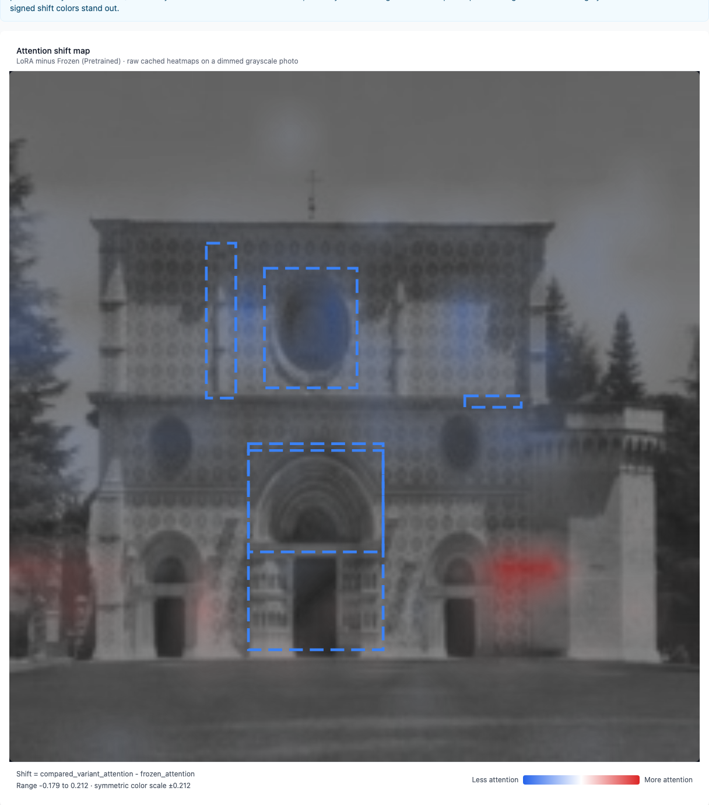
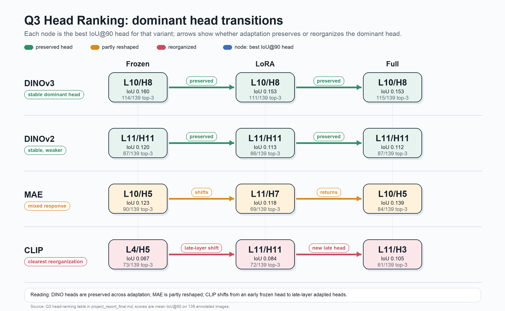
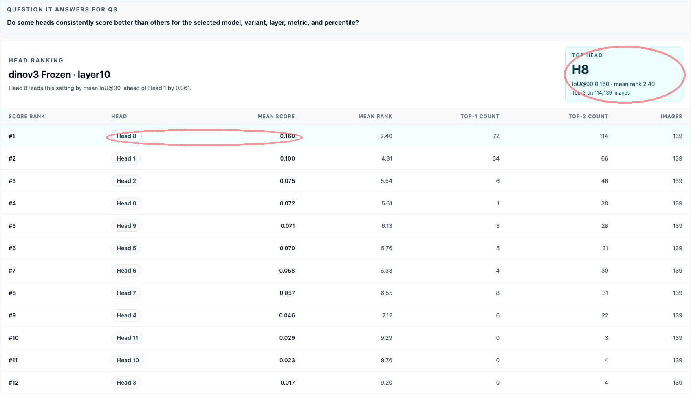
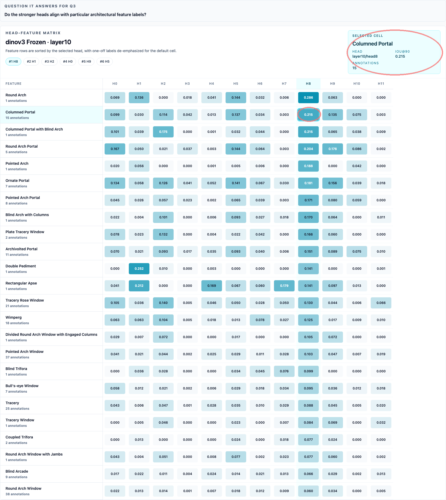
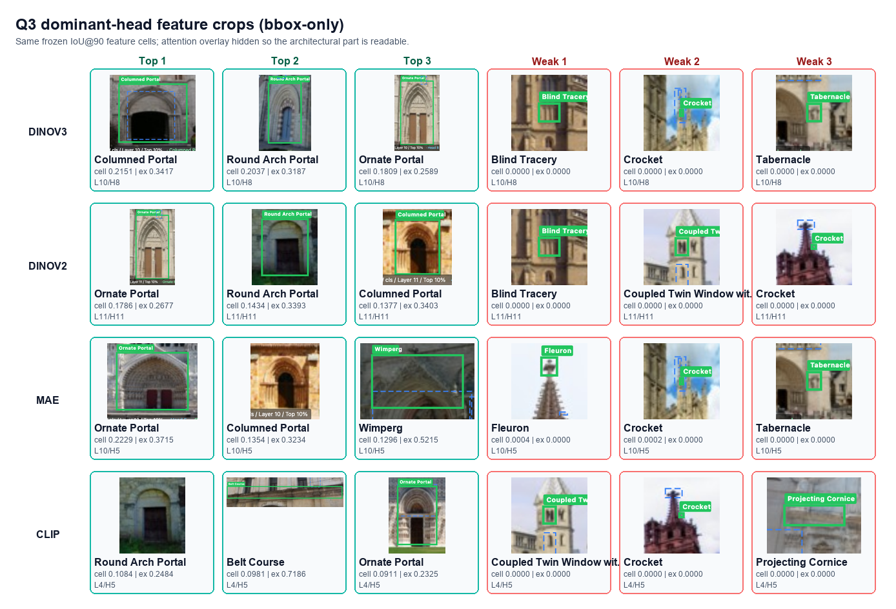
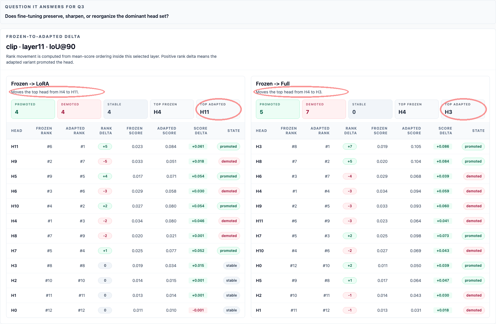

# Do Self-Supervised Vision Models Learn What Experts See?

## 1. Abstract

Self-supervised vision models achieve strong downstream performance, but high classification accuracy alone does not reveal whether those models attend to the same visual evidence that human experts consider diagnostically important. This project studies that question in the WikiChurches setting, where expert bounding boxes identify architectural features such as arches, windows, towers, and facade elements that matter for style recognition.

We evaluate seven vision models across self-distillation (DINOv2, DINOv3), masked autoencoding (MAE), image-text contrastive pretraining (CLIP), sigmoid-pairwise contrastive pretraining (SigLIP, SigLIP2), and a supervised CNN baseline (ResNet-50), then measure attention-alignment against 631 expert boxes on 139 annotated church images using IoU, Coverage, MSE, KL divergence, and EMD.

The study is organized around three linked questions:
1. How well frozen models align with expert-marked regions
2. How Linear Probe, LoRA, and Full fine-tuning change that alignment
3. Whether individual attention heads exhibit descriptive specialization for different architectural features

For Q1, frozen expert-aligned attention is present but highly model-family dependent: DINOv3 provides the strongest evidence, leading the default-method benchmark on `IoU@90`, Coverage, KL, and EMD, and uniquely clearing all calibrated continuous baselines across MSE, KL, and EMD. Base SigLIP is a competitive overlap result at its best mean-attention layer, but SigLIP2 remains weaker on overlap despite having the lowest MSE; the two should not be collapsed into one family-level frozen result.

The Q2 findings are that fine-tuning moves attention unevenly across families: CLIP gains the most (IoU 0.0181→0.0745, Cohen's d≈1.0) but its gains concentrate on prominent Gothic and Romanesque structures; MAE's largest single-style gain is on Renaissance, driven specifically by pediment geometry; the SigLIP variants improve from weaker layer-11 baselines; and the DINO family preserves its already-strong frozen alignment. Models with different pretraining objectives converge on the same structurally easy images rather than covering complementary subsets, with DINOv3 frozen IoU predicting per-image CLIP Δ at Pearson r=+0.677.

For Q3, the per-head analysis suggests sparse descriptive specialization rather than uniform head behavior: DINO-family dominant heads remain stable across adaptation, MAE is partly reshaped, and CLIP reorganizes from earlier frozen attention toward later adapted heads, with the clearest feature alignment appearing on larger architectural structures such as portals, arches, and rose windows. Overall, the project contributes a calibrated way to test whether model attention is spatially compatible with expert evidence, not a claim that attention maps prove expert-like reasoning.

## 2. Project-At-A-Glance Overview

The report studies whether vision models that perform well on style classification also focus on the same architectural evidence that experts use. It combines a multi-model benchmark, a fine-tuning shift analysis, and a scoped per-head study.

| Study dimension | Value |
| --- | --- |
| Compared frozen models | 7 |
| Fine-tuning strategies | 3 |
| Alignment metrics | 5 |
| Annotated evaluation images | 139 |
| Expert bounding boxes | 631 |
| Architectural feature types in the ontology | 106 |
| Core research questions | 3 |
| Primary Q3 headline-study models | 4 (`dinov2`, `dinov3`, `mae`, `clip`) |

The project combines a research pipeline and a frontend app for analysis:
- The pipeline extracts model attention, computes calibrated alignment metrics, stores experiment artifacts, and precomputes cache-backed summaries
- The app then exposes those results through Gallery, Image Detail, Dashboard, Compare, Q2, and Q3 surfaces that let the team inspect the same findings at dataset, model, layer, and image level.

## 3. Introduction and Motivation

A vision model can be correct for the wrong visual reasons. In architectural style recognition, a model that classifies a church as Gothic because it attends to pointed arches and flying buttresses is qualitatively different from one that succeeds because it exploits background regularities, photographer bias, or other shortcuts unrelated to expert reasoning. Accuracy alone cannot distinguish between those cases. For a project framed around trust, interpretability, and the relationship between representation learning and domain knowledge, the question is not only whether a model predicts the right label, but also whether it looks at the right evidence.

WikiChurches provides a strong evaluation setting for that question because it pairs fine-grained architectural-style labels with expert bounding boxes marking characteristic visual features. Those annotations make it possible to compare model attention directly against human expert targets instead of inferring plausibility indirectly from class predictions. They also anchor the evaluation in a domain where meaningful distinctions depend on visually specific, repeated, and semantically rich structures rather than on generic object categories alone.

This report addresses three gaps. First, it compares multiple frozen SSL paradigms and a supervised baseline against the same expert annotations rather than evaluating a single model family in isolation. Second, it asks how attention changes after task adaptation, using shared evaluation images and multiple fine-tuning strategies instead of relying only on frozen-model inspection. Third, it asks whether the model's attention behavior is uniform across heads or whether a smaller subset of heads appears to align better with certain feature types. Taken together, these questions shift the project from a visualization exercise into a domain-grounded evaluation study of what different pretraining and adaptation choices encourage models to attend to.

## 4. Research Questions and Contributions

The study is organized around three linked research questions. Q1 establishes the baseline frozen-model benchmark. Q2 asks whether task-specific adaptation changes that alignment and whether strategy choice matters. Q3 narrows the focus to the descriptive specialization of individual attention heads.

### 4.1 Q1: Frozen-Model Attention Alignment

Do frozen SSL and baseline vision models attend to the same architectural regions that human experts mark as diagnostically important? This is the core benchmark question. It asks whether alignment with expert evidence is already present in the pretraining regime before any task-specific adaptation.

### 4.2 Q2: Fine-Tuning and Attention Shift

How does attention change after adaptation to the style-classification task, and does the strategy matter? This question compares Linear Probe, LoRA, and Full fine-tuning using the same annotated evaluation images. It treats attention shift as both a directional question and a magnitude question: fine-tuning may preserve, improve, or degrade alignment, and the same strategy need not affect every model family in the same way.

### 4.3 Q3: Per-Head Specialization

Do individual attention heads exhibit descriptive specialization for different architectural features, and do the dominant heads change across variants? Q3 is scoped more narrowly than Q1 and Q2. Its goal is not to prove causal explanations for predictions, but to test whether some heads align more strongly than others with expert-marked structures and feature types.

### 4.4 Contributions

- A multi-metric benchmark for comparing expert-alignment across frozen SSL model families and a supervised baseline on the same annotated evaluation set.
- A calibrated Q1 interpretation layer that compares continuous metrics against naive baselines rather than treating raw scores as self-explanatory.
- A Q2 analysis workflow that compares frozen-to-fine-tuned attention shifts across Linear Probe, LoRA, and Full fine-tuning using shared evaluation images and experiment-scoped provenance.
- A scoped Q3 per-head study that reuses the metric pipeline to rank heads and inspect head-feature patterns without overstating causal claims.
- A reproducible pipeline and interactive analysis interface that connect precomputation, experiment artifacts, and qualitative inspection.

## 5. Related Work

This section only cites papers that carry a design choice in the project: the dataset, the evaluated model family, the attention-alignment method, the fine-tuning comparison, or the Q3 head-level unit of analysis. Broader localization and explanation papers are left out unless the project directly builds on them.

### 5.1 Attention Alignment and WikiChurches

[Barz and Denzler's WikiChurches dataset](https://arxiv.org/abs/2108.06959) is the project anchor because it provides both architectural style labels and expert bounding boxes for characteristic building parts. Those boxes turn the project from a generic interpretability demo into a domain-grounded alignment test: do model heatmaps land on the same architectural evidence that experts mark?

[Caron et al.](https://arxiv.org/abs/2104.14294) motivate the DINO-family part of the study by showing that self-supervised ViT attention can produce object-like masks without localization supervision. [Oquab et al.](https://arxiv.org/abs/2304.07193) and [Siméoni et al.](https://arxiv.org/abs/2508.10104) are direct model sources for DINOv2 and DINOv3, which matter here because DINOv3 is the strongest frozen model in the Q1 results and the DINO family is the main stability case in Q2.

[Chung et al.](https://arxiv.org/abs/2503.09535) are the closest methodological neighbor: they compare ViT attention maps with expert medical annotations rather than generic object masks. This report makes the same kind of domain-specific move, but for architectural heritage and across a wider model/adaptation matrix. [Abnar and Zuidema](https://arxiv.org/abs/2005.00928) are included because the project implements attention rollout as an alternative to single-layer CLS attention. [Chefer et al.](https://arxiv.org/abs/2012.09838) provide the key guardrail: attention visualizations can support alignment analysis, but they are not full causal explanations.

### 5.2 Fine-Tuning and Attention Shift

Q2 asks whether adaptation changes where a model looks. [Kumar et al.](https://arxiv.org/abs/2202.10054) justify the Linear Probe versus Full fine-tuning contrast by showing that full fine-tuning can distort pretrained features rather than merely improving a classifier head. [Biderman et al.](https://arxiv.org/abs/2405.09673) motivate the LoRA middle case: parameter-efficient adaptation can learn less and forget less than full fine-tuning. [Li et al.](https://arxiv.org/abs/2411.09702) are relevant because they argue that attention patterns carry transfer signal; this report asks the stricter question of whether those changed patterns move toward expert architectural evidence.

Two further papers shape the Q2 expectation that different pretraining regimes will not respond to adaptation in the same way. [Walmer et al.](https://arxiv.org/abs/2212.03862) compare supervised, image-text contrastive, masked-autoencoding, and self-distillation training and show that the choice of supervision produces qualitatively different attention behavior in vision transformers; that result motivates reporting Q2 deltas per model family rather than pooling them. [Park et al.](https://arxiv.org/abs/2305.00729) compare contrastive learning and masked image modeling and find that the two objectives induce different attention patterns, with contrastive features capturing longer-range global structure while masked-image-modeling features remain more local. That distinction informs the Q2 reading in §9.2 that CLIP-family and MAE improvements concentrate on different image subsets rather than the same structurally easy regions.

### 5.3 Per-Head Specialization

Q3 remains descriptive. [Voita et al.](https://arxiv.org/abs/1905.09418) are the useful precedent for the idea that a small subset of attention heads can carry interpretable, task-relevant behavior. [Li et al.'s TVCG visual analytics paper](https://doi.org/10.1109/TVCG.2023.3261935) is the vision-specific counterpart because it analyzes head importance, head attention strength, and head attention patterns in ViTs. This report uses those papers to justify a narrower question: whether individual heads in DINOv2, DINOv3, MAE, and CLIP align more strongly with particular expert-marked architectural features. It does not claim that a high-ranking head causally explains the model's final prediction.

## 6. Dataset and Problem Setup

The primary dataset is WikiChurches, a fine-grained architectural-style dataset centered on European church buildings. For this project, the dataset matters not only because it supports classification, but because it includes expert annotations of diagnostically important building parts. Those boxes make it possible to evaluate whether models attend to the same structural evidence that experts use to distinguish styles.

The report uses two related data scopes. The first is the annotated subset used for attention-alignment evaluation: 139 images with 631 expert bounding boxes. The second is the larger style-labeled pool derived from `churches.json`, which supports linear-probe and fine-tuning experiments. The root documentation cites 9,485 images in the official WikiChurches release. The implementation also documents that a local mirror may expose a slightly different raw file count, but the analysis anchors its description to the official release and to the 139-image expert-annotated subset that defines the alignment benchmark.

The annotation file `building_parts.json` defines an ontology of 106 feature types and stores bounding boxes in normalized `left`, `top`, `width`, `height` coordinates. The code clamps negative left or top coordinates to zero, converts boxes into pixel masks at the target heatmap resolution, and combines multiple boxes per image into a union mask for the primary image-level IoU and Coverage calculations. The project proposal documents the annotated style distribution as Romanesque 51, Gothic 49, Renaissance 22, and Baroque 17, and the implementation maps the corresponding Wikidata style IDs into the working style-classification labels used for training and evaluation.

One count mismatch is intentional. The proposal-level summary lists 51 Romanesque annotated images, while the Q2 per-style artifact reports Romanesque `n=54` because `experiments/scripts/analyze_style_breakdown.py` groups each evaluation image under every mapped style tag in `building_parts.json`. The Q2 per-style rows therefore count style assignments rather than mutually exclusive images, so the displayed style counts can sum above the 139-image evaluation set. The report uses the artifact-level counts in §9.2.1 because those are the exact groups used to compute the reported per-style deltas.

The preprocessing strategy keeps the annotated evaluation images out of the primary fine-tuning train and validation splits. This separation matters because Q2 asks how adaptation changes attention on the same expert-annotated pool, so those images remain evaluation-only in the primary experiment path. For the attention pipeline, the project uses model-appropriate image preprocessing and generates standardized heatmaps at the app's working resolution for metric computation and visualization.

The most important dataset caveat is sparse annotation bias. WikiChurches annotates representative instances of features rather than exhaustively marking every visible instance. As a result, a model can correctly attend to several copies of the same feature while still being penalized by IoU for attending outside the single annotated box. This affects per-bbox interpretation most strongly and is treated as a documented limitation rather than as a bug in the metric implementation. The analysis addresses this by emphasizing cross-metric interpretation, by distinguishing union-mask from per-bbox views, and by keeping the limitation visible in both methodology and discussion.

## 7. Methodology

*Figure. End-to-end pipeline. The 139-image expert-annotated evaluation set is disjoint from the fine-tuning pool. Linear Probe is a zero-Δ control (backbone frozen); ResNet-50 is excluded from Q2. Attention extraction depends on model family; Q3 is restricted to native CLS-token models. Five alignment metrics are computed against expert boxes (M binary union, G Gaussian) and calibrated against four naive baselines. Cached artefacts feed the Q1, Q2, and Q3 analyses.*

The methodology is designed to support a comparative evaluation study rather than a single-model demo. The figure above summarises the end-to-end pipeline; the subsections that follow walk through each stage. It therefore has to define model coverage, attention extraction rules, metric interpretation, experimental splits, statistical comparisons, and reproducibility safeguards in a way that remains coherent across Q1, Q2, and Q3.

### 7.1 Models and Attention Extraction

The frozen benchmark compares seven models. Six are transformer-based models: `dinov2`, `dinov3`, `mae`, `clip`, `siglip`, and `siglip2`. The seventh, `resnet50`, acts as a supervised CNN baseline. All transformer models use ViT-Base scale backbones in the implementation. DINOv2 uses a patch-size-14 configuration with 4 register tokens and a 16 x 16 spatial patch grid. DINOv3, MAE, CLIP, SigLIP, and SigLIP2 use patch size 16 and a 14 x 14 patch grid at the standard input resolution. ResNet-50 is handled through a separate Grad-CAM path.

The attention-extraction method depends on model architecture. For DINOv2, DINOv3, MAE, and CLIP, the main methods are CLS attention and attention rollout. CLS attention isolates the class token's attention to patch tokens in a selected layer. Attention rollout composes attention across layers to capture indirect information flow. For SigLIP and SigLIP2, the project uses a mean attention proxy because those models do not expose a CLS-token path equivalent to the DINO, MAE, or CLIP setup. For ResNet-50, the interpretability baseline is Grad-CAM rather than transformer attention. The extraction methods are summarised below.

| Extraction Method | Models | Description|
| :---- | :---- | :---- |
| **CLS token attention** | DINOv2, DINOv3, MAE, CLIP | Aggregate attention from [CLS] token to spatial patches across heads. Supports head fusion strategies: mean (default), max, or min across the 12 attention heads.|
| **Attention rollout** | DINOv2, DINOv3, MAE, CLIP | Propagate attention through layers to capture indirect dependencies. Recursive layer-wise multiplication following Abnar & Zuidema (2020).|
| **Mean attention** | SigLIP, SigLIP2 | Average attention across all tokens for models without [CLS] token. In this project it is used as an interpretability proxy for models that expose a separate pooling head rather than a CLS-token attention path.|
| **Grad-CAM (baseline)** | ResNET | Gradient-weighted activation maps across all 4 ResNet stages (7×7 final feature grid).|

These choices are important for interpretation. CLS attention and rollout are not interchangeable, and mean attention for the SigLIP family is an interpretability proxy rather than an architecture-native pooling explanation. That distinction becomes especially important in Q3, where the analysis avoids mixing architecture-native and proxy-based per-head claims without qualification.

| Model | Training paradigm | Default method | Other supported method(s) |
| --- | --- | --- | --- |
| `dinov2` | Self-distillation | `cls` | `rollout` |
| `dinov3` | Self-distillation with Gram anchoring | `cls` | `rollout` |
| `mae` | Masked autoencoding | `cls` | `rollout` |
| `clip` | Contrastive language-image pretraining | `cls` | `rollout` |
| `siglip` | Sigmoid-based contrastive language-image pretraining | `mean` | None |
| `siglip2` | Sigmoid-based contrastive pretraining with improved dense features | `mean` | None |
| `resnet50` | Supervised CNN baseline | `gradcam` | None |

### 7.2 Alignment Metrics

The project uses five alignment metrics because no single score is sufficient for all of the intended interpretations. IoU and Coverage answer slightly different questions about whether the model's attention lands on expert-marked regions. MSE, KL divergence, and EMD compare the full heatmap against a soft target derived from the boxes and help distinguish overlap from distributional fit.

IoU is the primary threshold-dependent overlap metric. It thresholds the attention heatmap using exact pixel-count percentile selection via `torch.topk` and measures overlap against the union of all boxes for the image. Higher IoU is better. Because IoU depends on the chosen attention percentile, the Q2 summary figures sometimes treat `IoU@90` and `IoU@50` as separate metric views. This does not add a sixth metric family; it exposes the same IoU metric under two threshold settings. Coverage is threshold-free and measures what fraction of total attention energy falls inside the annotated union mask. Higher Coverage is better. MSE, KL, and EMD are computed against a Gaussian soft-union target derived from the expert boxes. Lower MSE, lower KL, and lower EMD are better. That direction matters because the lower-is-better convention for the continuous metrics affects both Q1 leaderboard interpretation and Q2 delta interpretation.

| Metric | Type | Target representation | Direction |
| --- | --- | --- | --- |
| IoU | Threshold-dependent | Binary union mask | Higher is better |
| Coverage | Threshold-free | Binary union mask with attention energy | Higher is better |
| MSE | Threshold-free | Gaussian soft-union heatmap | Lower is better |
| KL divergence | Threshold-free | Gaussian soft-union distribution | Lower is better |
| EMD | Threshold-free | Gaussian soft-union distribution on shared 8 x 8 support | Lower is better |

### 7.3 Baselines and Calibration

Raw continuous-metric values are difficult to interpret without reference points, because unlike accuracy they do not come with a fixed notion of "chance" or "ceiling." The project therefore calibrates Q1 continuous metrics against naive baselines: random attention, center Gaussian, saliency prior, and Sobel edge. This matters because a model that merely beats random attention is not necessarily attending to expert-relevant structures in a meaningful way. Stronger evidence comes from beating several naive baselines, including ones that capture generic center or low-level edge biases.

The documented dataset-level mean baseline references used in the analysis are shown below. Lower is better for every metric in the table.

| Baseline | MSE | KL | EMD |
| --- | --- | --- | --- |
| Random | 0.3192 | 3.3627 | 0.3468 |
| Center Gaussian | 0.1770 | 2.6317 | 0.2836 |
| Saliency Prior | 0.0957 | 2.6111 | 0.2654 |
| Sobel Edge | 0.0376 | 3.2237 | 0.3137 |

These calibration values make it possible to interpret Q1 results in a more measured way. For example, beating random only is weak evidence, matching center bias suggests generic spatial priors may still dominate, and beating all naive baselines on a metric is stronger support that the model is capturing non-trivial semantic alignment rather than only generic image structure.

### 7.4 Fine-Tuning Protocol

Q2 uses a shared experiment-batch workflow. The primary fine-tuning path trains on the non-annotated style-labeled pool, reuses one shared stratified validation split across all `model x strategy` runs in the same batch, selects the best checkpoint per run by classification validation accuracy, and then evaluates attention alignment on the held-out annotated evaluation images. The 139 bbox-annotated images are excluded from the primary train and validation split and remain the evaluation pool for frozen-vs-fine-tuned comparison.

The comparison covers three strategies. Linear Probe freezes the backbone and trains only the classification head. LoRA inserts trainable low-rank adapters into attention layers while keeping the backbone largely frozen. Full fine-tuning updates the backbone end-to-end. ResNet-50 is not part of the fine-tuning comparison. The canonical artifact layout is experiment scoped and selected through `outputs/results/active_experiment.json`, which points the app and reporting scripts to the active run matrix and Q2 analysis artifact.

| Strategy | Backbone updates | Intended role in Q2 |
| --- | --- | --- |
| Linear Probe | No | Frozen-backbone control |
| LoRA | Parameter-efficient partial adaptation | Intermediate attention shift |
| Full fine-tuning | Yes, end-to-end | Maximum adaptation capacity |

### 7.5 Q3 Per-Head Scope

Q3 is restricted to architecture-native CLS-token transformer models: `dinov2`, `dinov3`, `mae`, and ViT-based `clip`. These models support the same unit of analysis: a single layer/head pair producing a CLS-to-patch attention map that can be scored against expert boxes.

The primary Q3 variants are `frozen`, `lora`, and `full`. `linear_probe` is treated as a control because the backbone does not change. `siglip` and `siglip2` are excluded from the primary Q3 claim because their analysis uses a mean-attention proxy rather than an architecture-native CLS-token path; `resnet50` is excluded because it has no transformer attention heads. Q3 therefore remains a descriptive head-specialization analysis, not a causal attribution claim.

### 7.6 Statistical Analysis

The analysis pipeline supports paired model comparisons, paired t-tests, Wilcoxon signed-rank tests, bootstrap confidence intervals, Cohen's d for paired differences, and Holm multiple-comparison correction. This statistical layer is especially important in Q2, where the same evaluation images are reused across frozen and fine-tuned conditions and where many model-strategy-metric combinations are compared within shared correction families. The experiment artifacts serialize correction metadata explicitly, which helps preserve the logic behind headline significance calls instead of leaving it implicit in separate analysis notes.

### 7.7 Methodological Safeguards and Reproducibility

Several design choices strengthen the credibility of the findings. The project uses stable model configuration definitions, exact top-k thresholding for IoU, documented Gaussian-target construction for continuous metrics, explicit dataset-split artifacts for the primary fine-tuning path, and experiment-scoped manifests and run matrices that preserve checkpoint-selection provenance. Combined with cache-backed metric storage and active-experiment pointers, this gives the report a defensible artifact-based workflow rather than a collection of ad hoc screenshots or manually assembled numbers.

## 8. System and Analysis Interface

The software system is the vehicle for running the study and inspecting the results. It appears in the report as supporting infrastructure rather than as the sole research contribution. At a high level, the system has three layers.

The first layer is the precompute and cache pipeline. It generates frozen and fine-tuned attention heatmaps, feature caches, heatmap images, and the SQLite metrics database that powers leaderboard, progression, Q2, and Q3 queries. The same pipeline also supports per-head cache generation for the scoped Q3 study.

The second layer is the experiment workflow. Fine-tuning scripts write checkpoints, run manifests, split artifacts, experiment ledgers, run matrices, and Q2 summary artifacts into experiment-scoped output directories. This is the operational backbone of the Q2 analysis and the reason the report can describe checkpoint selection, evaluation holdout discipline, and artifact provenance in concrete terms.

The third layer is the analysis interface itself: a FastAPI backend plus a React frontend. The frontend exposes Gallery, Image Detail, Compare, Dashboard, Q2, and Q3 surfaces. The backend resolves cached attention, metrics, and comparison summaries into those views. For the report, the key point is that the app supports the research workflow by making the same quantitative and qualitative evidence inspectable at multiple levels, not that every route is a separate result.

## 9. Results

The results are organized around the three research questions: frozen-model attention alignment, fine-tuning-induced attention shift, and per-head specialization. Together, they show that expert alignment is model-family dependent, adaptation dependent, and shaped by the geometry of the annotated architectural evidence.

### 9.1 Q1 Results: Frozen-Model Attention Alignment

Q1 uses a multi-metric benchmark because attention alignment is not one thing. A model can place its strongest attention inside the expert boxes, spread attention across the right facade region, or match the overall target distribution, and those are related but not identical behaviors. Treating one score as the whole answer would make the result look cleaner than it really is. The Q1 benchmark therefore combines `IoU@90`, Coverage, MSE, KL divergence, and EMD.

That choice matters because each metric catches a different failure mode.
- `IoU@90` asks the sharpest overlap question: do the model's top-attended pixels land inside the expert annotations?
- Coverage asks a softer energy question: how much of the model's total attention falls inside the annotated regions?
- MSE, KL, and EMD then compare the full heatmap against a Gaussian soft-union target, which helps expose cases where a model looks reasonable under overlap but still puts attention mass in the wrong place.

The table below uses the default-method Q1 ranking semantics from `outputs/cache/metrics_summary.json` (`ranking_mode = default_method`) and the continuous-baseline clearances from `outputs/results/q1_continuous_baseline_comparison.json`. Each score is the model's best default-method layer for that metric on the 139 annotated images. The rows are ranked by `IoU@90`, where `90` means the top 10% of pixels by attention value under the exact pixel-count `torch.topk` thresholding rule.

| Rank by `IoU@90` | Model | Training paradigm | Method | `IoU@90` | Coverage | MSE | KL | EMD | Continuous baseline clearance |
| --- | --- | --- | --- | --- | --- | --- | --- | --- | --- |
| 1 | `dinov3` | Self-distillation with Gram anchoring | `cls` | 0.1327 (layer11) | 0.1373 (layer11) | 0.0270 (layer0) | 2.3247 (layer11) | 0.2600 (layer11) | MSE 4/4; KL 4/4; EMD 4/4 |
| 2 | `resnet50` | Supervised CNN baseline | `gradcam` | 0.0903 (layer3) | 0.1043 (layer3) | 0.0242 (layer2) | 2.6917 (layer3) | 0.3025 (layer3) | MSE 4/4; KL 2/4; EMD 2/4 |
| 3 | `dinov2` | Self-distillation | `cls` | 0.0816 (layer11) | 0.1004 (layer11) | 0.0209 (layer0) | 2.6842 (layer11) | 0.2978 (layer11) | MSE 4/4; KL 2/4; EMD 2/4 |
| 4 | `siglip` | Sigmoid language-image contrastive pretraining | `mean` | 0.0739 (layer8) | 0.0759 (layer4) | 0.01755 (layer6) | 3.0020 (layer4) | 0.3476 (layer4) | MSE 4/4; KL 2/4; EMD 0/4 |
| 5 | `mae` | Masked autoencoding | `cls` | 0.0702 (layer11) | 0.0904 (layer11) | 0.0483 (layer3) | 2.7562 (layer10) | 0.3177 (layer10) | MSE 3/4; KL 2/4; EMD 1/4 |
| 6 | `clip` | Language-image contrastive pretraining | `cls` | 0.0485 (layer0) | 0.0851 (layer0) | 0.0211 (layer6) | 2.9122 (layer0) | 0.3261 (layer0) | MSE 4/4; KL 2/4; EMD 1/4 |
| 7 | `siglip2` | Sigmoid contrastive pretraining with denser grounding components | `mean` | 0.0466 (layer4) | 0.0705 (layer4) | 0.01745 (layer6) | 3.0710 (layer4) | 0.3538 (layer4) | MSE 4/4; KL 2/4; EMD 0/4 |

Under that more demanding benchmark, DINOv3 is the cleanest Q1 result. It leads the default-method leaderboard on `IoU@90`, Coverage, KL, and EMD. It does not win MSE, where the extra displayed precision shows SigLIP2 marginally lower than base SigLIP (`0.01745` versus `0.01755`), but that is exactly why the benchmark cannot collapse to one number. The SigLIP rows also show that `siglip` and `siglip2` should not be treated as interchangeable: base SigLIP reaches a competitive `IoU@90` peak of `0.0739` at `layer8`, ahead of MAE and CLIP, while SigLIP2 remains weaker on sharp overlap despite its slightly lower MSE. The calibrated Q1 analysis still shows that DINOv3 is the only model that beats all four naive baselines on all three continuous metrics when each metric is evaluated at that model's best default-method layer. In other words, DINOv3 is not just winning the most convenient metric; it is the model whose alignment survives the broadest set of checks.

#### Gram Anchoring

Our hypothesis is that DINOv3 benefits from the combination of scale, curated data, and a training recipe designed to preserve dense spatial structure. The DINOv2 paper already argues that curated, diverse data improves feature quality beyond raw web scale. DINOv3 then scales that self-distillation recipe to a much larger curated corpus and model, but the detail that matters most for Q1 is **Gram anchoring**.

The DINOv3 technical report identifies dense-feature degradation as a failure mode during long SSL training and introduces Gram anchoring to stabilize patch-level feature maps. Given Q1 metrics reward spatial correspondence to expert-marked architectural parts, a method designed to protect dense features is a natural fit for the observed result. This is still a hypothesis, not a causal claim, because the WikiChurches analysis does not separately ablate DINOv3's model scale, data mixture, and Gram-anchored training.

The dashboard view below shows the same headline pattern in the app's best-available `IoU@90` ranking mode.

*Figure. Local React app screenshot from `/dashboard` Overview for the `IoU@90` leaderboard. With `Metric = IoU`, `Threshold = Top 10%`, and `Ranking = Best available`, DINOv3 ranks first with IoU = 0.133 at layer11 using CLS attention. The leaderboard also shows base SigLIP at rank 4 with IoU = 0.074 at layer8, separated from SigLIP2 at rank 7. The layer-progression panel shows DINOv3's late-layer jump relative to the other models, while the leaderboard ranks each model by its strongest available attention method.*

Two further checks test whether DINOv3's lead is both statistically stable and spatially interpretable:

The first check is robustness. Paired image-level checks recomputed from `outputs/cache/metrics.db` show that DINOv3 remains separated from the next-best model on the headline metrics, with Holm-adjusted p-values below `1.31e-07` in all four comparisons. The paired gaps below are sign-normalized, so positive always favors DINOv3.

| Check | Result | Why it matters |
| --- | --- | --- |
| Paired metric gap | `+0.0425` `IoU@90`, `+0.0330` Coverage, `+0.3595` KL, `+0.0378` EMD | The DINOv3 lead is not just a leaderboard artifact. |
| Strongest style slices | Gothic `0.1688`, Romanesque `0.1596` | Alignment is highest where architectural structure is visually prominent. |
| Strongest feature slices | Ornate Portal `0.2142`, Tracery Rose Window `0.1641`, Round Arch Portal `0.1438` | The model aligns best with large, coherent building parts. |
| Weakest feature slices | Crocket, Fleuron, Pinnacle, Quatrefoil | Tiny decorative details remain hard. |

The second check is where DINOv3 wins, and this is where the result connects back to the Gram-anchoring hypothesis. If Gram anchoring helps DINOv3 preserve cleaner patch-level spatial structure, then we would **expect its frozen attention to work best on mid-to-large architectural parts and still struggle on small ornamentation**. That is what we observe: DINOv3 aligns strongly with large, coherent building parts such as Ornate Portal and Tracery Rose Window, while remaining weak on small decorative features such as Crocket and Fleuron. This does not prove Gram anchoring is the cause, but it makes the hypothesis plausible: DINOv3 appears to have a better dense spatial prior for prominent architectural structure, not a complete understanding of every fine-grained architectural cue.

### 9.2 Q2 Results: Fine-Tuning Effects on Attention

The Q2 results support a clear storyline: Linear Probe acts as a near-zero control, while LoRA and Full fine-tuning produce model-dependent attention shifts rather than a uniform "fine-tuning helps" story. In experiment `fine_tuning_primary_20260327`, the reference Q2 rows show exactly zero deltas for Linear Probe across all reported metrics because the backbone remains frozen. That behavior is methodologically useful because it confirms that the Q2 pipeline is measuring attention change in the model rather than merely recomputing the same frozen heatmaps under a new label.

The multi-metric improvement heatmap compresses the full strategy comparison into one view and makes the zero-shift Linear Probe control immediately visible.

*Figure. Sign-normalized Q2 metric deltas for each model and strategy. Blue denotes improvement, red denotes degradation, and asterisks denote significance. The strongest positive clusters appear in CLIP, MAE, and the SigLIP variants, while Linear Probe remains at zero by construction.*

The most dramatic improvement appears in CLIP. Full fine-tuning raises CLIP's `IoU@90` from `0.0181` to `0.0745` and raises Coverage from `0.0510` to `0.1047`, while also decreasing KL from `3.6873` to `2.6967` and EMD from `0.4096` to `0.3071`. LoRA also improves CLIP substantially, but not as strongly as Full fine-tuning. On WikiChurches, that pattern is meaningful because the diagnostic evidence is not a generic whole-object foreground but a set of localized architectural parts such as portals, arches, towers, and facade details. A model whose frozen attention is comparatively diffuse or global can therefore gain a great deal once the style-classification objective pushes it toward those expert-marked structures. In that sense, CLIP is not just "improving"; it is being retargeted from a weaker frozen spatial prior toward the kind of localized evidence this dataset rewards. That reading is consistent with prior work such as Walmer et al., which shows that supervision regime affects how vision transformers distribute attention.

MAE and the SigLIP variants also show meaningful improvements under LoRA and Full fine-tuning, but for reasons that appear slightly different. For MAE, both strategies improve `IoU@90`, Coverage, KL, and EMD, with LoRA producing a particularly strong MSE reduction in the saved artifact. That fits the broader intuition from MAE-style pretraining that reconstruction objectives preserve broad contextual information but do not inherently force the model to privilege the specific regions that experts use for fine-grained style discrimination. For `siglip` and `siglip2`, LoRA and Full both improve `IoU@90`, Coverage, KL, and EMD, though the Q2 analyzed layer (`layer11`) starts from weaker frozen overlap baselines than the DINO family (`0.0364` for `siglip`, `0.0220` for `siglip2`). That is not the same as the Q1 best-layer story, where base SigLIP has a stronger `layer8` peak; it means adaptation is sharpening a relatively weak late-layer signal rather than improving each model's best frozen layer. The SigLIP2 row is a small but useful variant-specific clue: Full fine-tuning still leaves base SigLIP higher in absolute `IoU@90` (`0.0618` versus `0.0519`), but SigLIP2 moves further in standardized-effect terms (`Δ=0.0299`, Cohen's d=`0.781`, versus SigLIP's `Δ=0.0254`, d=`0.604`), consistent with more late-layer adaptation headroom from its weaker starting point and denser grounding components. A plausible interpretation is that sigmoid contrastive pretraining provides strong semantic features while still leaving substantial room for downstream supervision to sharpen where attention lands inside a structured scene. By contrast, the DINO family is more stable. DINOv2 stays close to preserve across most reported metrics, while DINOv3 largely preserves its strong frozen IoU but shows some threshold-free degradation under certain adapted variants.

That divergence is where the paper can say something more specific than "fine-tuning helps some models more than others." On this dataset, self-distillation-based models appear to begin with stronger frozen spatial coherence on expert-marked architectural evidence, while MAE, CLIP, and the SigLIP variants appear to benefit more from a task objective that reweights attention toward style-diagnostic parts. That interpretation is consistent with Caron et al. on emergent object-like attention in DINO and with Park et al. on how different self-supervised objectives produce different attention behavior. It also fits the fine-tuning comparison literature: LoRA often captures a substantial share of the improvement without the largest possible shift, while Full fine-tuning has more capacity to help but also more capacity to disturb an already strong frozen spatial prior. Substantively, Q2 is therefore not only about whether alignment rises, but about which combinations of pretraining objective and adaptation method are most compatible with expert-grounded evidence use in a fine-grained architectural domain.

The preserve/enhance/destroy framing is useful but must be reported carefully. Across the `72` non-linear-probe model-strategy-metric-view combinations shown in the summary figure (`6` models × `2` strategies × `6` metric views), the outcome split is `46` enhance, `16` preserve, and `10` destroy. The six views are `IoU@90`, `IoU@50`, Coverage, MSE, KL, and EMD.

The preserve/enhance/destroy figure simplifies that result into a scannable classification layer that exposes both the dominant improvement pattern and the remaining regression risk.

*Figure. Each cell classifies a model-strategy-metric-view outcome as Enhance, Preserve, or Destroy using the run-matrix logic. The six displayed views are `IoU@90`, `IoU@50`, Coverage, MSE, KL, and EMD. Enhancement is the dominant outcome, but the remaining destroy cells show that adaptation can still move attention in the wrong direction.*

The forest-plot visualization adds the statistical layer that the heatmap and categorical summary cannot show on their own, making it easier to distinguish robust movement from small, noisy shifts.

*Figure. Mean Q2 deltas with 95% bootstrap confidence intervals for LoRA and Full fine-tuning across six metric views (`IoU@90`, `IoU@50`, Coverage, MSE, KL, and EMD), sign-normalized so rightward always means improvement. Several CLIP, MAE, and SigLIP-family gains are statistically robust rather than anecdotal.*

A qualitative shift-map example complements the aggregate summaries by showing what a localized redistribution of attention looks like on the architectural facade itself.

*Figure. Example shift map for a LoRA-adapted model relative to the frozen baseline. Blue indicates regions that gained attention after adaptation and red indicates regions that lost attention. This is a supporting figure rather than a headline claim, but it gives the reader a concrete visual intuition for the type of change quantified by the aggregate metrics.*

#### 9.2.1 Per-Style and Per-Feature Breakdown

The aggregate deltas above mask a sharp asymmetry in where each model's improvement lands. Decomposing each model's per-image Δ IoU by the architectural style of the image exposes two patterns that the aggregate cannot show.

| Model | Romanesque (n=54) | Gothic (n=49) | Renaissance (n=22) | Baroque (n=17) |
|-------|:-----------------:|:-------------:|:-----------------:|:--------------:|
| **CLIP** | **+0.066** | **+0.079** | +0.014 | +0.013 |
| **MAE** | +0.007 | +0.009 | **+0.108** | **+0.045** |
| **SigLIP2** | +0.034 | +0.044 | +0.007 | +0.007 |
| **SigLIP** | +0.029 | +0.039 | -0.006 | +0.005 |
| **DINOv2** | -0.010 | +0.001 | -0.004 | -0.012 |
| **DINOv3** | -0.001 | +0.006 | -0.004 | -0.009 |

*Δ IoU (full fine-tuning, IoU p90, layer 11) by architectural style.*

*Figure. Per-style Δ IoU for each fine-tuned model relative to its frozen baseline. CLIP's improvement is entirely carried by Romanesque and Gothic; MAE's largest single-style gain is on Renaissance; DINOv2 and DINOv3 are flat across all four styles.*

CLIP's +0.0564 aggregate gain is not uniformly distributed across the dataset. Virtually all of it comes from Romanesque (+0.066) and Gothic (+0.079) images, with Renaissance (+0.014) and Baroque (+0.013) near zero. The strongly improving styles are dominated by features with heavy presence in English-language descriptions of churches — Romanesque Round Arch Portals and Lesenes, Gothic Pointed Arch Portals, Bull's-eye Windows, and Tracery — which is consistent with, though not directly quantified by, the hypothesis that CLIP's fine-tuning unlocks latent text-aligned patch features. Renaissance and Baroque features such as Pediments, Volutes, and Pilasters are comparatively under-represented in English alt-text, and CLIP shows little gain there. A Kruskal-Wallis test finds significant style moderation for CLIP (p=7.2e-09), MAE (p=3.8e-07), SigLIP (p=1.5e-05), and SigLIP 2 (p=5.0e-07); DINOv2 and DINOv3 are not significant (p=0.18 and p=0.12 respectively), consistent with their flat per-style profiles.

MAE's Renaissance Δ of +0.108 is the largest single-style shift observed in the dataset and is not explained by its modest aggregate (+0.029). Decomposing MAE's Renaissance improvement by feature reveals that the gain is concentrated on pediment-class shapes.

| Feature | Frozen IoU | FT IoU | Δ IoU | n images |
|---------|-----------|--------|-------|----------|
| Triangular Pediment | 0.0360 | 0.1161 | **+0.0800** | 19 |
| Cranked Cornice | 0.0045 | 0.0668 | **+0.0623** | 2 |
| Broken Pediment | 0.0054 | 0.0599 | **+0.0545** | 7 |
| Volute | 0.0087 | 0.0516 | **+0.0429** | 4 |
| Segmental Pediment | 0.0126 | 0.0543 | **+0.0417** | 7 |
| Pilaster | 0.0232 | 0.0111 | −0.0121 | 15 |
| Belt Course | 0.0311 | 0.0155 | −0.0156 | 9 |

*Per-feature Δ IoU for MAE under full fine-tuning, on Renaissance images.*

*Figure. Per-feature Δ IoU for MAE, full fine-tuning, on the 22 Renaissance images. Pediment-class features dominate the positive tail; Pilaster and Belt Course show negative Δ.*

Two points stand out. First, the frozen IoU values for the top-gaining pediment features are near zero, so fine-tuning is creating alignment from scratch rather than amplifying a pre-existing advantage. Second, the most common Renaissance features — Pilaster (15 images) and Belt Course (9 images) — show negative Δ, meaning fine-tuning actively shifts MAE's attention away from them and toward the pediment forms. A plausible reading consistent with MAE's pixel-reconstruction pretraining is that the 75%-masking objective rewards precise local geometry, pediments are geometrically compact and Renaissance-exclusive in this dataset, and the style-classification gradient routes attention to the most discriminative geometric forms while suppressing features that appear across multiple styles.

A caveat applies to the Baroque column. The annotated Baroque subset has only 1.8 boxes per image (versus 4.2–5.9 for the other three styles), so the weak improvement across all models partly reflects a weaker evaluation signal rather than a clean null. The Baroque Δ values are therefore not over-interpreted in either direction.

#### 9.2.2 Cross-Model Structure: Shared Easy Images

The per-style table invites a second question: are different models improving on the same images through different mechanisms, or are they finding complementary subsets that ensemble well? A per-image correlation analysis points clearly to the first answer.

*Figure. Per-image scatter of CLIP Δ IoU (y-axis) against each other model's frozen IoU (x-axis), across the 139 annotated images. CLIP is the reference because its Δ is both the largest and the most interpretable. The DINOv3 panel shows the central finding: images where DINOv3's pretraining already produces expert-aligned attention are the same images where CLIP's fine-tuning succeeds.*

Across the 139 annotated images, DINOv3 frozen IoU predicts CLIP Δ IoU at Pearson r=+0.677 (Spearman ρ=+0.681, both p<0.0001). That is a large effect on a modest sample, and it reframes what CLIP's fine-tuning is doing. The images CLIP "gains" on are not a CLIP-specific niche; they are the images whose expert annotations cover visually prominent, spatially compact regions — regions that any spatially-sensitive model (frozen DINOv3 or fine-tuned CLIP) can align to given the right training signal. The structural barrier is the image, not the model family. Appendix B illustrates this concretely with four representative examples — two structurally easy and two structurally hard — showing the DINOv3 frozen attention heatmap alongside the CLIP frozen-vs-fine-tuned shift map for each.

Extending this to all pairwise per-image Δ correlations produces three clusters. The language cluster — CLIP, SigLIP, SigLIP2 — shows within-cluster correlations of roughly r=0.43–0.58, consistent with these three models improving on overlapping image subsets when adaptation supplies spatial signal. This is a Q2 layer-11 statement rather than a claim that their best frozen layers are equivalent; Q1 separates base SigLIP's stronger `layer8` overlap peak from SigLIP2's weaker `layer4` peak. MAE is anti-correlated with the language cluster at r≈−0.22 to −0.31, which is consistent with MAE's Renaissance pediment finding: its improvements target a different image subset (Renaissance geometry) rather than the Gothic/Romanesque portals the language cluster responds to. The DINO pair (DINOv2, DINOv3) correlates weakly with each other (r=0.33) and near zero with the language cluster, which is consistent with their Δ being essentially zero everywhere — there is nothing for a correlation to latch onto.

The substantive reading is that models with different pretraining objectives converge on the same structurally easy images rather than specializing on complementary subsets. MAE is the single exception, and it covers a disjoint part of the dataset. This is a meaningful finding beyond the aggregate Δ story: it tells the reader that the "hard" images are hard for most of these models in the same way, and that an ensemble of language-cluster and DINO models would be unlikely to add coverage on the hard subset.

### 9.3 Q3 Results: Per-Head Specialization

To answer Q3, we define **descriptive specialization** to mean a head's attention heatmap that consistently aligns better than other heads with certain expert-marked architectural regions or feature labels. It does not mean that the head is a causal detector for that feature, or that the head alone explains the final prediction. Q3 is therefore a head-level alignment study, not a causal attribution study.

As defined in Section 7.5, Q3 is restricted to the architecture-native CLS-token models: `dinov2`, `dinov3`, `mae`, and ViT-based `clip`. This keeps the unit of analysis consistent across models:

> layer -> head -> CLS-to-patch attention map -> alignment score

We have built three views in the frontend to answer Q3:

| Frontend view | What it answers |
| --- | --- |
| Head ranking view | Do certain heads consistently align better than others for a selected model, variant, layer, and metric? |
| Head-feature matrix view | Do the stronger heads align with particular architectural feature labels? |
| Frozen-to-adapted delta view | Does fine-tuning preserve, sharpen, or reorganize the dominant head set? |

Within the scoped CLS-token ViT models defined in Section 7.5 (`dinov2`, `dinov3`, `mae`, and ViT-`clip`), the headline Q3 result is sparse, family-shaped specialization: DINO-family models preserve stable dominant heads, MAE is partly reshaped by adaptation, and CLIP reorganizes from earlier frozen heads toward later adapted heads.

We rank individual layer/head pairs primarily by `IoU@90`, because specialization is easiest to interpret as localized overlap with expert boxes. Coverage and EMD serve as robustness checks: Coverage removes the thresholding choice, while EMD tests whether the full attention map stays spatially close to the soft target. We therefore report rankings metric-by-metric rather than forcing a composite "best head" score.

#### View: Head Ranking

The head-ranking view shows that expert-aligned attention is concentrated in a small number of heads, not evenly spread across the transformer. The main distinction is whether adaptation preserves the same dominant head or reorganizes the head ranking. DINOv3 and DINOv2 are stable, MAE is mixed, and CLIP reorganizes most clearly.

*Figure. Q3 head-ranking transition map. Each node shows the best `IoU@90` head for a model variant, with mean `IoU@90` and top-3 frequency across the 139 annotated images. DINO-family models preserve their dominant heads across adaptation, MAE shows a mixed pattern, and CLIP shifts from an early frozen head to late-layer adapted heads.*

- **DINOv3**: The cleanest case - the same `layer10/head8` head remains best across Frozen, LoRA, and Full variants, and it appears in the top three on more than 110 of 139 images in every condition
- **DINOv2**: Shows the same preserved-head pattern at lower absolute alignment
- **MAE**: Shifts from `layer10/head5` to `layer11/head7` under LoRA, then returns to `layer10/head5` under Full fine-tuning
- **CLIP**: The clearest reorganization case. Frozen CLIP's best heads sit in early layers (`layer4/head5` leads at mean `IoU@90 = 0.067`). The selected late layer used in the delta view is weak before adaptation (`layer11` max `IoU@90 = 0.034`), then becomes the strongest adapted layer: the best `layer11` head reaches `0.084` under LoRA and `0.105` under Full fine-tuning, while `layer4/head5` stays near its frozen score (`0.067` → `0.067` LoRA, `0.069` Full).

Coverage and EMD support the same high-level reading, with one important caveat: DINO-family stability is cross-metric, while MAE and CLIP are metric-sensitive. In other words, DINOv3 and DINOv2 preserve the same dominant heads no matter how alignment is measured; MAE and CLIP preserve the broader adaptation pattern, but not the exact winning head.

The dashboard screenshot below keeps the result inspectable by showing the underlying head-ranking table for the cleanest case in the transition map. For DINOv3 frozen attention at `layer10`, `head8` is not just a marginal winner: it leads by mean `IoU@90`, has mean rank `2.40`, and appears in the top three on `114/139` images.

*Figure. DINOv3 frozen head-ranking drill-down at `layer10` using `IoU@90`. `Head 8` leads with mean `IoU@90 = 0.160`, mean rank `2.40`, and top-3 placement on `114/139` images. This supports the sparsity claim behind the transition map: the strongest expert-aligned signal is concentrated in a small number of heads rather than evenly distributed across all heads.*

The same concentration pattern holds across the full 12 × 12 grid of `(layer, head)` pairs. In each frozen scoped model, the top-ranked pair's mean `IoU@90` lands `2.7×`–`3.5×` above the median pair's (DINOv3 `3.45×`, CLIP `3.22×`, MAE `2.92×`, DINOv2 `2.69×`). The five best pairs together account for `7.3%`–`9.0%` of total mean `IoU@90` across all `144` pairs, roughly `2×` the `3.5%` they would hold if alignment were uniform. This is the quantitative content of "sparse": expert-aligned signal is not spread evenly across heads, it concentrates in a small minority.

This pattern connects directly to Q2. DINO-family models already have strong frozen spatial alignment, so fine-tuning mostly preserves the dominant expert-aligned head. CLIP and MAE gain more from adaptation, and Q3 shows that those gains can come from different heads becoming best aligned after fine-tuning. CLIP's `layer11` alignment is newly strengthened by adaptation rather than inherited from an already strong frozen `layer11` head, while MAE is selectively reshaped toward discriminative geometric forms.

#### View: Head-Feature Matrix

Head Ranking identifies a dominant head, but what architectural evidence does that head align with? We use the Head-Feature Matrix to surface the results - the observation is that the strongest heads mostly align with larger, coherent structural features.

To keep this visual check disciplined, for each scoped Q3 model we take its frozen `IoU@90` dominant head from the ranking view, then sort the architectural feature labels supported by at least three annotated bounding boxes in the 139-image evaluation set for that head. The first figure below shows the matrix view for the DINOv3 case; the second figure shows the three strongest and three weakest architectural features for each model's selected dominant head.

*Figure. Head-Feature Matrix report view for DINOv3 frozen attention (`layer = 10`, `IoU@90`). The same `head8` that leads the ranking view also carries the selected `Columned Portal` cell, with `IoU@90 = 0.215` across `15` annotations. This links the ranking evidence to the feature evidence: the dominant head is not only strong overall, it is strongest on portal-scale structure.*

*Figure. Bbox-only frontend Image Detail Q3 crops for the frozen dominant `IoU@90` head in each scoped model: DINOv3 `layer10/head8`, DINOv2 `layer11/head11`, MAE `layer10/head5`, and CLIP `layer4/head5`. The strongest architectural features are dominated by portal-scale or facade-structure parts: `Columned Portal`, `Round Arch Portal`, `Ornate Portal`, `Wimperg`, and `Belt Course`. The weakest architectural features are thin or decorative labels such as `Blind Tracery`, `Crocket`, `Tabernacle`, `Fleuron`, `Coupled Twin Window with Discharging Arch`, and `Projecting Cornice`.*

**Analysis**:
- DINOv3's frozen `layer10/head8` reaches mean feature-level `IoU@90` of `0.2151` on `Columned Portal`, `0.2037` on `Round Arch Portal`, and `0.1809` on `Ornate Portal`, while its weakest supported architectural features are essentially zero on `Blind Tracery`, `Crocket`, and `Tabernacle`.
- DINOv2 shows the same portal-heavy top end and the same small-detail failure boundary.
- MAE also favors large facade parts, but its third strongest architectural feature is `Wimperg`, which fits the Q2 observation that MAE is more responsive to compact geometric forms.
- CLIP's inclusion of `Belt Course` is useful rather than awkward: it suggests that feature extent and clean geometry matter, not only semantic category names.

The strongest heads are not exact part detectors, and they do not solve fine ornamentation. They are better described as heads whose spatial patterns are more compatible with expert-marked **structural architectural parts**. Failure cases are not random - across model families, the weak architectural features tend to be small, thin, repeated, or visually entangled with surrounding masonry.

One caveat moderates the weak-feature reading. `IoU@90` keeps a fixed-size top-`10%` attention region and scores it against a variable-size expert mask, so for thin or repeated ornamentation (`Crocket`, `Fleuron`, `Blind Tracery`) the mask is small and the achievable `IoU@90` is mechanically capped regardless of where attention falls. Part of the weak-feature shortfall is therefore metric geometry rather than head-attribution; a robustness check using threshold-free Coverage would help separate the two effects.

Together, the ranking and matrix views support the Q3 hypothesis: per-head specialization is **sparse and family-shaped**:
- Sparse, because a small number of heads account for a disproportionate share of the strongest alignment results.
- Family-shaped, because the dominant head pattern differs across self-distillation, reconstruction, and language-image contrastive pretraining.

#### View: Frozen-to-Adapted Delta

Head Ranking shows whether the winning head changes across variants. Frozen-to-Adapted Delta asks the sharper follow-up: when adaptation changes the dominant head, does the strongest expert-aligned signal stay in the same head or move to a different one?

Here, expert-aligned signal means the selected head's normalized CLS-to-patch heatmap scored against expert boxes. For `IoU@90`, the pipeline keeps the top 10% of heatmap pixels and compares that binary mask with the expert-box union; the head with the highest mean `IoU@90` across the 139 annotated images is treated as the strongest expert-aligned head for that layer, variant, and metric.

The answer is family-specific. DINO-family heads are mostly preserved, MAE is partially reshaped, and CLIP shows the clearest reorganization. The delta view below makes the CLIP case concrete inside `layer11`, the late layer where adapted CLIP becomes strongest. The cross-layer change is that frozen CLIP's best alignment lives in early layers (`layer4` max `IoU@90 = 0.067`), while `layer11` is weak before adaptation (`0.034` max). Adaptation strengthens `layer11` (`0.084` LoRA and `0.105` Full) without substantially changing `layer4/head5`, which stays near its frozen value. This view then zooms into `layer11` to show which adapted heads pick up the new signal: frozen `H4` gives way to LoRA `H11` and Full `H3`.

*Figure. Frozen-to-Adapted Delta report view for CLIP (`layer = 11`, `IoU@90`). Within this late layer, LoRA changes the top head from `H4` to `H11`, while Full fine-tuning changes it from `H4` to `H3`. This supports the Q3 adaptation claim: CLIP's expert-aligned evidence is reorganized by fine-tuning rather than simply preserving the frozen head ranking.*

**Analysis**:
- DINOv3 is the clean stability case: `layer10/head8` remains the strongest `IoU@90` head in Frozen, LoRA, and Full, with top-three support above `110/139` images in every condition. DINOv2 shows the same preserved-head pattern with `layer11/head11`, but at lower absolute alignment.
- MAE is the intermediate case. Frozen and Full both favor `layer10/head5`, while LoRA shifts the strongest `IoU@90` head to `layer11/head7`. That is not a full CLIP-style rewrite, but it does show that parameter-efficient adaptation can move MAE's dominant expert-aligned signal.
- CLIP is the clearest reorganization case, which is why it is the screenshot example. In `layer11`, LoRA promotes `H11` from rank `#6` to `#1`, while frozen-best `H4` only falls to `#3` and remains close in score (`0.080` versus `0.084`). LoRA therefore promotes a new top head without completely erasing the frozen late-layer pattern.
- Full fine-tuning reorganizes CLIP more strongly: `H3` moves from rank `#8` to `#1`, `H8` moves from `#7` to `#2`, and frozen-best `H4` drops to `#4`. Read together with Head Ranking, this gives the CLIP-specific claim: adaptation strengthens expert alignment in `layer11`, where frozen CLIP is weak (`0.034` max), and reorganizes the within-layer ranking of those newly strengthened heads (`H4` to `H11` under LoRA or `H3` under Full).

DINO-style models already align well with expert regions before fine-tuning, so adaptation leaves their strongest heads mostly unchanged. CLIP and MAE have more room to move: after adaptation, the best-aligned attention comes from different heads, not just from the same head with a higher score.

## 10. Discussion

The analysis shows that expert alignment depends on the interaction between three factors: the model's pretraining objective, the adaptation method, and the geometry of the architectural evidence being measured. Q1 establishes which frozen models already carry a useful spatial prior. Q2 shows which models can be redirected by task adaptation. Q3 then shows that the strongest aligned signal is concentrated in a small number of heads rather than distributed evenly across the transformer.

### 10.1 Spatial Priors Determine Fine-Tuning Headroom

The clearest cross-question pattern is that models with stronger frozen spatial priors have less room to improve under fine-tuning. DINOv3 is the strongest Q1 case: it leads the default-method benchmark on `IoU@90`, Coverage, KL, and EMD, clears all calibrated continuous baselines, and stays separated from the next-best model in paired comparisons. That result fits the design logic of DINOv3, where [Siméoni et al.](https://arxiv.org/abs/2508.10104) explicitly target dense-feature preservation through Gram anchoring. In this project, the practical effect is not that DINOv3 recognizes every architectural detail, but that its frozen attention already lands well on large, coherent structures such as portals and rose-window-scale features.

CLIP and MAE behave differently. CLIP's global image-text contrastive objective, introduced by [Radford et al.](https://arxiv.org/abs/2103.00020), is not trained with direct patch-level localization pressure. That helps explain why frozen CLIP begins with weak alignment but gains sharply after full fine-tuning, especially on Romanesque and Gothic examples where style evidence is carried by visually prominent named structures. MAE, by contrast, follows the masked-reconstruction setup of [He et al.](https://arxiv.org/abs/2111.06377), and its largest gain appears on Renaissance pediment geometry rather than on the same image subset as the language-image models. The SigLIP variants sit between these stories: base SigLIP has a competitive best-layer frozen overlap peak, but both SigLIP variants still have weak late-layer Q2 baselines and improve under adaptation. The point is not that one pretraining family is universally better. The point is that each family arrives with a different spatial bias, and fine-tuning has the largest effect when that bias does not already match the expert evidence in WikiChurches.

Linear Probe is the useful control in this story. Because the backbone stays frozen, the attention metrics stay unchanged. That result is mundane in the best possible way: it confirms that Q2 is measuring representation movement, not a reporting artifact from changing only the classifier head.

### 10.2 Dataset Geometry Shapes What Alignment Looks Like

The expert boxes in [Barz and Denzler's WikiChurches dataset](https://arxiv.org/abs/2108.06959) make this project stricter than a generic attention-visualization exercise. The question is not whether a heatmap looks plausible to a reader, but whether it overlaps with architectural evidence that domain experts marked as diagnostic. This is the same general move made by [Chung et al.](https://arxiv.org/abs/2503.09535) in medical imaging: evaluate model attention against expert annotations rather than against generic object masks or subjective visual appeal. The contribution here is to apply that style of expert-grounded evaluation across multiple SSL paradigms and adaptation strategies in a fine-grained architectural domain.

That expert grounding also explains why the strongest results cluster where they do. Across Q1, Q2, and Q3, the most interpretable gains appear on large, coherent structures: portals, arches, rose windows, pediments, and facade-scale components. Small, thin, repeated, or visually entangled ornamentation remains difficult. Some of that difficulty is real model weakness, and some of it is metric geometry. `IoU@90` compares a fixed-size top-attention region against variable-size expert masks, so tiny features such as crockets or fleurons are mechanically harder to reward than broad portal regions. This is why the continuous metrics and calibrated baselines matter: they stop the report from pretending that one overlap score fully defines expert alignment.

This is also where the interpretation has to stay disciplined. Expert-box overlap gives the report a stronger grounding than visual inspection alone, but it still measures spatial correspondence rather than causal reasoning. [Chefer et al.](https://arxiv.org/abs/2012.09838) are the useful guardrail here: attention visualizations can support an alignment argument, but they are not complete explanations of a model's decision. In this report, a model attending to a portal means its strongest visual evidence is compatible with expert annotation; it does not mean the model has learned the architectural concept or reasoning process an expert would use.

### 10.3 Implications and Limits

For model selection, the implication is straightforward: classification accuracy alone is the wrong criterion when plausible evidence use matters. DINOv3 is attractive when the goal is to preserve a strong pretrained spatial prior. CLIP and MAE become more attractive when adaptation is allowed and the goal is to redirect weak frozen attention toward expert-marked features. The Q2 results also support the fine-tuning caution from [Kumar et al.](https://arxiv.org/abs/2202.10054): full fine-tuning has the capacity to reshape representations, but that same capacity can disturb an already useful pretrained structure. In this report, that is why "more adaptation" is not automatically better.

LoRA sits in the middle. The project results show that it can capture a substantial share of the attention-shift benefit for several models without always requiring full end-to-end movement. That is consistent with [Biderman et al.](https://arxiv.org/abs/2405.09673), who frame LoRA as learning less and forgetting less. The practical reading is that LoRA is a strong first adaptation strategy when a model needs some spatial redirection, while full fine-tuning is more appropriate when the frozen model clearly needs a larger reorganization.

Q3 adds one final implication: expert-aligned attention is sparse. The strongest heads matter disproportionately, which echoes [Voita et al.](https://arxiv.org/abs/1905.09418) on specialized attention heads while staying within this report's narrower descriptive claim. DINO-family heads are mostly preserved, MAE is partly reshaped, and CLIP reorganizes most clearly under adaptation. The remaining limits stay visible: only 139 annotated images define the alignment benchmark, the boxes are diagnostic rather than exhaustive, the Baroque subset has weaker annotation density, and attention alignment is not causal explanation. The project therefore makes a bounded but useful claim: different pretraining and adaptation choices produce different kinds of expert-aligned spatial evidence use, and those differences are measurable in WikiChurches.

## 11. Conclusion

This project asked whether self-supervised vision models attend to the same architectural evidence that human experts mark as diagnostically important. The answer is conditional rather than universal. Using WikiChurches, expert bounding boxes, and a multi-metric alignment framework, the results show that expert-aligned attention depends on the interaction between pretraining objective, adaptation method, and feature geometry. DINOv3 provides the strongest frozen alignment evidence, leading the default-method benchmark on four of five metrics and uniquely clearing all calibrated continuous baselines. Base SigLIP is a stronger frozen overlap result than SigLIP2, but both variants still have late-layer adaptation headroom. CLIP and MAE both gain under full fine-tuning, but redirect attention toward different evidence: CLIP toward prominent Gothic and Romanesque structures, and MAE toward compact Renaissance pediment geometry. Across families, those gains concentrate on structurally easy images rather than complementary subsets. Within the strongest models, the aligned signal concentrates in a small number of heads rather than distributing evenly across the transformer.

The project therefore contributes a calibrated way to test whether model attention is spatially compatible with expert evidence, not a claim that attention maps prove expert-like reasoning. The remaining limits are important: the annotated set is small at 139 images, the boxes are diagnostic rather than exhaustive, the Baroque subset has lower annotation density, and attention alignment remains evidence of spatial correspondence rather than causal understanding. Methodologically, the multi-metric framework, experiment-scoped fine-tuning analysis, and descriptive per-head study are reusable in other settings where expert annotations can ground attention evaluation against domain knowledge.

## References

Abnar, S., & Zuidema, W. (2020). Quantifying Attention Flow in Transformers. *Proceedings of the 58th Annual Meeting of the Association for Computational Linguistics (ACL)*. [arXiv:2005.00928](https://arxiv.org/abs/2005.00928)

Barz, B., & Denzler, J. (2021). WikiChurches: A Fine-Grained Dataset of Architectural Styles with Real-World Challenges. *Proceedings of the 35th Conference on Neural Information Processing Systems (NeurIPS) Datasets and Benchmarks Track*. [arXiv:2108.06959](https://arxiv.org/abs/2108.06959)

Biderman, D., Portes, J., Ortiz, J. J. G., Paul, M., Greengard, P., Jennings, C., King, D., Havens, S., Chiley, V., Frankle, J., Blakeney, C., & Cunningham, J. P. (2024). LoRA Learns Less and Forgets Less. *Transactions on Machine Learning Research (TMLR)*. [arXiv:2405.09673](https://arxiv.org/abs/2405.09673)

Caron, M., Touvron, H., Misra, I., Jégou, H., Mairal, J., Bojanowski, P., & Joulin, A. (2021). Emerging Properties in Self-Supervised Vision Transformers. *Proceedings of the IEEE/CVF International Conference on Computer Vision (ICCV)*. [arXiv:2104.14294](https://arxiv.org/abs/2104.14294)

Chefer, H., Gur, S., & Wolf, L. (2021). Transformer Interpretability Beyond Attention Visualization. *Proceedings of the IEEE/CVF Conference on Computer Vision and Pattern Recognition (CVPR)*. [arXiv:2012.09838](https://arxiv.org/abs/2012.09838)

Chung, M., Won, J. B., Kim, G., Kim, Y., & Ozbulak, U. (2024). Evaluating Visual Explanations of Attention Maps for Transformer-based Medical Imaging. *MICCAI 2024 Workshop on Interpretability of Machine Intelligence in Medical Image Computing (iMIMIC)*. [arXiv:2503.09535](https://arxiv.org/abs/2503.09535)

He, K., Chen, X., Xie, S., Li, Y., Dollár, P., & Girshick, R. (2022). Masked Autoencoders Are Scalable Vision Learners. *Proceedings of the IEEE/CVF Conference on Computer Vision and Pattern Recognition (CVPR)*, pp. 16000–16009. [arXiv:2111.06377](https://arxiv.org/abs/2111.06377)

Kumar, A., Raghunathan, A., Jones, R., Ma, T., & Liang, P. (2022). Fine-Tuning can Distort Pretrained Features and Underperform Out-of-Distribution. *Proceedings of the 10th International Conference on Learning Representations (ICLR)*. [arXiv:2202.10054](https://arxiv.org/abs/2202.10054)

Li, A. C., Tian, Y., Chen, B., Pathak, D., & Chen, X. (2024). On the Surprising Effectiveness of Attention Transfer for Vision Transformers. *Proceedings of the 38th Conference on Neural Information Processing Systems (NeurIPS)*. [arXiv:2411.09702](https://arxiv.org/abs/2411.09702)

Li, Y., Wang, J., Dai, X., Wang, L., Yeh, C.-C. M., Zheng, Y., Zhang, W., & Ma, K.-L. (2023). How Does Attention Work in Vision Transformers? A Visual Analytics Attempt. *IEEE Transactions on Visualization and Computer Graphics (TVCG)*. [doi:10.1109/TVCG.2023.3261935](https://doi.org/10.1109/TVCG.2023.3261935)

Oquab, M., Darcet, T., Moutakanni, T., Vo, H., Szafraniec, M., Khalidov, V., Fernandez, P., Haziza, D., Massa, F., El-Nouby, A., Assran, M., Ballas, N., Galuba, W., Howes, R., Huang, P.-Y., Li, S.-W., Misra, I., Rabbat, M., Sharma, V., Synnaeve, G., Xu, H., Jegou, H., Mairal, J., Labatut, P., Joulin, A., & Bojanowski, P. (2024). DINOv2: Learning Robust Visual Features without Supervision. *Transactions on Machine Learning Research (TMLR)*. [arXiv:2304.07193](https://arxiv.org/abs/2304.07193)

Park, N., Kim, W., Heo, B., Kim, T., & Yun, S. (2023). What Do Self-Supervised Vision Transformers Learn? *Proceedings of the 11th International Conference on Learning Representations (ICLR)*. [arXiv:2305.00729](https://arxiv.org/abs/2305.00729)

Radford, A., Kim, J. W., Hallacy, C., Ramesh, A., Goh, G., Agarwal, S., Sastry, G., Askell, A., Mishkin, P., Clark, J., Krueger, G., & Sutskever, I. (2021). Learning Transferable Visual Models From Natural Language Supervision. *Proceedings of the 38th International Conference on Machine Learning (ICML)*, PMLR vol. 139. [arXiv:2103.00020](https://arxiv.org/abs/2103.00020)

Siméoni, O., Vo, H. V., Seitzer, M., Baldassarre, F., Oquab, M., Jose, C., Khalidov, V., Szafraniec, M., Yi, S., Ramamonjisoa, M., Massa, F., Haziza, D., Wehrstedt, L., Wang, J., Darcet, T., Moutakanni, T., Sentana, L., Roberts, C., Vedaldi, A., Tolan, J., Brandt, J., Couprie, C., Mairal, J., Jégou, H., Labatut, P., & Bojanowski, P. (2025). DINOv3. *arXiv preprint*. [arXiv:2508.10104](https://arxiv.org/abs/2508.10104)

Voita, E., Talbot, D., Moiseev, F., Sennrich, R., & Titov, I. (2019). Analyzing Multi-Head Self-Attention: Specialized Heads Do the Heavy Lifting, the Rest Can Be Pruned. *Proceedings of the 57th Annual Meeting of the Association for Computational Linguistics (ACL)*. [arXiv:1905.09418](https://arxiv.org/abs/1905.09418)

Walmer, M., Suri, S., Gupta, K., & Shrivastava, A. (2023). Teaching Matters: Investigating the Role of Supervision in Vision Transformers. *Proceedings of the IEEE/CVF Conference on Computer Vision and Pattern Recognition (CVPR)*. [arXiv:2212.03862](https://arxiv.org/abs/2212.03862)

## 12. Appendix

The appendix collects material that is useful for reproducibility or supplementary interpretation without overloading the main narrative. Appendix A documents the artifact-provenance pointers a reviewer would use to verify each headline number against its source. Appendix B provides the qualitative shift-map examples that make the "structurally easy vs. structurally hard" finding from §9.2.2 concrete.

### 12.1 Appendix A: Reproducibility Anchors

Every headline number in this report can be traced back to a serialized artifact in the repository. A reviewer who wants to independently verify a specific claim should consult the relevant group below. The metrics database (`outputs/cache/metrics.db`) is the authoritative source for all per-image Q1 alignment numbers; the experiment directory (`outputs/results/experiments/fine_tuning_primary_20260327/`) is the authoritative source for all Q2 deltas, per-style breakdowns, and cross-model correlations; `outputs/cache/metrics_summary.json` summarises default-method best layers and is what the leaderboard table in §9.1 draws from.

- **Experiment artifact layout and provenance** — `docs/reference/fine_tuning_run_matrix.md`, `outputs/results/active_experiment.json`, `outputs/results/experiments/fine_tuning_primary_20260327/run_matrix.json`. Use these to confirm which checkpoint, split, and run-matrix entry produced each Q2 row.
- **Continuous-metric calibration details** — `docs/reference/metrics_methodology.md`, `outputs/results/q1_continuous_baseline_comparison.json`. Use these to verify the baseline-clearance counts in the §9.1 leaderboard and the calibration values in §7.3.
- **Q1 paired image-level comparison provenance** — `outputs/cache/metrics.db` tables `image_metrics`, `style_metrics`, and `feature_metrics`; default-method best layers from `outputs/cache/metrics_summary.json`. Use these to reproduce the Holm-adjusted paired comparisons in §9.1.
- **Supplementary Q2 figures** — `outputs/figures/01_val_accuracy_by_model_strategy.png`, `outputs/figures/04_iou_delta_by_percentile.png`, `outputs/figures/05_iou_coverage_mse_kl_emd_radar.png`, `outputs/figures/06_val_accuracy_vs_iou90_delta.png`, and `outputs/figures/09_per_image_delta_strips.png`. These extend the headline Q2 heatmap and forest plot with per-percentile, per-metric, and per-image views.
- **Q2 image-level, per-style, feature-level, and cross-model artifacts** — `outputs/results/experiments/fine_tuning_primary_20260327/q2_delta_iou_analysis.json`; `style_breakdown.png` and `style_breakdown.json`; `model_correlation_scatter.png`, `model_correlation_heatmap.png`, and `model_correlation.json`; `feature_delta_iou_mae_full_renaissance.png` and `feature_delta_iou_mae_full_renaissance.json`. Use these to verify the per-style table in §9.2.1, the `r=+0.677` correlation in §9.2.2, and the MAE Renaissance pediment breakdown.
- **Q3 technical caveats and data layout** — `docs/reference/per_head_methodology.md`, `outputs/cache/metrics.db` (`head_image_metrics`, `head_feature_metrics`, `head_summary_metrics`). Use these to reproduce the per-head rankings in §9.3.

### 12.2 Appendix B: Structurally Easy vs. Hard Images — Visual Evidence

Each row below shows one representative church from the annotated evaluation set. The left column shows the DINOv3 frozen CLS attention heatmap at layer 11 with expert bounding boxes overlaid (IoU p90, Top 10%). The centre column shows the CLIP frozen-vs-fine-tuned shift map from the Compare view (blue = attention gained after full fine-tuning, red = attention lost). The right column shows the shift map with the selected expert feature box highlighted. Images are sourced from the interactive analysis app (`/images/<id>` and `/compare/<id>`).

#### Easy images (high DINOv3 frozen IoU, high CLIP Δ IoU)

**Q1710328 — Gothic** · DINOv3 frozen IoU = 0.438 · CLIP Δ IoU = +0.207 (Ornate Portal feature)

| DINOv3 frozen attention (layer 11) | CLIP shift map (frozen → full FT) | Shift map with feature box |
|---|---|---|
| .png) | .png) | .png) |

DINOv3's frozen attention concentrates on the central Ornate Portal — a tall, spatially compact Gothic arch filling the lower third of the facade. That same region gains the most CLIP attention after fine-tuning (+0.249 IoU on the Ornate Portal feature alone), confirming that structural compactness, not model family, determines what is easy.

---

**Q2034923 — Romanesque** · DINOv3 frozen IoU = 0.403 · CLIP Δ IoU = +0.135 (Ornate Portal feature)

| DINOv3 frozen attention (layer 11) | CLIP shift map (frozen → full FT) | Shift map with feature box |
|---|---|---|
| .png) | .png) | .png) |

The Romanesque church has a clearly delineated Ornate Portal at the base of the central facade. DINOv3's frozen attention peaks at this region (IoU = 0.403), and CLIP's fine-tuning redirects attention toward the same portal (+0.157 IoU on the feature). The consistent convergence on architecturally prominent portal structures across both easy examples is consistent with the r=+0.677 correlation: what DINOv3 already attends to is what CLIP learns to attend to.

---

#### Hard images (low DINOv3 frozen IoU, low/negative CLIP Δ IoU)

**Q694252 — Baroque** · DINOv3 frozen IoU = 0.000 · CLIP Δ IoU = −0.005 (Broken Pediment feature)

| DINOv3 frozen attention (layer 11) | CLIP shift map (frozen → full FT) | Shift map with feature box |
|---|---|---|
| .png) | .png) | .png) |

The Baroque church has a single annotated expert box — a Broken Pediment tucked in the upper corner of the right tower. DINOv3's frozen attention is broadly distributed across sky and facade surfaces, missing the annotation entirely (IoU = 0.000). CLIP's fine-tuning produces no improvement (Δ IoU = −0.005): the feature is too small, peripherally placed, and not visually prominent enough for the style-classification gradient to locate it. This example also illustrates the annotation sparsity caveat for the Baroque subset (1.8 boxes per image on average), where evaluation signal is weakest.

---

**Q1424095 — Renaissance** · DINOv3 frozen IoU = 0.002 · CLIP Δ IoU = +0.002 (Triangular Pediment feature)

| DINOv3 frozen attention (layer 11) | CLIP shift map (frozen → full FT) | Shift map with feature box |
|---|---|---|
| .png) | .png) | .png) |

The Renaissance church facade has three spread annotation boxes (Triangular Pediment, Volute, Pilaster). DINOv3's frozen attention scatters across multiple structural elements without concentrating on any annotated region (IoU = 0.002). CLIP's fine-tuning likewise fails to improve alignment (Δ IoU = 0.000 on the Triangular Pediment). The annotations cover spatially diffuse decorative elements that span much of the facade width, making the easy-image condition — compact, prominent, single-region — absent here. This image is representative of the Renaissance subset that CLIP and the language cluster cannot improve on, in contrast to MAE's pediment-geometry specialization described in §9.2.1.
