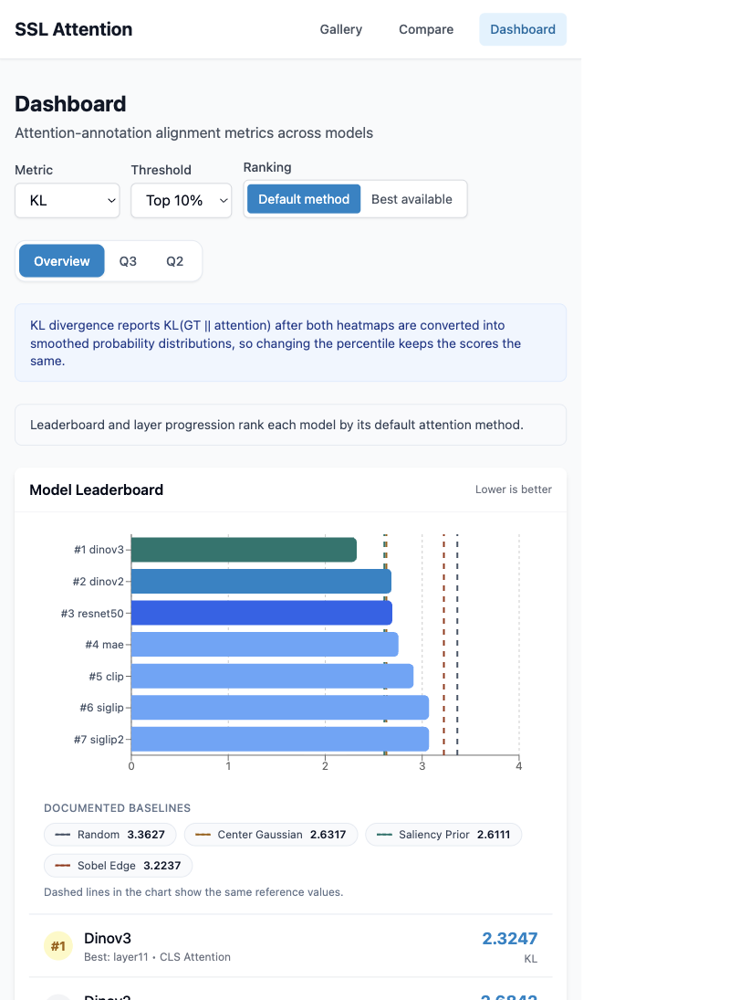

# Do Self-Supervised Vision Models Learn What Experts See?

## Working Report Draft

This document converts the earlier report-structure outline into a working draft grounded in the current repository state. It is intended to be readable as an academic report draft rather than as a planning memo, while still keeping visible placeholders for sections whose final wording depends on unsettled figures, tables, or findings.

For a LaTeX-oriented scaffold that can later be moved into the course template, see [`project_report_overleaf_skeleton.tex`](./project_report_overleaf_skeleton.tex).

This draft reflects the current project scope:

- Q1: frozen-model attention alignment
- Q2: fine-tuning effects on attention alignment
- Q3: per-head specialization

It also reflects the current project guidance from the repo: keep the report question-driven, foreground methodology and calibrated interpretation, and avoid turning the main narrative into a route-by-route system walkthrough.

> Note to self: keep the observations and analysis grounded in how each compared model family is pretrained and how representation learning is induced, rather than treating all of the models as if they learned the same kind of visual evidence. The comparison spans self-distillation (`dinov2`, `dinov3`), masked reconstruction (`mae`), language-image contrastive training (`clip`, `siglip`, `siglip2`), and a supervised CNN baseline (`resnet50`), with additional differences inside those groups such as Gram anchoring in `dinov3` and the denser grounding components in `siglip2`. Tie the narrative back to how those objective and training differences may shape frozen spatial priors, fine-tuning headroom, and the kinds of expert-aligned patterns we observe.

## 1. Abstract

Self-supervised vision models achieve strong downstream performance, but high classification accuracy alone does not reveal whether those models attend to the same visual evidence that human experts consider diagnostically important. This project studies that question in the WikiChurches setting, where expert bounding boxes identify architectural features such as arches, windows, towers, and facade elements that matter for style recognition. We evaluate seven vision models across self-distillation, masked autoencoding, multimodal contrastive pretraining, and a supervised CNN baseline, then measure attention-alignment against 631 expert boxes on 139 annotated church images using IoU, Coverage, MSE, KL divergence, and EMD. The study is organized around three linked questions: how well frozen models align with expert-marked regions, how Linear Probe, LoRA, and Full fine-tuning change that alignment, and whether individual attention heads exhibit descriptive specialization for different architectural features. The current repository already supports the full pipeline for dataset preparation, attention extraction, metric precomputation, fine-tuning analysis, and interactive inspection through a backend and frontend analysis application.

The Q2 findings are that fine-tuning moves attention unevenly across families: CLIP gains the most (IoU 0.0181→0.0745, Cohen's d≈1.0) but its gains concentrate on Gothic and Romanesque features that are densely described in English-language web text; MAE's largest single-style gain is on Renaissance, driven specifically by pediment geometry; and the DINO family preserves its already-strong frozen alignment. Models with different pretraining objectives converge on the same structurally easy images rather than covering complementary subsets, with DINOv3 frozen IoU predicting per-image CLIP Δ at Pearson r=+0.677.

For Q1, frozen expert-aligned attention is present but highly model-family dependent: DINOv3 is the only model with consistently strong cross-metric alignment, leading the default-method benchmark on overlap and distributional metrics and clearing all calibrated continuous baselines, while the other frozen models show more partial or metric-specific alignment.

> TODO: Add the final abstract findings sentence for the headline Q3 claim once that section locks.

## 2. Project-At-A-Glance Overview

The report studies whether vision models that perform well on style classification also focus on the same architectural evidence that experts use. The current repo state supports a multi-model benchmark, a fine-tuning shift analysis, and a scoped per-head study.

| Study dimension | Current repo-grounded value |
| --- | --- |
| Compared frozen models | 7 |
| Fine-tuning strategies | 3 |
| Alignment metrics | 5 |
| Annotated evaluation images | 139 |
| Expert bounding boxes | 631 |
| Architectural feature types in the ontology | 106 |
| Core research questions | 3 |
| Primary Q3 headline-study models | 4 (`dinov2`, `dinov3`, `mae`, `clip`) |

The project combines a research pipeline and an analysis interface. The pipeline extracts model attention, computes calibrated alignment metrics, stores experiment artifacts, and precomputes cache-backed summaries. The app then exposes those results through Gallery, Image Detail, Dashboard, Compare, Q2, and Q3 surfaces that let the team inspect the same findings at dataset, model, layer, and image level.

> TODO: Insert opening overview table or infographic summarizing the study. Candidate inputs: `README.md`, `docs/core/one_pager_pitch.md`, `outputs/results/active_experiment.json`.

## 3. Introduction and Motivation

A vision model can be correct for the wrong visual reasons. In architectural style recognition, a model that classifies a church as Gothic because it attends to pointed arches and flying buttresses is qualitatively different from one that succeeds because it exploits background regularities, photographer bias, or other shortcuts unrelated to expert reasoning. Accuracy alone cannot distinguish between those cases. For a project framed around trust, interpretability, and the relationship between representation learning and domain knowledge, the question is not only whether a model predicts the right label, but also whether it looks at the right evidence.

WikiChurches provides a strong evaluation setting for that question because it pairs fine-grained architectural-style labels with expert bounding boxes marking characteristic visual features. Those annotations make it possible to compare model attention directly against human expert targets instead of inferring plausibility indirectly from class predictions. They also anchor the evaluation in a domain where meaningful distinctions depend on visually specific, repeated, and semantically rich structures rather than on generic object categories alone.

This report addresses three gaps that the current repo is explicitly designed to study together. First, it compares multiple frozen SSL paradigms and a supervised baseline against the same expert annotations rather than evaluating a single model family in isolation. Second, it asks how attention changes after task adaptation, using shared evaluation images and multiple fine-tuning strategies instead of relying only on frozen-model inspection. Third, it asks whether the model's attention behavior is uniform across heads or whether a smaller subset of heads appears to align better with certain feature types. Taken together, these questions shift the project from a visualization exercise into a domain-grounded evaluation study of what different pretraining and adaptation choices encourage models to attend to.

## 4. Research Questions and Contributions

The study is organized around three linked research questions. Q1 establishes the baseline frozen-model benchmark. Q2 asks whether task-specific adaptation changes that alignment and whether strategy choice matters. Q3 narrows the focus to the descriptive specialization of individual attention heads.

### 4.1 Q1: Frozen-Model Attention Alignment

Do frozen SSL and baseline vision models attend to the same architectural regions that human experts mark as diagnostically important? This is the core benchmark question. It asks whether alignment with expert evidence is already present in the pretraining regime before any task-specific adaptation.

### 4.2 Q2: Fine-Tuning and Attention Shift

How does attention change after adaptation to the style-classification task, and does the strategy matter? This question compares Linear Probe, LoRA, and Full fine-tuning using the same annotated evaluation images. It treats attention shift as both a directional question and a magnitude question: fine-tuning may preserve, improve, or degrade alignment, and the same strategy need not affect every model family in the same way.

### 4.3 Q3: Per-Head Specialization

Do individual attention heads exhibit descriptive specialization for different architectural features, and do the dominant heads change across variants? Q3 is scoped more narrowly than Q1 and Q2. Its goal is not to prove causal explanations for predictions, but to test whether some heads align more strongly than others with expert-marked structures and feature types.

### 4.4 Contributions

- A multi-metric benchmark for comparing expert-alignment across frozen SSL model families and a supervised baseline on the same annotated evaluation set.
- A calibrated Q1 interpretation layer that compares continuous metrics against naive baselines rather than treating raw scores as self-explanatory.
- A Q2 analysis workflow that compares frozen-to-fine-tuned attention shifts across Linear Probe, LoRA, and Full fine-tuning using shared evaluation images and experiment-scoped provenance.
- A scoped Q3 per-head study that reuses the metric pipeline to rank heads and inspect head-feature patterns without overstating causal claims.
- A reproducible pipeline and interactive analysis interface that connect precomputation, experiment artifacts, and qualitative inspection.

## 5. Related Work

### 5.1 Attention Interpretability in Vision Transformers

Prior work has already shown that attention maps in vision transformers can carry useful spatial structure, but the literature is careful about what those maps do and do not prove. DINO popularized the observation that late-layer self-attention can resemble semantic object masks, while attention-rollout work argued that single-layer raw attention may miss how information flows across the full network. Transformer-interpretability work by Chefer et al. further demonstrated that attention visualization alone is not a complete explanation method, which is one reason this project frames its outputs as alignment measurements and descriptive evidence rather than as definitive causal proof.

Representative sources already cited elsewhere in the repo include:

- [Caron et al. (2021), *Emerging Properties in Self-Supervised Vision Transformers*](https://arxiv.org/abs/2104.14294)
- [Oquab et al. (2024), *DINOv2: Learning Robust Visual Features without Supervision*](https://arxiv.org/abs/2304.07193)
- [Siméoni et al. (2025), *DINOv3*](https://arxiv.org/abs/2508.10104)
- [Abnar and Zuidema (2020), *Quantifying Attention Flow in Transformers*](https://arxiv.org/abs/2005.00928)
- [Chefer et al. (2021), *Transformer Interpretability Beyond Attention Visualization*](https://arxiv.org/abs/2012.09838)

### 5.2 Evaluation Against Human or Expert Annotations

The most relevant methodological precedent is the broader literature that compares model explanations against human- or expert-provided spatial targets. In computer vision, IoU-style localization evaluation, pointing-game style metrics, and plausibility-oriented explanation benchmarks established the basic pattern of comparing model-derived maps against annotated regions. More recent work in medical imaging has applied similar logic to expert annotations and found that model families behave differently when the evaluation target is domain-specific rather than generic. That precedent strengthens the framing of this project as a domain-grounded evaluation study rather than as a new interpretability algorithm.

Representative sources already cited elsewhere in the repo include:

- [Zhou et al. (2016), *Learning Deep Features for Discriminative Localization*](https://arxiv.org/abs/1512.04150)
- [Zhang et al. (2016), *Top-Down Neural Attention by Excitation Backprop*](https://arxiv.org/abs/1511.02668)
- [Choe et al. (2020), *Evaluating Weakly Supervised Object Localization Methods Right*](https://arxiv.org/abs/1910.12449)
- [Chung et al. (2025), *What Should We Learn from Attention Maps? A ViT Study in Medical Imaging*](https://arxiv.org/abs/2503.09535)

### 5.3 Fine-Tuning, Representation Shift, and Attention Drift

The fine-tuning literature suggests that adaptation can reshape pretrained representations in ways that are useful, unstable, or both. Kumar et al. showed that fine-tuning can distort pretrained features relative to linear-probe-style controls, while Biderman et al. argued that LoRA tends to learn less and forget less than full fine-tuning. Work on attention transfer and self-supervised ViT analysis further suggests that attention patterns are not incidental to downstream performance. Q2 builds on this literature by asking not just whether representations change, but whether the change moves attention toward or away from expert-marked architectural evidence.

Representative sources already cited elsewhere in the repo include:

- [Kumar et al. (2022), *Fine-Tuning can Distort Pretrained Features and Underperform Out-of-Distribution*](https://arxiv.org/abs/2202.10054)
- [Biderman et al. (2024), *LoRA Learns Less and Forgets Less*](https://arxiv.org/abs/2405.09673)
- [Park et al. (2023), *What Do Self-Supervised Vision Transformers Learn?*](https://openreview.net/forum?id=azCKuYyS74)
- [Li et al. (2024), *On the Surprising Effectiveness of Attention Transfer for Vision Transformers*](https://arxiv.org/abs/2411.09702)

### 5.4 Attention-Head Specialization

The head-specialization literature, especially Voita et al., established the broader idea that only a subset of heads may carry the most interpretable or task-relevant behavior. Later ViT work extended that intuition to head-level spatial patterns in vision models. Q3 adopts that descriptive framing. It asks whether some heads align more strongly with architectural features than others, not whether one can reduce the full model decision to a single head.

Representative sources already cited elsewhere in the repo include:

- [Voita et al. (2019), *Analyzing Multi-Head Self-Attention: Specialized Heads Do the Heavy Lifting*](https://arxiv.org/abs/1905.09418)
- [Li et al. (2023), *Interpreting Vision Transformer from Head Distribution*](https://doi.org/10.1109/TVCG.2023.3327840)
- [Walmer et al. (2023), *Teaching Matters: Investigating the Role of Supervision in Vision Transformers*](https://openaccess.thecvf.com/content/CVPR2023/papers/Walmer_Teaching_Matters_Investigating_the_Role_of_Supervision_in_Vision_Transformers_CVPR_2023_paper.pdf)
- [Raghu et al. (2021), *Do Vision Transformers See Like Convolutional Neural Networks?*](https://arxiv.org/abs/2108.08810)

### 5.5 Cultural Heritage and Architectural Recognition Context

Architectural heritage and cultural-recognition datasets are less saturated than standard object-recognition benchmarks, yet they are especially appropriate for attention-alignment studies because the diagnostic evidence is often structural, expert-defined, and visually localized. WikiChurches is particularly useful in this regard because it combines style labels with bounding-box annotations of characteristic building parts. The project's novelty therefore lies less in inventing a new metric than in bringing together expert-annotation-grounded evaluation, multiple SSL paradigms, adaptation analysis, and an architecture-focused domain where "looking at the right evidence" is central to the research question.

Representative sources already cited elsewhere in the repo include:

- [Barz and Denzler (2021), *WikiChurches: A Fine-Grained Dataset of Architectural Styles with Real-World Challenges*](https://arxiv.org/abs/2108.06959)
- [Hu et al. (2025), *ASCENT-ViT: Attentive Semantic Concept Explainability for Vision Transformers*](https://www.ijcai.org/proceedings/2025/58)

> TODO: Convert these inline markdown links into the course citation style and final bibliography format. Current source notes: `docs/research/claude_novelty_check.md`, `docs/research/attention_methods.md`, and `docs/reference/metrics_methodology.md`.

## 6. Dataset and Problem Setup

The primary dataset is WikiChurches, a fine-grained architectural-style dataset centered on European church buildings. For this project, the dataset matters not only because it supports classification, but because it includes expert annotations of diagnostically important building parts. Those boxes make it possible to evaluate whether models attend to the same structural evidence that experts use to distinguish styles.

The report uses two related data scopes. The first is the annotated subset used for attention-alignment evaluation: 139 images with 631 expert bounding boxes. The second is the larger style-labeled pool derived from `churches.json`, which supports linear-probe and fine-tuning experiments. The root documentation cites 9,485 images in the official WikiChurches release. The implementation also documents that a local mirror may expose a slightly different raw file count, but the main report should anchor its description to the official release and to the 139-image expert-annotated subset that defines the alignment benchmark.

The annotation file `building_parts.json` defines an ontology of 106 feature types and stores bounding boxes in normalized `left`, `top`, `width`, `height` coordinates. The code clamps negative left or top coordinates to zero, converts boxes into pixel masks at the target heatmap resolution, and combines multiple boxes per image into a union mask for the primary image-level IoU and Coverage calculations. The current project proposal documents the annotated style distribution as Romanesque 51, Gothic 49, Renaissance 22, and Baroque 17, and the implementation maps the corresponding Wikidata style IDs into the working style-classification labels used for training and evaluation.

The current preprocessing strategy keeps the annotated evaluation images out of the primary fine-tuning train and validation splits. This separation matters because Q2 asks how adaptation changes attention on the same expert-annotated pool, so those images should remain evaluation-only in the primary experiment path. For the attention pipeline, the project uses model-appropriate image preprocessing and generates standardized heatmaps at the app's working resolution for metric computation and visualization.

The most important dataset caveat is sparse annotation bias. WikiChurches annotates representative instances of features rather than exhaustively marking every visible instance. As a result, a model can correctly attend to several copies of the same feature while still being penalized by IoU for attending outside the single annotated box. This affects per-bbox interpretation most strongly and should be treated as a documented limitation rather than as a bug in the metric implementation. The current repo addresses this by emphasizing cross-metric interpretation, by distinguishing union-mask from per-bbox views, and by keeping the limitation visible in both methodology and discussion.

## 7. Methodology

The methodology is designed to support a comparative evaluation study rather than a single-model demo. It therefore has to define model coverage, attention extraction rules, metric interpretation, experimental splits, statistical comparisons, and reproducibility safeguards in a way that remains coherent across Q1, Q2, and Q3.

### 7.1 Models and Attention Extraction

The frozen benchmark compares seven models. Six are transformer-based models: `dinov2`, `dinov3`, `mae`, `clip`, `siglip`, and `siglip2`. The seventh, `resnet50`, acts as a supervised CNN baseline. All transformer models use ViT-Base scale backbones in the current implementation. DINOv2 uses a patch-size-14 configuration with 4 register tokens and a 16 x 16 spatial patch grid. DINOv3, MAE, CLIP, SigLIP, and SigLIP2 use patch size 16 and a 14 x 14 patch grid at the standard input resolution. ResNet-50 is handled through a separate Grad-CAM path.

The attention-extraction method depends on model architecture. For DINOv2, DINOv3, MAE, and CLIP, the main methods are CLS attention and attention rollout. CLS attention isolates the class token's attention to patch tokens in a selected layer. Attention rollout composes attention across layers to capture indirect information flow. For SigLIP and SigLIP2, the project uses a mean attention proxy because those models do not expose a CLS-token path equivalent to the DINO, MAE, or CLIP setup. For ResNet-50, the interpretability baseline is Grad-CAM rather than transformer attention. The extraction methods are summarised below.

| Extraction Method | Models | Description|
| :---- | :---- | :---- |
| **CLS token attention** | DINOv2, DINOv3, MAE, CLIP | Aggregate attention from [CLS] token to spatial patches across heads. Supports head fusion strategies: mean (default), max, or min across the 12 attention heads.|
| **Attention rollout** | DINOv2, DINOv3, MAE, CLIP | Propagate attention through layers to capture indirect dependencies. Recursive layer-wise multiplication following Abnar & Zuidema (2020).|
| **Mean attention** | SigLIP, SigLIP2 | Average attention across all tokens for models without [CLS] token. In this project it is used as an interpretability proxy for models that expose a separate pooling head rather than a CLS-token attention path.|
| **Grad-CAM (baseline)** | ResNET | Gradient-weighted activation maps across all 4 ResNet stages (7×7 final feature grid).|

These choices are important for interpretation. CLS attention and rollout are not interchangeable, and mean attention for the SigLIP family is an interpretability proxy rather than an architecture-native pooling explanation. That distinction becomes especially important in Q3, where the report should avoid mixing architecture-native and proxy-based per-head claims without qualification.

| Model | Training paradigm | Default method | Other supported method(s) |
| --- | --- | --- | --- |
| `dinov2` | Self-distillation | `cls` | `rollout` |
| `dinov3` | Self-distillation with Gram anchoring | `cls` | `rollout` |
| `mae` | Masked autoencoding | `cls` | `rollout` |
| `clip` | Contrastive language-image pretraining | `cls` | `rollout` |
| `siglip` | Sigmoid-based contrastive language-image pretraining | `mean` | None |
| `siglip2` | Sigmoid-based contrastive pretraining with improved dense features | `mean` | None |
| `resnet50` | Supervised CNN baseline | `gradcam` | None |

### 7.2 Alignment Metrics

The project uses five alignment metrics because no single score is sufficient for all of the intended interpretations. IoU and Coverage answer slightly different questions about whether the model's attention lands on expert-marked regions. MSE, KL divergence, and EMD compare the full heatmap against a soft target derived from the boxes and help distinguish overlap from distributional fit.

IoU is the primary threshold-dependent overlap metric. It thresholds the attention heatmap using exact pixel-count percentile selection via `torch.topk` and measures overlap against the union of all boxes for the image. Higher IoU is better. Coverage is threshold-free and measures what fraction of total attention energy falls inside the annotated union mask. Higher Coverage is better. MSE, KL, and EMD are computed against a Gaussian soft-union target derived from the expert boxes. Lower MSE, lower KL, and lower EMD are better. The report should make that direction explicit whenever these metrics first appear because the lower-is-better convention for the continuous metrics affects both Q1 leaderboard interpretation and Q2 delta interpretation.

| Metric | Type | Target representation | Direction |
| --- | --- | --- | --- |
| IoU | Threshold-dependent | Binary union mask | Higher is better |
| Coverage | Threshold-free | Binary union mask with attention energy | Higher is better |
| MSE | Threshold-free | Gaussian soft-union heatmap | Lower is better |
| KL divergence | Threshold-free | Gaussian soft-union distribution | Lower is better |
| EMD | Threshold-free | Gaussian soft-union distribution on shared 8 x 8 support | Lower is better |

### 7.3 Baselines and Calibration

Raw continuous-metric values are difficult to interpret without reference points, because unlike accuracy they do not come with a fixed notion of "chance" or "ceiling." The current project therefore calibrates Q1 continuous metrics against naive baselines: random attention, center Gaussian, saliency prior, and Sobel edge. This matters because a model that merely beats random attention is not necessarily attending to expert-relevant structures in a meaningful way. Stronger evidence comes from beating several naive baselines, including ones that capture generic center or low-level edge biases.

The documented dataset-level baseline references currently used in the repo are shown below. Lower is better for every metric in the table.

| Baseline | MSE | KL | EMD |
| --- | --- | --- | --- |
| Random | 0.3192 | 3.3627 | 0.3468 |
| Center Gaussian | 0.1770 | 2.6317 | 0.2836 |
| Saliency Prior | 0.0957 | 2.6111 | 0.2654 |
| Sobel Edge | 0.0376 | 3.2237 | 0.3137 |

These calibration values make it possible to interpret Q1 results in a more measured way. For example, beating random only is weak evidence, matching center bias suggests generic spatial priors may still dominate, and beating all naive baselines on a metric is stronger support that the model is capturing non-trivial semantic alignment rather than only generic image structure.

### 7.4 Fine-Tuning Protocol

Q2 uses a shared experiment-batch workflow. The primary fine-tuning path trains on the non-annotated style-labeled pool, reuses one shared stratified validation split across all `model x strategy` runs in the same batch, selects the best checkpoint per run by classification validation accuracy, and then evaluates attention alignment on the held-out annotated evaluation images. The 139 bbox-annotated images are excluded from the primary train and validation split and remain the evaluation pool for frozen-vs-fine-tuned comparison.

The current comparison covers three strategies. Linear Probe freezes the backbone and trains only the classification head. LoRA inserts trainable low-rank adapters into attention layers while keeping the backbone largely frozen. Full fine-tuning updates the backbone end-to-end. ResNet-50 is not part of the fine-tuning comparison. The canonical artifact layout is experiment scoped and selected through `outputs/results/active_experiment.json`, which points the app and reporting scripts to the active run matrix and Q2 analysis artifact.

| Strategy | Backbone updates | Intended role in Q2 |
| --- | --- | --- |
| Linear Probe | No | Frozen-backbone control |
| LoRA | Parameter-efficient partial adaptation | Intermediate attention shift |
| Full fine-tuning | Yes, end-to-end | Maximum adaptation capacity |

### 7.5 Q3 Per-Head Scope

Q3 is intentionally narrower than the rest of the report. The most defensible headline scope is the set of architecture-native CLS-token models: `dinov2`, `dinov3`, `mae`, and `clip`. Within that scope, the primary variants are `frozen`, `lora`, and `full`, while `linear_probe` is best treated as a control condition rather than as a main adaptation claim because the backbone does not change. The main Q3 method is `cls`.

The report should explicitly exclude `siglip` and `siglip2` from the primary Q3 claim because their per-head analysis relies on a mean-attention proxy rather than the model's learned pooling head. It should also exclude `resnet50`, which has no transformer attention heads, and avoid claiming that raw per-head attention proves causal feature use. In this report, Q3 is a descriptive head-specialization analysis.

### 7.6 Statistical Analysis

The repo supports paired model comparisons, paired t-tests, Wilcoxon signed-rank tests, bootstrap confidence intervals, Cohen's d for paired differences, and Holm multiple-comparison correction. This statistical layer is especially important in Q2, where the same evaluation images are reused across frozen and fine-tuned conditions and where many model-strategy-metric combinations are compared within shared correction families. The current experiment artifacts serialize correction metadata explicitly, which helps preserve the logic behind headline significance calls instead of leaving it implicit in separate analysis notes.

### 7.7 Methodological Safeguards and Reproducibility

Several design choices strengthen the credibility of the findings. The project uses stable model configuration definitions, exact top-k thresholding for IoU, documented Gaussian-target construction for continuous metrics, explicit dataset-split artifacts for the primary fine-tuning path, and experiment-scoped manifests and run matrices that preserve checkpoint-selection provenance. Combined with cache-backed metric storage and active-experiment pointers, this gives the report a defensible artifact-based workflow rather than a collection of ad hoc screenshots or manually assembled numbers.

## 8. System and Analysis Interface

The software system is the vehicle for running the study and inspecting the results. It should therefore appear in the report as supporting infrastructure rather than as the sole research contribution. At a high level, the system has three layers.

The first layer is the precompute and cache pipeline. It generates frozen and fine-tuned attention heatmaps, feature caches, heatmap images, and the SQLite metrics database that powers leaderboard, progression, Q2, and Q3 queries. The same pipeline also supports per-head cache generation for the scoped Q3 study.

The second layer is the experiment workflow. Fine-tuning scripts write checkpoints, run manifests, split artifacts, experiment ledgers, run matrices, and Q2 summary artifacts into experiment-scoped output directories. This is the operational backbone of the Q2 analysis and the reason the report can describe checkpoint selection, evaluation holdout discipline, and artifact provenance in concrete terms.

The third layer is the analysis interface itself: a FastAPI backend plus a React frontend. The frontend exposes Gallery, Image Detail, Compare, Dashboard, Q2, and Q3 surfaces. The backend resolves cached attention, metrics, and comparison summaries into those views. For the report, the key point is that the app supports the research workflow by making the same quantitative and qualitative evidence inspectable at multiple levels, not that every route is a separate result.

## 9. Results

The current repo already contains enough checked-in artifacts to support a substantive draft narrative for Q1 and Q2, while Q3 remains appropriately more placeholder-heavy. Because the report is still a mixed draft, the sections below treat the existing artifacts as current evidence rather than as permanently frozen final tables.

### 9.1 Q1 Results: Frozen-Model Attention Alignment

Q1 asks whether attention alignment with expert architectural annotations is already present before task-specific adaptation. The current frozen-model evidence is strong enough to answer that question, but only if the result is read as a multi-metric benchmark rather than as a single leaderboard. The table below uses the default-method Q1 ranking semantics from `outputs/cache/metrics_summary.json` (`ranking_mode = default_method`) and the continuous-baseline clearances from `outputs/results/q1_continuous_baseline_comparison.json`. Each score is the model's best default-method layer for that metric on the 139 annotated images. The rows are ranked by `IoU@90`, where `90` means the top 10% of pixels by attention value under the exact pixel-count `torch.topk` thresholding rule.

| Rank by `IoU@90` | Model | Training paradigm | Method | `IoU@90` | Coverage | MSE | KL | EMD | Continuous baseline clearance |
| --- | --- | --- | --- | --- | --- | --- | --- | --- | --- |
| 1 | `dinov3` | Self-distillation with Gram anchoring | `cls` | 0.1327 (layer11) | 0.1373 (layer11) | 0.0270 (layer0) | 2.3247 (layer11) | 0.2600 (layer11) | MSE 4/4; KL 4/4; EMD 4/4 |
| 2 | `resnet50` | Supervised CNN baseline | `gradcam` | 0.0903 (layer3) | 0.1043 (layer3) | 0.0242 (layer2) | 2.6917 (layer3) | 0.3025 (layer3) | MSE 4/4; KL 2/4; EMD 2/4 |
| 3 | `dinov2` | Self-distillation | `cls` | 0.0816 (layer11) | 0.1004 (layer11) | 0.0209 (layer0) | 2.6842 (layer11) | 0.2978 (layer11) | MSE 4/4; KL 2/4; EMD 2/4 |
| 4 | `mae` | Masked autoencoding | `cls` | 0.0702 (layer11) | 0.0904 (layer11) | 0.0483 (layer3) | 2.7562 (layer10) | 0.3177 (layer10) | MSE 3/4; KL 2/4; EMD 1/4 |
| 5 | `clip` | Language-image contrastive pretraining | `cls` | 0.0485 (layer0) | 0.0851 (layer0) | 0.0211 (layer6) | 2.9122 (layer0) | 0.3261 (layer0) | MSE 4/4; KL 2/4; EMD 1/4 |
| 6 | `siglip` | Sigmoid language-image contrastive pretraining | `mean` | 0.0466 (layer4) | 0.0705 (layer4) | 0.0175 (layer6) | 3.0710 (layer4) | 0.3538 (layer4) | MSE 4/4; KL 2/4; EMD 0/4 |
| 7 | `siglip2` | Sigmoid contrastive pretraining with denser grounding components | `mean` | 0.0466 (layer4) | 0.0705 (layer4) | 0.0175 (layer6) | 3.0710 (layer4) | 0.3538 (layer4) | MSE 4/4; KL 2/4; EMD 0/4 |

The most defensible headline is that DINOv3 has the cleanest frozen cross-metric alignment profile. It leads the checked-in default-method leaderboard on `IoU@90`, Coverage, KL, and EMD. It is not the absolute winner on MSE, where the SigLIP family scores lowest, but the calibrated Q1 artifact shows that DINOv3 is the only model that beats all four naive baselines on all three continuous metrics when each metric is evaluated at that model's best default-method layer. This distinction matters: a model can look good on one metric while still failing a stronger calibration check.

One plausible hypothesis is that DINOv3's Q1 advantage comes from the interaction of scale, curated data, and a training recipe that explicitly preserves dense spatial structure, rather than from dataset size alone. The DINOv2 paper already argues that curated, diverse data improves feature quality beyond raw web scale. DINOv3 then scales the DINOv2-style recipe to a much larger curated corpus and model, but its more Q1-relevant addition is Gram anchoring: the DINOv3 technical report identifies dense-feature degradation as a failure mode of long SSL training and introduces Gram anchoring to stabilize patch-level feature maps. Because this project's Q1 metrics reward spatial correspondence to expert boxes, a method designed to preserve clean dense features is a natural fit for the observed DINOv3 pattern. This remains a hypothesis, not a causal claim, because the current WikiChurches artifact does not ablate DINOv3's data size, model scale, and Gram-anchored training separately.

*Draft Figure. Direct screenshot from the React dashboard for a cited continuous metric. With `Metric = KL`, `Threshold = Top 10%`, and `Ranking = Default method`, DINOv3 ranks first at layer11 with KL = 2.3247 and is shown against the documented random, center Gaussian, saliency-prior, and Sobel-edge baselines. The linked dashboard route is local and requires the development server.*

The headline rank differences are also supported by paired image-level checks from `outputs/cache/metrics.db`. The table below compares DINOv3 with the next-best model for the metric in question, using the same best default-method layers reported above. Mean improvement is sign-normalized so positive values always favor DINOv3. The one-sided Wilcoxon signed-rank p-values are Holm-adjusted across the 21 pairwise model comparisons within each metric.

| Metric | Headline comparison | Mean paired improvement | 95% bootstrap CI | `p_Holm` | `d_z` |
| --- | --- | ---: | ---: | ---: | ---: |
| `IoU@90` | `dinov3` vs `resnet50` | 0.0425 | [0.0280, 0.0572] | 1.31e-07 | 0.48 |
| Coverage | `dinov3` vs `resnet50` | 0.0330 | [0.0271, 0.0391] | 4.48e-17 | 0.91 |
| KL | `dinov3` vs `dinov2` | 0.3595 | [0.3153, 0.4030] | 4.43e-21 | 1.39 |
| EMD | `dinov3` vs `dinov2` | 0.0378 | [0.0338, 0.0419] | 4.43e-22 | 1.57 |

The second tier depends on which part of alignment is emphasized. `resnet50` is second on the two overlap-style metrics, `IoU@90` and Coverage, which shows that the supervised CNN baseline has meaningful localization behavior under Grad-CAM. However, ResNet-50 does not clear all continuous baselines on KL or EMD, so its spatial distribution is less robust than DINOv3's when the full heatmap is compared to the Gaussian soft-union target. `dinov2` is slightly weaker than ResNet-50 on overlap, but it is second on KL and EMD and therefore gives the stronger distributional second-tier story among the transformer models. This is consistent with the broader DINO literature: self-distillation often produces late-layer attention that is more object- or part-like even before downstream supervision.

MAE and CLIP show more limited frozen alignment. MAE reaches a respectable `IoU@90` and Coverage at late layers, but it fails the Sobel baseline on MSE and beats only the random baseline on EMD. That pattern is plausible for masked reconstruction: the model can preserve broad structural context without necessarily concentrating attention on the expert-marked parts that separate architectural styles. CLIP is especially useful as a contrast case because its best frozen overlap and distributional scores occur at layer 0 rather than in a late-layer regime. In this dataset, the language-image contrastive objective appears to encode useful visual semantics without producing the same late-layer expert-box alignment seen in DINOv3.

The SigLIP family provides the sharpest warning against one-metric interpretation. `siglip` and `siglip2` have the best frozen MSE values (`0.0175`), so they look strongest if Q1 is judged only by bounded pointwise error against the Gaussian target. But both have EMD `0.3538`, which is worse than the random-attention baseline of `0.3468`. In plain terms, their maps can be locally smooth or low-error under MSE while still placing attention mass in the wrong regions under a transport-distance view. Because SigLIP and SigLIP2 are also evaluated through a mean-attention proxy rather than a CLS-token pathway, the report should treat them as a useful contrastive family result rather than claim that SigLIP2 improves Q1 alignment over SigLIP in the current frozen artifact.

The absolute IoU values should not be read like classification accuracy. The primary `IoU@90` result uses a top-10%-of-pixels attention mask and compares it with the union of expert boxes for each image. Because the annotations are sparse and often cover much less or much more than exactly 10% of the image, even good spatial correspondence does not imply an IoU near 1.0. The more important point is therefore comparative and calibrated: DINOv3 is well ahead of the other frozen models on overlap, clears the strongest continuous-baseline test, and remains statistically separated from the next-best model on the headline metrics. Q1 therefore supports a measured answer: frozen expert-aligned attention is present in some pretrained models, strongest in DINOv3, but it is not a generic property of all SSL or vision-language pretraining objectives.

### 9.2 Q2 Results: Fine-Tuning Effects on Attention

The current Q2 artifacts support a clear provisional storyline: Linear Probe acts as a near-zero control, while LoRA and Full fine-tuning produce model-dependent attention shifts rather than a uniform "fine-tuning helps" story. In the checked-in experiment `fine_tuning_primary_20260327`, the reference Q2 rows show exactly zero deltas for Linear Probe across all reported metrics because the backbone remains frozen. That behavior is methodologically useful because it confirms that the Q2 pipeline is measuring attention change in the model rather than merely recomputing the same frozen heatmaps under a new label.

The checked-in multi-metric improvement heatmap is already strong enough to include in this mixed draft because it compresses the full strategy comparison into one view and makes the zero-shift Linear Probe control immediately visible.

*Draft Figure. Sign-normalized Q2 metric deltas for each model and strategy. Blue denotes improvement, red denotes degradation, and asterisks denote significance in the generated artifact. The strongest positive clusters appear in CLIP, MAE, and the SigLIP family, while Linear Probe remains at zero by construction.*

The most dramatic improvement currently appears in CLIP. Full fine-tuning raises CLIP's `IoU@90` from `0.0181` to `0.0745` and raises Coverage from `0.0510` to `0.1047`, while also decreasing KL from `3.6873` to `2.6967` and EMD from `0.4096` to `0.3071`. LoRA also improves CLIP substantially, but not as strongly as Full fine-tuning. On WikiChurches, that pattern is meaningful because the diagnostic evidence is not a generic whole-object foreground but a set of localized architectural parts such as portals, arches, towers, and facade details. A model whose frozen attention is comparatively diffuse or global can therefore gain a great deal once the style-classification objective pushes it toward those expert-marked structures. In that sense, CLIP is not just "improving"; it is being retargeted from a weaker frozen spatial prior toward the kind of localized evidence this dataset rewards. That reading is consistent with prior work such as Walmer et al., which shows that supervision regime affects how vision transformers distribute attention.

MAE and the SigLIP family also show meaningful improvements under LoRA and Full fine-tuning, but for reasons that appear slightly different. For MAE, both strategies improve `IoU@90`, Coverage, KL, and EMD, with LoRA currently producing a particularly strong MSE reduction in the saved artifact. That fits the broader intuition from MAE-style pretraining that reconstruction objectives preserve broad contextual information but do not inherently force the model to privilege the specific regions that experts use for fine-grained style discrimination. For `siglip` and `siglip2`, LoRA and Full both improve `IoU@90`, Coverage, KL, and EMD, though the absolute frozen baseline remains weaker than the DINO-family models on the overlap metrics. A plausible interpretation is that contrastive and multilingual contrastive objectives provide strong semantic features while still leaving substantial room for downstream supervision to sharpen where attention lands inside a structured scene. By contrast, the DINO family is more stable. DINOv2 stays close to preserve across most reported metrics, while DINOv3 largely preserves its strong frozen IoU but shows some threshold-free degradation under certain adapted variants in the current artifact set.

That divergence is where the paper can say something more specific than "fine-tuning helps some models more than others." On this dataset, self-distillation-based models appear to begin with stronger frozen spatial coherence on expert-marked architectural evidence, while MAE-, CLIP-, and SigLIP-family models appear to benefit more from a task objective that reweights attention toward style-diagnostic parts. That interpretation is consistent with Caron et al. on emergent object-like attention in DINO and with Park et al. on how different self-supervised objectives produce different attention behavior. It also fits the fine-tuning comparison literature: LoRA often captures a substantial share of the improvement without the largest possible shift, while Full fine-tuning has more capacity to help but also more capacity to disturb an already strong frozen spatial prior. Substantively, Q2 is therefore not only about whether alignment rises, but about which combinations of pretraining objective and adaptation method are most compatible with expert-grounded evidence use in a fine-grained architectural domain.

The preserve/enhance/destroy framing is therefore useful, but it should be reported carefully. The current checked-in figure commentary summarizes `46` enhance, `16` preserve, and `10` destroy outcomes across `72` non-linear-probe model-strategy-metric combinations. That count is a helpful draft summary rather than a substitute for the final table, and the final report should make its counting convention explicit when the figure set is locked.

The checked-in preserve/enhance/destroy figure helps simplify that same result into an easily scannable classification layer and is worth retaining in the draft because it exposes both the dominant improvement pattern and the remaining regression risk.

*Draft Figure. Each cell classifies a model-strategy-metric outcome as Enhance, Preserve, or Destroy using the run-matrix logic described in the figure commentary. Enhancement is the dominant outcome in the current artifact set, but the remaining destroy cells show that adaptation can still move attention in the wrong direction.*

The forest-plot visualization adds the statistical layer that the heatmap and categorical summary cannot show on their own, making it easier to distinguish robust movement from small, noisy shifts.

*Draft Figure. Mean Q2 deltas with 95% bootstrap confidence intervals for LoRA and Full fine-tuning across six metrics, sign-normalized so rightward always means improvement. This is currently the clearest checked-in figure for showing that several CLIP, MAE, and SigLIP-family gains are not merely anecdotal.*

The draft can also support at least one qualitative example of attention shift rather than relying only on aggregate summaries. The current issue-focused shift map is useful as a provisional example because it shows what a localized redistribution of attention can look like on the architectural facade itself.

*Draft Figure. Example shift map for a LoRA-adapted model relative to the frozen baseline. Blue indicates regions that gained attention after adaptation and red indicates regions that lost attention. This should remain a supporting figure rather than a headline claim, but it gives the reader a concrete visual intuition for the type of change quantified by the aggregate metrics.*

#### 9.2.1 Per-Style and Per-Feature Breakdown

The aggregate deltas above mask a sharp asymmetry in where each model's improvement lands. Decomposing each model's per-image Δ IoU by the architectural style of the image exposes two patterns that the aggregate cannot show.

| Model | Romanesque (n=54) | Gothic (n=49) | Renaissance (n=22) | Baroque (n=17) |
|-------|:-----------------:|:-------------:|:-----------------:|:--------------:|
| **CLIP** | **+0.066** | **+0.079** | +0.014 | +0.013 |
| **MAE** | +0.007 | +0.009 | **+0.108** | **+0.045** |
| **SigLIP2** | +0.034 | +0.044 | +0.007 | +0.007 |
| **SigLIP** | +0.029 | +0.039 | -0.006 | +0.005 |
| **DINOv2** | -0.010 | +0.001 | -0.004 | -0.012 |
| **DINOv3** | -0.001 | +0.006 | -0.004 | -0.009 |

*Δ IoU (full fine-tuning, IoU p90, layer 11) by architectural style.*

*Figure. Per-style Δ IoU for each fine-tuned model relative to its frozen baseline. CLIP's improvement is entirely carried by Romanesque and Gothic; MAE's largest single-style gain is on Renaissance; DINOv2 and DINOv3 are flat across all four styles.*

CLIP's +0.0564 aggregate gain is not uniformly distributed across the dataset. Virtually all of it comes from Romanesque (+0.066) and Gothic (+0.079) images, with Renaissance (+0.014) and Baroque (+0.013) near zero. The strongly improving styles are dominated by features with heavy presence in English-language descriptions of churches — Romanesque Round Arch Portals and Lesenes, Gothic Pointed Arch Portals, Bull's-eye Windows, and Tracery — which is consistent with, though not directly quantified by, the hypothesis that CLIP's fine-tuning unlocks latent text-aligned patch features. Renaissance and Baroque features such as Pediments, Volutes, and Pilasters are comparatively under-represented in English alt-text, and CLIP shows little gain there. A Kruskal-Wallis test finds significant style moderation for CLIP (p=7.2e-09), MAE (p=3.8e-07), SigLIP (p=1.5e-05), and SigLIP 2 (p=5.0e-07); DINOv2 and DINOv3 are not significant (p=0.18 and p=0.12 respectively), consistent with their flat per-style profiles.

MAE's Renaissance Δ of +0.108 is the largest single-style shift observed in the dataset and is not explained by its modest aggregate (+0.029). Decomposing MAE's Renaissance improvement by feature reveals that the gain is concentrated on pediment-class shapes.

| Feature | Frozen IoU | FT IoU | Δ IoU | n images |
|---------|-----------|--------|-------|----------|
| Triangular Pediment | 0.0360 | 0.1161 | **+0.0800** | 19 |
| Cranked Cornice | 0.0045 | 0.0668 | **+0.0623** | 2 |
| Broken Pediment | 0.0054 | 0.0599 | **+0.0545** | 7 |
| Volute | 0.0087 | 0.0516 | **+0.0429** | 4 |
| Segmental Pediment | 0.0126 | 0.0543 | **+0.0417** | 7 |
| Pilaster | 0.0232 | 0.0111 | −0.0121 | 15 |
| Belt Course | 0.0311 | 0.0155 | −0.0156 | 9 |

*Per-feature Δ IoU for MAE under full fine-tuning, on Renaissance images.*

*Figure. Per-feature Δ IoU for MAE, full fine-tuning, on the 22 Renaissance images. Pediment-class features dominate the positive tail; Pilaster and Belt Course show negative Δ.*

Two points stand out. First, the frozen IoU values for the top-gaining pediment features are near zero, so fine-tuning is creating alignment from scratch rather than amplifying a pre-existing advantage. Second, the most common Renaissance features — Pilaster (15 images) and Belt Course (9 images) — show negative Δ, meaning fine-tuning actively shifts MAE's attention away from them and toward the pediment forms. A plausible reading consistent with MAE's pixel-reconstruction pretraining is that the 75%-masking objective rewards precise local geometry, pediments are geometrically compact and Renaissance-exclusive in this dataset, and the style-classification gradient routes attention to the most discriminative geometric forms while suppressing features that appear across multiple styles.

A caveat applies to the Baroque column. The annotated Baroque subset has only 1.8 boxes per image (versus 4.2–5.9 for the other three styles), so the weak improvement across all models partly reflects a weaker evaluation signal rather than a clean null. The report should not over-interpret Baroque Δ values in either direction.

#### 9.2.2 Cross-Model Structure: Shared Easy Images

The per-style table invites a second question: are different models improving on the same images through different mechanisms, or are they finding complementary subsets that ensemble well? A per-image correlation analysis points clearly to the first answer.

*Figure. Per-image scatter of CLIP Δ IoU (y-axis) against each other model's frozen IoU (x-axis), across the 139 annotated images. CLIP is the reference because its Δ is both the largest and the most interpretable. The DINOv3 panel shows the central finding: images where DINOv3's pretraining already produces expert-aligned attention are the same images where CLIP's fine-tuning succeeds.*

Across the 139 annotated images, DINOv3 frozen IoU predicts CLIP Δ IoU at Pearson r=+0.677 (Spearman ρ=+0.681, both p<0.0001). That is a large effect on a modest sample, and it reframes what CLIP's fine-tuning is doing. The images CLIP "gains" on are not a CLIP-specific niche; they are the images whose expert annotations cover visually prominent, spatially compact regions — regions that any spatially-sensitive model (frozen DINOv3 or fine-tuned CLIP) can align to given the right training signal. The structural barrier is the image, not the model family. Appendix A illustrates this concretely with four representative examples — two structurally easy and two structurally hard — showing the DINOv3 frozen attention heatmap alongside the CLIP frozen-vs-fine-tuned shift map for each.

Extending this to all pairwise per-image Δ correlations produces three clusters. The language cluster — CLIP, SigLIP, SigLIP2 — shows within-cluster correlations of roughly r=0.43–0.58, consistent with these three models sharing the same frozen deficiency (no patch-level spatial pressure during pretraining) and therefore improving on the same images when adaptation supplies spatial signal. MAE is anti-correlated with the language cluster at r≈−0.22 to −0.31, which is consistent with MAE's Renaissance pediment finding: its improvements target a different image subset (Renaissance geometry) rather than the Gothic/Romanesque portals the language cluster responds to. The DINO pair (DINOv2, DINOv3) correlates weakly with each other (r=0.33) and near zero with the language cluster, which is consistent with their Δ being essentially zero everywhere — there is nothing for a correlation to latch onto.

The substantive reading is that models with different pretraining objectives converge on the same structurally easy images rather than specializing on complementary subsets. MAE is the single exception, and it covers a disjoint part of the dataset. This is a meaningful finding beyond the aggregate Δ story: it tells the reader that the "hard" images are hard for most of these models in the same way, and that an ensemble of language-cluster and DINO models would be unlikely to add coverage on the hard subset.

> TODO: Convert the current draft Q2 figure embeds into final float placement and cross-references in the course template. Current draft assets: `outputs/figures/02_all_metrics_improvement_heatmap.png`, `outputs/figures/07_preserve_enhance_destroy.png`, `outputs/figures/08_forest_plot_ci.png`, and `docs/assets/q2_shift_map_issue_focused.png`.

### 9.3 Q3 Results: Per-Head Specialization

The current repository already supports Q3 data extraction, storage, ranking, and inspection, but the report should keep the findings section narrower and more conservative than Q1 and Q2. The most defensible headline scope is the set of architecture-native CLS-token models: `dinov2`, `dinov3`, `mae`, and `clip`, with `frozen`, `lora`, and `full` as the primary variants. Within that scope, the available pipeline can rank heads by metric, build head-by-feature matrices, store per-image head-feature exemplar rows, and expose them through Dashboard Q3, Image Detail Q3, and the advanced `/q3` workspace.

At the same time, the report should resist the temptation to overstate what Q3 currently proves. The Q3 methodology note is explicit that raw post-softmax self-attention provides a descriptive head-specialization analysis, not a full causal attribution method. It is also explicit that `siglip` and `siglip2` should stay out of the primary headline scope because their per-head analysis uses a mean-attention proxy rather than the models' learned pooling heads.

The most appropriate Q3 result framing in this mixed draft is therefore that the repo already supports the intended head-ranking and head-feature workflow, the primary study scope is defined, and the final narrative should focus on whether late-layer head dominance appears sparse, whether supervision family changes the dominant head set, and whether `lora` or `full` shifts those dominant heads relative to `frozen`. Until the final Q3 figures and aggregated claims are frozen, this section should remain descriptive and explicitly placeholder-heavy.

> TODO: Insert final Q3 head-ranking or head-feature figure. Candidate inputs: `outputs/cache/metrics.db`, `outputs/cache/attention_viz.h5`, and the Q3-specific cache tables documented in `docs/reference/per_head_methodology.md`.

> TODO: Add the finalized Q3 narrative once the team confirms which scoped head-specialization claims are mature enough for the main report.

### 9.4 Investigation Note: CNN Feature-Map Analogy

> Investigation note: Explore whether the layer-wise Q3 pattern in ViTs partly mirrors the hierarchical progression often described for CNN feature maps. Treat this as a hypothesis to test, not as an equivalence to assume.

In a CNN, a feature map is an activation map for a learned filter. Early CNN layers often respond to local primitives such as edges, color transitions, or repeated textures, while deeper layers respond to larger compositions such as corners, object parts, or whole objects. In a vision transformer, an attention map is not the same thing. It is a patch-to-patch weighting pattern that describes how information is routed, not a direct activation map of a detector. The closer transformer analogue to a CNN feature map is the evolving patch-token representation at each layer. Even so, the analogy remains useful at a higher level because both architectures may build progressively more structured and semantically meaningful spatial organization with depth.

For the report, describe this angle carefully. The claim should not be that attention heads are just feature maps, or that one head is equivalent to one CNN channel. The safer claim is that later transformer layers may show more expert-aligned spatial patterns in the same broad sense that deeper CNN layers show more abstract visual structure. The parallel is therefore about hierarchical abstraction, not about architectural identity. That wording also fits the repo's current guardrail that Q3 is descriptive rather than causal.

A defensible way to study this angle in the current repo is to separate three questions:

1. Layer progression: do fused or aggregate attention metrics improve from early to late layers for the architecture-native Q3 models?
2. Head specialization: within each layer, do a small number of heads dominate the alignment ranking, and does that sparsity increase in later layers?
3. Feature specificity: do certain late heads align repeatedly with certain architectural feature labels, such as arches, towers, or windows, across many images?

Then compare those patterns across `frozen`, `lora`, and `full`. If `lora` or `full` improves alignment, the useful follow-up question is whether adaptation sharpens an existing layer hierarchy, shifts the dominant heads to different layers, or reorganizes which feature types each head best aligns with. This gives the report a more precise claim than simply saying that fine-tuning changed attention.

This angle should be described with two explicit caveats. First, strong late-layer alignment does not prove that the model has learned human-like part detectors. It only shows that its spatial weighting patterns are becoming more compatible with expert annotations. Second, because raw attention is only one interpretability signal, the strongest version of the claim should be that expert-aligned structure emerges with depth in a descriptive sense, not that the measured heads are the sole causal mechanism behind the prediction.

Most useful repo entry points for a deeper dive:

- `docs/research/attention_methods.md` for the current layer-by-layer interpretation language
- `docs/reference/metrics_methodology.md` for layer progression expectations, metric behavior, and threshold caveats
- `docs/reference/per_head_methodology.md` for Q3 scope, head-level caveats, and wording guardrails
- `app/backend/services/metrics_service.py` for layer progression, head ranking, head-feature matrix, and exemplar queries
- `src/ssl_attention/attention/cls_attention.py` and `src/ssl_attention/attention/rollout.py` for how the attention maps are extracted
- `app/precompute/generate_attention_cache.py` and `app/precompute/generate_metrics_cache.py` for how per-layer and per-head artifacts are generated
- `outputs/cache/metrics.db` and `outputs/cache/attention_viz.h5` for the main cached Q1, Q2, and Q3 analysis artifacts

Potential report wording if this angle becomes part of the final narrative:

> Although transformer attention maps are not equivalent to CNN feature maps, both architectures may exhibit a depth-wise progression from lower-level spatial organization toward more semantically meaningful structure. We therefore treat increasing late-layer head alignment as a testable descriptive pattern rather than assuming that individual heads are fixed feature detectors.

## 10. Discussion

The discussion should explain why the results are intuitive or surprising, not repeat the tables. The current repo evidence already supports several useful interpretations, though some of them remain provisional until the final figure set is frozen.

> TODO: Keep the final insights non-surface-level. The discussion and headline findings should connect observed patterns back to dataset properties, fine-tuning method, model architecture, or an interaction among those factors, rather than stopping at leaderboard-style description. Where relevant, tie those interpretations to related academic literature already cited in the repo or additional formal references.

Working rubric for final insights:

1. Start from a concrete result, not a vibe. Name the model, condition, metric, or comparison that actually changed.
2. Move from observation to explanation. Ask what likely accounts for that pattern in terms of dataset properties, fine-tuning strategy, model architecture, or a specific interaction among them.
3. Do not force every insight to cover all three axes at once. A well-supported dataset-plus-architecture claim or architecture-plus-fine-tuning claim is better than a broad but weak three-way story.
4. Use literature to deepen the interpretation, not decorate it. When possible, state whether the result is consistent with, extends, or complicates related academic work already cited in the repo or additional sources.
5. End with the substantive takeaway. Explain why the finding matters for expert-alignment, trustworthy interpretation, adaptation strategy, or the broader research question instead of stopping at score differences.

### 10.1 Intuitive vs Surprising Findings

One intuitive result is that Linear Probe behaves like a true control for attention change: because the backbone stays frozen, the attention-alignment metrics remain unchanged. That is not just a sanity check for the implementation. It matters for the paper's argument because it shows that the observed Q2 movement is tied to actual representation change rather than to a reporting artifact or a new classifier head sitting on top of unchanged attention. Another intuitive result is that stronger task-conditioned adaptation helps most when the frozen model is not yet strongly aligned to the kinds of localized evidence this dataset cares about. The current CLIP, MAE, and SigLIP-family results fit that pattern, which makes WikiChurches look like a good test bed for separating "good features" from "good evidence use."

A more surprising result is that the strongest frozen score on one metric does not always produce the strongest explanatory story overall. The SigLIP family illustrates this clearly by pairing excellent frozen MSE with weak frozen EMD. That is important because the dataset contains repeated and spatially distributed architectural elements, so a model can look good under one notion of smooth local fit while still failing under a distributional notion of where attention mass ought to be placed. Another surprising result is that the DINO family, especially DINOv2, does not improve dramatically under Q2 even though several other model families do. The most compelling reading is not that DINO resists learning, but that self-distillation may already place more attention on semantically coherent, object-like, or part-like regions before adaptation, leaving less headroom for the downstream task to improve alignment.

### 10.2 What the Results Suggest About Pretraining Objectives

The Q2 per-style and cross-model evidence lets the report move from a general objective-shapes-attention claim to a more specific mechanistic account, grounded in each model's pretraining whitepaper.

CLIP (Radford et al., 2021) is trained on 400M web image–text pairs with a global InfoNCE contrastive loss. That objective applies no patch-level spatial pressure: the only gradient signal is whether the whole-image embedding matches a caption embedding. Frozen CLIP attention is therefore diffuse, and the report's Q1 artifact has CLIP's best frozen IoU at an early layer rather than a late one. Fine-tuning on a 4-class style task is the first time a spatial signal is applied, and the Q2 aggregate gain (IoU 0.0181→0.0745, Cohen's d≈1.0) is the largest in the dataset. The per-style breakdown sharpens this reading: CLIP's gain concentrates almost entirely on Romanesque (+0.066) and Gothic (+0.079), the two styles whose diagnostic features (Round Arch Portals, Pointed Arch Portals, Bull's-eye Windows, Tracery) appear most frequently in English-language descriptions of churches. Renaissance and Baroque features such as Pediments, Volutes, and Pilasters are less densely described in web alt-text, and CLIP shows near-zero Δ on those styles. The linguistic-grounding hypothesis is consistent with this pattern but is not directly quantified in this report; a patch-level text-similarity probe is the natural next step to close it.
<!-- TODO(KM): Find research that backs up that these 2 styles have diagnostic features more commonly seen in English descriptions. -->

SigLIP and SigLIP 2 (Zhai et al., 2023; Tschannen et al., 2025) use a pairwise sigmoid loss over 10B WebLI image–text pairs, which decouples the loss from batch size but retains a global alignment objective with no spatial signal for the bulk of training. SigLIP 2 adds LocCa spatial grounding and masked patch prediction for the last 20% of training, and the whitepaper reports a modest +2% ADE20k mIoU from that change. The Q2 artifacts are consistent with that partial spatial stage: SigLIP 2's Cohen's d of 0.781 exceeds SigLIP's 0.604 despite a comparable frozen IoU, and both show LP Δ=0.000 across all images, confirming that neither model develops a linearly-separable style representation at the frozen CLS token. Neither shows CLIP's Gothic/Romanesque-specific gain pattern, which is consistent with the sigmoid objective not emphasizing named linguistic features as strongly as CLIP's InfoNCE.

MAE (He et al., 2022) is pretrained on ImageNet-1k with an asymmetric encoder-decoder reconstructing pixel values for masked patches under 75% masking. The whitepaper's masking-ratio ablation identifies 75% as optimal (76.5% fine-tune accuracy versus 73.9% at 50% and 76.0% at 90%), because that ratio forces the encoder to build precise local geometry representations from sparse visible context. The Q2 per-feature table is consistent with that mechanism: MAE's Renaissance Δ of +0.108 is carried by pediment-class features (Triangular Pediment +0.080, Broken Pediment +0.055, Segmental Pediment +0.042, Cranked Cornice +0.062, Volute +0.043), all geometrically compact and Renaissance-exclusive in this dataset. The two most common Renaissance features that are not style-discriminative, Pilaster (−0.012) and Belt Course (−0.016), show negative Δ. MAE's LP Δ=0.000 result confirms the whitepaper's broader observation that MAE's frozen CLS token is not linearly separable (the paper reports a ~7-point LP-vs-FT gap on ImageNet-1k), and that backbone gradients are required to reorganize spatial attention.

The DINO family behaves differently. DINOv2 (Oquab et al., 2024) combines DINO self-distillation, iBOT patch prediction, and KoLeo regularization on the curated LVD-142M, and the whitepaper reports frozen ADE20k mIoU of 75.9 versus OpenCLIP's 63.8 — a 12.1-point gap — with only a ~2-point frozen-to-FT gap on ImageNet-1k. DINOv3 (Siméoni et al., 2025) extends this on LVD-1689M and adds a Gram-anchoring loss that penalizes Frobenius drift between student and early-teacher patch-patch Gram matrices, explicitly preserving second-order spatial structure during long training. DINOv3 reaches frozen ADE20k mIoU of 81.1. In the Q2 artifacts, both DINO variants have near-zero Δ across all four styles and across the preserve/enhance/destroy classification. The most defensible reading is that expert-aligned spatial structure is already baked in by pretraining, the style-classification gradient is absorbed by the classification head rather than propagated to reshape attention, and the small DINOv3 Coverage drop under fine-tuning is consistent with fine-tuning sharpening selectivity while the Gram-anchored patch structure resists reorganization. Δ≈0 is a positive generalization result for DINO, not a failure to learn.

Taken together, the Q2 picture is that pretraining objectives set different spatial priors, and those priors interact with downstream adaptation in different ways depending on whether the target task's diagnostic evidence is localized and whether the pretraining signal already carries spatial structure. The report does not claim that one paradigm is universally preferable; it claims that the compatibility between pretraining objective and downstream adaptation strategy is the right unit of analysis for expert-aligned evidence use.

### 10.3 Practical Implications

From a practical perspective, the current results suggest that model selection for domain adaptation should not be guided by classification accuracy alone. A frozen model such as DINOv3, which already aligns comparatively well with expert-marked evidence, may be preferable when plausible evidence use matters and when preserving a strong pretrained spatial prior is more valuable than extracting the largest possible task-specific shift. By contrast, a model such as CLIP or MAE may become much more attractive once the workflow allows adaptation, because the downstream task can redirect attention toward architectural parts that the frozen model underemphasizes. The Q2 comparison also suggests that LoRA can capture a substantial share of the attention-shift benefit in several models without always requiring the full cost or instability of end-to-end fine-tuning, while Full fine-tuning remains the stronger option when a model clearly needs a larger reorganization of its attention patterns. That is the practical takeaway the paper can offer: the best adaptation choice depends not only on task accuracy, but on whether the chosen model-method combination encourages attention to move toward the expert evidence that defines success in this domain.

The cross-model correlation evidence adds a second practical implication for ensembling. Because the language cluster (CLIP, SigLIP, SigLIP 2) and the DINO family converge on the same structurally easy images rather than covering complementary subsets, an ensemble that combines a language-cluster model with a DINO model would be unlikely to gain coverage on the hard image subset that none of them currently explain well. MAE is the only model whose per-image Δ is anti-correlated with the language cluster, which makes MAE the natural complementary partner in an ensemble aimed at expanding coverage rather than reinforcing consensus.

### 10.4 Limitations and Threats to Validity

Several limitations should remain explicit in the final report. The annotated evaluation subset is small relative to the full image pool, which limits statistical power and domain breadth. The bounding boxes are expert-guided but not exhaustive, which introduces sparse annotation bias, especially in per-bbox interpretations. Attention itself is also an incomplete explanation signal, so a strong alignment result should be read as evidence of plausibility or spatial correspondence rather than as definitive proof of causal reasoning.

The metric design adds additional interpretive constraints. IoU depends on the thresholding rule, and continuous metrics require calibration against naive baselines to avoid overreading raw numbers. Q3 has its own guardrails: the primary claim should stay within architecture-native CLS-token models, and even there the analysis remains descriptive rather than causal.

> TODO: Add any final threat-to-validity text tied to the exact figure set, especially if the final report includes additional per-feature or per-style tables.

## 11. Conclusion

This project asks whether self-supervised vision models attend to the same architectural evidence that experts consider diagnostically important. Using WikiChurches, expert bounding boxes, and a multi-metric alignment framework, the report studies three linked questions: how well frozen models align with expert evidence, how fine-tuning changes that alignment, and whether individual attention heads exhibit descriptive specialization.

The current repository already supports a strong draft conclusion. The project has a defensible methodology, a calibrated Q1 benchmark, an experiment-scoped Q2 analysis workflow, and a scoped Q3 study design. The draft evidence suggests that model families differ meaningfully both in their frozen spatial alignment and in how much they change under task-specific adaptation. At the same time, the report should remain careful about metric calibration, sparse annotation bias, and the broader limitation that attention is not identical to causal explanation.

For Q2, the headline synthesis is that fine-tuning's effect on expert alignment is mediated by three interacting factors: the pretraining objective's spatial prior (DINO preserves strong frozen alignment; CLIP, MAE, and the SigLIP family gain because they lack that prior); dataset linguistic coverage (CLIP's gain concentrates on Gothic and Romanesque features that are densely described in English web text); and geometric discriminability (MAE redirects attention to Renaissance-exclusive pediment forms that its pixel-reconstruction pretraining already encodes with high local fidelity). Models with different objectives converge on the same structurally easy images rather than specializing on complementary subsets, which has direct implications for ensembling and for interpreting what fine-tuning has actually taught each model to look at.

For Q1, the headline synthesis is that frozen expert-aligned attention exists, but it is not evenly distributed across pretraining families. DINOv3 provides the strongest evidence because it leads the default-method benchmark on `IoU@90`, Coverage, KL, and EMD, clears all calibrated continuous baselines across MSE, KL, and EMD, and remains statistically separated from the next-best model on the headline metrics. The safest interpretation is therefore not that all SSL models attend like experts, but that DINOv3's spatial prior is unusually compatible with the expert-marked architectural evidence in WikiChurches.

> TODO: Add the final synthesis sentence for the Q3 headline finding once that section locks.

## 12. Appendix

The appendix should absorb material that is useful for reproducibility or supplementary interpretation without overloading the main narrative. Likely appendix items include additional leaderboards, extra qualitative examples, artifact provenance tables, per-metric or per-style supplementary summaries, and implementation details that would distract from the question-driven flow of the main report.

Potential appendix content already has clear repo anchors:

- experiment artifact layout and provenance: `docs/reference/fine_tuning_run_matrix.md`, `outputs/results/active_experiment.json`, `outputs/results/experiments/fine_tuning_primary_20260327/run_matrix.json`
- continuous-metric calibration details: `docs/reference/metrics_methodology.md`, `outputs/results/q1_continuous_baseline_comparison.json`
- supplementary Q2 figures: `outputs/figures/01_val_accuracy_by_model_strategy.png`, `outputs/figures/04_iou_delta_by_percentile.png`, `outputs/figures/05_iou_coverage_mse_kl_emd_radar.png`, `outputs/figures/06_val_accuracy_vs_iou90_delta.png`, and `outputs/figures/09_per_image_delta_strips.png`
- Q2 image-level, per-style, feature-level, and cross-model artifacts: `outputs/results/experiments/fine_tuning_primary_20260327/q2_delta_iou_analysis.json`; `style_breakdown.png` and `style_breakdown.json`; `model_correlation_scatter.png`, `model_correlation_heatmap.png`, and `model_correlation.json`; `feature_delta_iou_mae_full_renaissance.png` and `feature_delta_iou_mae_full_renaissance.json`
- Q3 technical caveats and data layout: `docs/reference/per_head_methodology.md`, `outputs/cache/metrics.db`

> TODO: Insert appendix table for experiment artifact provenance. Candidate inputs: `outputs/results/active_experiment.json` and `outputs/results/experiments/fine_tuning_primary_20260327/run_matrix.json`.

> TODO: Insert appendix table for supplementary Q1/Q2 result artifacts. Candidate inputs: `outputs/results/q1_continuous_baseline_comparison.json`, `outputs/cache/metrics_summary.json`, and `outputs/figures/`.

### 12.1 Appendix A: Structurally Easy vs. Hard Images — Visual Evidence

Each row below shows one representative church from the annotated evaluation set. The left column shows the DINOv3 frozen CLS attention heatmap at layer 11 with expert bounding boxes overlaid (IoU p90, Top 10%). The centre column shows the CLIP frozen-vs-fine-tuned shift map from the Compare view (blue = attention gained after full fine-tuning, red = attention lost). The right column shows the shift map with the selected expert feature box highlighted. Images are sourced from the interactive analysis app (`/images/<id>` and `/compare/<id>`).

#### Easy images (high DINOv3 frozen IoU, high CLIP Δ IoU)

**Q1710328 — Gothic** · DINOv3 frozen IoU = 0.438 · CLIP Δ IoU = +0.207 (Ornate Portal feature)

| DINOv3 frozen attention (layer 11) | CLIP shift map (frozen → full FT) | Shift map with feature box |
|---|---|---|
| .png) | .png) | .png) |

DINOv3's frozen attention concentrates on the central Ornate Portal — a tall, spatially compact Gothic arch filling the lower third of the facade. That same region gains the most CLIP attention after fine-tuning (+0.249 IoU on the Ornate Portal feature alone), confirming that structural compactness, not model family, determines what is easy.

---

**Q2034923 — Romanesque** · DINOv3 frozen IoU = 0.403 · CLIP Δ IoU = +0.135 (Ornate Portal feature)

| DINOv3 frozen attention (layer 11) | CLIP shift map (frozen → full FT) | Shift map with feature box |
|---|---|---|
| .png) | .png) | .png) |

The Romanesque church has a clearly delineated Ornate Portal at the base of the central facade. DINOv3's frozen attention peaks at this region (IoU = 0.403), and CLIP's fine-tuning redirects attention toward the same portal (+0.157 IoU on the feature). The consistent convergence on architecturally prominent portal structures across both easy examples is consistent with the r=+0.677 correlation: what DINOv3 already attends to is what CLIP learns to attend to.

---

#### Hard images (low DINOv3 frozen IoU, low/negative CLIP Δ IoU)

**Q694252 — Baroque** · DINOv3 frozen IoU = 0.000 · CLIP Δ IoU = −0.005 (Broken Pediment feature)

| DINOv3 frozen attention (layer 11) | CLIP shift map (frozen → full FT) | Shift map with feature box |
|---|---|---|
| .png) | .png) | .png) |

The Baroque church has a single annotated expert box — a Broken Pediment tucked in the upper corner of the right tower. DINOv3's frozen attention is broadly distributed across sky and facade surfaces, missing the annotation entirely (IoU = 0.000). CLIP's fine-tuning produces no improvement (Δ IoU = −0.005): the feature is too small, peripherally placed, and not visually prominent enough for the style-classification gradient to locate it. This example also illustrates the annotation sparsity caveat for the Baroque subset (1.8 boxes per image on average), where evaluation signal is weakest.

---

**Q1424095 — Renaissance** · DINOv3 frozen IoU = 0.002 · CLIP Δ IoU = +0.002 (Triangular Pediment feature)

| DINOv3 frozen attention (layer 11) | CLIP shift map (frozen → full FT) | Shift map with feature box |
|---|---|---|
| .png) | .png) | .png) |

The Renaissance church facade has three spread annotation boxes (Triangular Pediment, Volute, Pilaster). DINOv3's frozen attention scatters across multiple structural elements without concentrating on any annotated region (IoU = 0.002). CLIP's fine-tuning likewise fails to improve alignment (Δ IoU = 0.000 on the Triangular Pediment). The annotations cover spatially diffuse decorative elements that span much of the facade width, making the easy-image condition — compact, prominent, single-region — absent here. This image is representative of the Renaissance subset that CLIP and the language cluster cannot improve on, in contrast to MAE's pediment-geometry specialization described in §9.2.1.
