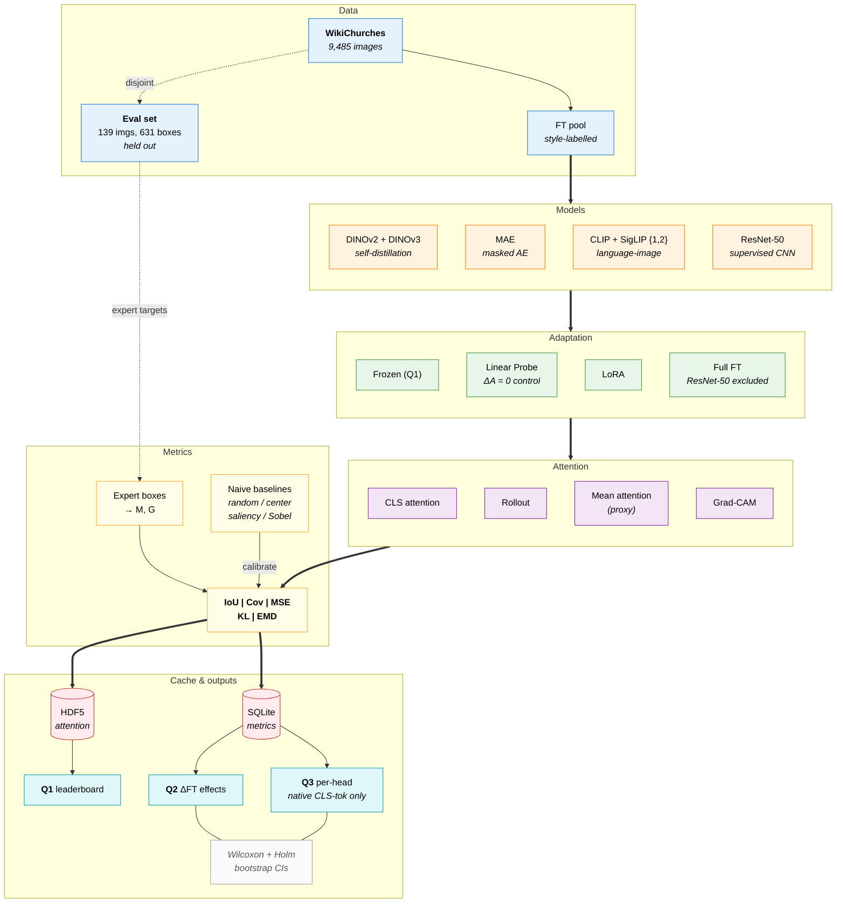

# Pipeline Diagram (Mermaid source)

Source for the end-to-end ML pipeline figure used in the final report
(Section 3, "Proposed Approach"). Render via the Mermaid Live editor
(<https://mermaid.live>) or the VSCode Mermaid preview, then export PNG to
`docs/final_report/figures/pipeline.png`.



## What this encodes (matches Section 3 of the report)

1. **The 139-image eval set is disjoint from fine-tuning.** Dashed
   `disjoint` arrow from WikiChurches to the Eval set; no path from the
   FT pool to Eval.
2. **Linear Probe is a zero-Δ control by construction** — annotated
   on the LP node so the §4.4 explanation isn't load-bearing on its own.
3. **CLS-token vs. proxy split drives Q3 scope.** Q3 output node is
   annotated *"native CLS-tok only"*, matching §3.6.
4. **Baselines are part of evaluation, not a sidebar.** They sit in the
   Metrics lane with an explicit `calibrate` edge into the metric node.
5. **Cache is the join point between research and app.** HDF5 + SQLite
   sit between metrics and the Q1/Q2/Q3 result surfaces.

## Export workflow

1. Open the fenced ````mermaid ```` block in <https://mermaid.live>
   (or right-click the rendered diagram in VSCode's preview).
2. Export PNG at high DPI (the Live editor's "PNG" button supports
   2x/3x scale).
3. Save to `docs/final_report/figures/pipeline.png`.
4. Add to the report at the top of Section 3 with a standard
   `\begin{figure*}[t] \includegraphics[width=\textwidth]{pipeline.png}`
   block.
