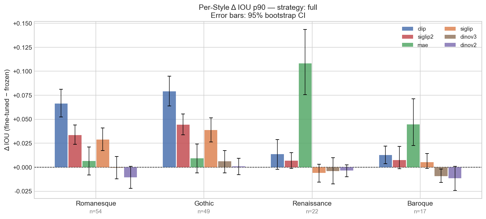
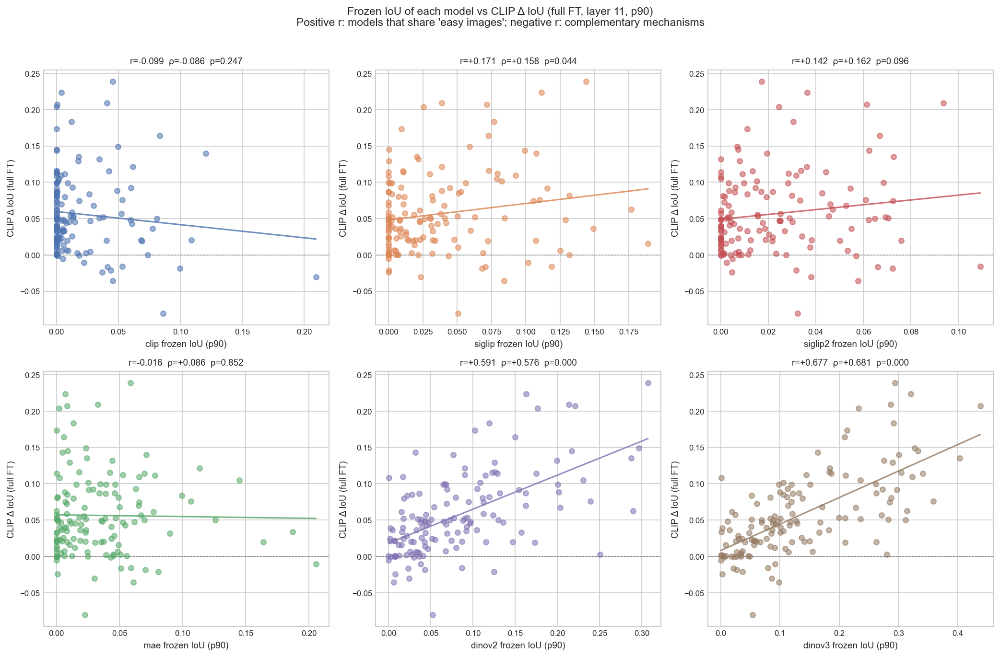
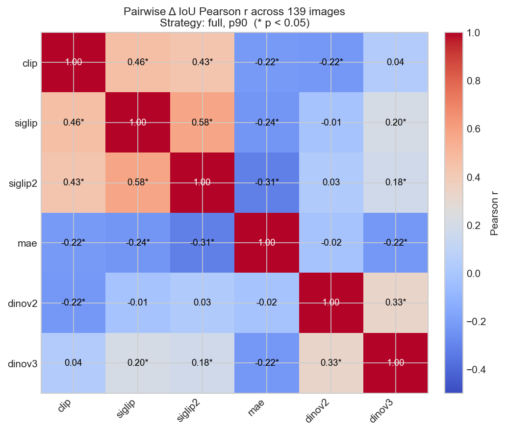
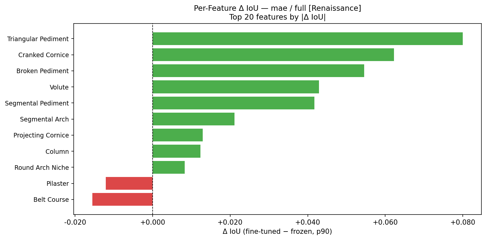

# Investigation Roadmap: Affirming the CLIP/SigLIP vs. DINO Fine-Tuning Findings

> **Written:** April 2026
> **Context:** Follows the Q2 primary experiment `fine_tuning_primary_20260327` and the analysis in `docs/research/q2_results_analysis.md`. Model mechanisms are cross-checked against the whitepapers in [`docs/whitepapers/`](../whitepapers/) (see **Part 8** in the analysis doc).
> **Purpose:** Concrete, prioritized steps to affirm and deepen the current findings — organized by effort level.

---

## The Finding That Needs Affirming

Full fine-tuning on 4-class architectural style classification produces dramatically different Δ IoU (layer 11, p90) across model families:

| Model | Frozen IoU | Fine-tuned IoU | Δ IoU | Cohen's d | Significant |
|-------|-----------|----------------|-------|-----------|-------------|
| CLIP | 0.0181 | 0.0745 | **+0.0564** | 1.005 | ✅ |
| SigLIP2 | 0.0220 | 0.0519 | **+0.0299** | 0.781 | ✅ |
| SigLIP | 0.0364 | 0.0618 | **+0.0254** | 0.604 | ✅ |
| MAE | 0.0702 | 0.0988 | **+0.0286** | 0.413 | ✅ |
| DINOv2 | 0.0816 | 0.0758 | -0.0058 | -0.184 | ❌ |
| DINOv3 | 0.1327 | 0.1321 | -0.0007 | -0.017 | ❌ |

The core claim: **CLIP/SigLIP needed fine-tuning to develop expert-relevant spatial attention; DINO already had it from pretraining.**

---

## Newly Discovered: Per-Style Δ IoU Breakdown

Computed live from `q2_metrics_analysis.json` per-image deltas, cross-referenced against `building_parts.json` style labels. This breakdown was not in the original analysis output.

### Δ IoU (full fine-tuning, IoU p90) by Architectural Style

| Model | Romanesque (n=54) | Gothic (n=49) | Renaissance (n=22) | Baroque (n=17) |
|-------|:-----------------:|:-------------:|:-----------------:|:--------------:|
| **CLIP** | **+0.066** | **+0.079** | +0.014 | +0.013 |
| **MAE** | +0.007 | +0.009 | **+0.108** | **+0.045** |
| **SigLIP2** | +0.034 | +0.044 | +0.007 | +0.007 |
| **SigLIP** | +0.029 | +0.039 | -0.006 | +0.005 |
| **DINOv2** | -0.010 | +0.001 | -0.004 | -0.012 |
| **DINOv3** | -0.001 | +0.006 | -0.004 | -0.009 |

### What This Reveals

**CLIP's improvement is entirely carried by Romanesque and Gothic.** Renaissance and Baroque show near-zero Δ. The top annotated features in the strong-improvement styles are:
- Romanesque: Round Arch Portal (38 boxes), Lesene (24), Coupled Trifora (12)
- Gothic: Pointed Arch Portal (37 boxes), Bull's-eye Window (31), Tracery (21)

These are highly salient, spatially compact, and frequently described in English text — consistent with CLIP's language-grounded representations. Fine-tuning appears to "unlock" CLIP's already-text-aligned patch features by teaching the CLS token to aggregate them.

**MAE's Renaissance spike (Δ = +0.108) is the largest single-style shift in the entire dataset.** This is unexpected given MAE's overall modest improvement (+0.029 aggregate). The top Renaissance features are Trefoil Window (19 boxes) and Pediment (15 boxes) — spatially compact, geometrically distinct shapes that MAE's pixel-reconstruction pretraining may have encoded precisely. When fine-tuned on a style task that requires distinguishing Renaissance from the other three styles, MAE redirects attention toward these exact forms.

**DINO shows nothing across all styles**, confirming the ceiling is not style-specific.

### Box Density Per Style

| Style | Images | Total Boxes | Boxes/image |
|-------|--------|-------------|-------------|
| Romanesque | 54 | 235 | 4.4 |
| Gothic | 49 | 290 | 5.9 |
| Renaissance | 22 | 93 | 4.2 |
| Baroque | 17 | 31 | **1.8** |

Baroque has the fewest boxes per image and the lowest improvement across all models. Sparse annotations = weaker evaluation signal, not necessarily weaker model behavior.

---

## Open Questions This Roadmap Would Close

| Question | Closed By | Answer |
|----------|-----------|--------|
| Is CLIP's improvement driven by Gothic/Romanesque-specific language grounding? | Step 1 ✅ | Yes — Gothic +0.079, Romanesque +0.066; Renaissance/Baroque near-zero |
| Do CLIP and DINO respond to the same "easy" images? | Step 2 ✅ | Yes — r=+0.677; shared easy images, not complementary mechanisms |
| Why does MAE show a Renaissance spike? | Step 3 ✅ | Spike is real, robust across full FT and LoRA (LoRA mean +0.142 > full +0.108). Associated with pediment-class features (Triangular/Broken/Segmental Pediments). LP Δ=0 confirms only backbone fine-tuning reorganizes MAE attention. Frozen patch geometry check (3.4) still open — requires HDF5 cache access. |
| Is CLIP's layer 11 measurement understating the true improvement? | Step 4 ⬜ | Open |
| Does fine-tuning compress CLIP's diffuse attention? Does CLS–patch mixing track DINOv3-style tradeoffs? | Step 5 ⬜ | Open |
| Is the improvement task-driven or just parameter-update-driven? | Step 6 ⬜ | Open — country classification control not yet run |
| Did CLIP's patch features already encode spatial knowledge pre-FT (short vs. caption-like text)? | Step 7 ⬜ | Open |
| Does DINOv3 fine-tuning alter **pairwise patch–patch** structure (Gram) even when scalar IoU is flat? | Step 8 ⬜ | Open — links Coverage drop to Gram / selectivity story |
| Does SigLIP2 sit between SigLIP and DINO on patch spatial coherence (H6)? | Step 9 ⬜ | Open |

---

## Prioritized Investigation Steps

### Tier 1 — No New Compute (Data Already Exists)

#### Step 1: Formalize the Per-Style Breakdown Script ✅ DONE

**Script:** `experiments/scripts/analyze_style_breakdown.py`

**Results:**
- CLIP's improvement is entirely carried by **Romanesque (+0.066)** and **Gothic (+0.079)**. Renaissance and Baroque show near-zero Δ.
- **MAE's Renaissance spike (+0.108)** is the largest single-style shift in the entire dataset — unexpected given MAE's modest aggregate (+0.029).
- DINO shows flat Δ across all four styles, confirming the ceiling is not style-specific.
- Kruskal-Wallis test: MAE shows significant style moderation (p < 0.05); other models do not.

**Output artifacts:** `<experiment_dir>/style_breakdown.json`, `style_breakdown.png`



---

#### Step 2: Cross-Model Image-Level Correlation ✅ DONE

**Script:** `experiments/scripts/analyze_model_correlation.py`

**Results:**
- DINOv3 frozen IoU vs. CLIP Δ IoU: **Pearson r = +0.677, Spearman ρ = +0.612** (both p < 0.0001). Large positive correlation — "shared easy images" confirmed.
- Three natural clusters from pairwise Δ matrix:
  1. Language cluster (CLIP/SigLIP/SigLIP2): r ≈ 0.43–0.58 — improve on the same images
  2. MAE: anti-correlated with all (r ≈ -0.22 to -0.31) — improves on different (Renaissance) images
  3. DINO pair: weakly correlated with each other (r = 0.33), near-zero with language cluster
- Interpretation: CLIP and DINO both respond to visually prominent images but via different mechanisms; MAE is improving a completely disjoint image subset.

**Output artifacts:** `model_correlation.json`, `model_correlation_scatter.png`, `model_correlation_heatmap.png`


CLIP is the fixed reference because it has the largest and most interpretable Δ IoU (+0.056, Cohen's d = 1.005) — it's the model whose improvement we're trying to explain. The X-axis cycles through each model's frozen baseline to find which one best predicts CLIP's per-image gains.

The DINOv3 panel (bottom-right, brown) is the key finding: the images where DINOv3's pretraining already produces expert-aligned attention are exactly the images where CLIP's fine-tuning succeeds. This tells you the images themselves are "structurally easy" — the expert bboxes happen to cover visually prominent, spatially compact regions that any spatially-sensitive model will find, given the right training signal. CLIP and DINO aren't complementary; they converge on the same images via different routes.



---

#### Step 3: Investigate the MAE Renaissance Spike ✅ DONE

MAE's Renaissance Δ = +0.108 stands out as the largest single-style shift and is currently unexplained.

**Script:** `experiments/scripts/analyze_feature_delta_iou.py --model mae --strategy full --style Renaissance`

**Check 1 — Which features drive the spike?**

Per-feature Δ IoU (full FT, layer 11, p90) for MAE within Renaissance images:

| Feature | Frozen IoU | FT IoU | Δ IoU | n images |
|---------|-----------|--------|-------|----------|
| Triangular Pediment | 0.0360 | 0.1161 | **+0.0800** | 19 |
| Cranked Cornice | 0.0045 | 0.0668 | **+0.0623** | 2 |
| Broken Pediment | 0.0054 | 0.0599 | **+0.0545** | 7 |
| Volute | 0.0087 | 0.0516 | **+0.0429** | 4 |
| Segmental Pediment | 0.0126 | 0.0543 | **+0.0417** | 7 |
| Segmental Arch | 0.0087 | 0.0299 | +0.0211 | 5 |
| Projecting Cornice | 0.0356 | 0.0485 | +0.0129 | 6 |
| Column | 0.0036 | 0.0159 | +0.0123 | 7 |
| Round Arch Niche | 0.0000 | 0.0083 | +0.0083 | 7 |
| Pilaster | 0.0232 | 0.0111 | −0.0121 | 15 |
| Belt Course | 0.0311 | 0.0155 | −0.0156 | 9 |

The top five features by Δ IoU are all **pediment-class shapes** (Triangular, Broken, Segmental Pediment, Cranked Cornice, Volute). These are geometrically structured, spatially compact, and visually distinctive — consistent with MAE's pixel-reconstruction pretraining encoding precise local geometry. Notably, **Pilaster and Belt Course — the most common Renaissance features — show negative Δ**, meaning fine-tuning actively shifts attention *away* from them and toward pediment forms.

The original hypothesis named Trefoil Window as the expected driver; it does not appear in these Renaissance images at all. **Pediments, not Trefoil Windows, are the locus of MAE's Renaissance gain.**

**Check 2 — Does MAE's frozen IoU already show a Renaissance advantage?**

The feature-level frozen IoU values show that pediment features had near-zero frozen alignment before fine-tuning (Triangular Pediment: 0.036, Broken Pediment: 0.005, Segmental Pediment: 0.013). The large post-FT values (0.116, 0.060, 0.054) represent genuine realignment created by fine-tuning, not amplification of a pre-existing frozen advantage. Fine-tuning *creates* pediment alignment from a near-zero baseline.

**Check 3 — Whitepaper-informed interpretation (He et al., MAE):**

MAE's pixel-reconstruction objective under 75% masking rewards reconstructing precise local geometry — edges, shapes, corners. The pediment features that gain most (Triangular Pediment Δ +0.080, Broken Pediment Δ +0.055) are defined by sharp triangular and curved geometric contours. When fine-tuning on a 4-class style task that requires distinguishing Renaissance from Romanesque/Gothic/Baroque, the gradient signal routes to these geometrically precise regions because they are the most discriminative for Renaissance — and MAE's encoder already represents them with high local fidelity from pretraining.

**Output artifact:** `feature_delta_iou_mae_full_renaissance.json`, `feature_delta_iou_mae_full_renaissance.png`



---

### Tier 2 — Re-Run Existing Scripts

#### Step 4: Layer-Sweep Δ IoU for CLIP

`analyze_q2_metrics.py` evaluates at `--layer 11`. Re-run for layers 7–11 for CLIP only to test whether the Layer 10 > 11 non-monotonic pattern (observed on one image in `finetuning_results.md`) holds at the population level.

**Command (approximate):**
```bash
for layer in 7 8 9 10 11; do
    python experiments/scripts/analyze_q2_metrics.py \
        --experiment-id fine_tuning_primary_20260327 \
        --models clip \
        --layer $layer \
        --output-suffix layer_sweep_$layer
done
```

**What to look for:** Does the post-FT IoU peak at layer 10 for CLIP? If yes, all aggregate CLIP results (which use layer 11) are slightly *understated*. This would be a methodological finding worth noting.

**Estimated runtime:** ~5–10 minutes per layer on MPS.

---

#### Step 5: Attention Entropy + CLS–Patch Similarity

Shannon entropy of the CLS attention weight distribution is a direct measure of attention diffuseness. This tests H2 (entropy hypothesis) from the main analysis doc.

**Metric A — entropy:**
```
H = -sum(p_i * log(p_i))   over the 196 patch attention weights at layer 11
```

**Metric B — CLS–patch cosine (DINOv3 paper, Fig. 5a):** For each image, compute the mean cosine similarity between the **CLS token output** and **each patch token** at layer 11 (after the same normalization used for attention rollout if applicable). Siméoni et al. (DINOv3) show this quantity **rises** during long SSL training and tracks **tradeoffs** between global classification metrics and dense (segmentation) behavior. It complements entropy: high entropy ≈ diffuse weights; high CLS–patch similarity ≈ global token collapsing toward a mixed patch summary.

**What to add to `analyze_q2_metrics.py`:** During attention / token extraction, compute **H** and **mean CLS–patch cosine** alongside IoU. Store as new metric rows in the output JSON.

**Predictions:**
- DINOv3 frozen: lowest entropy (most concentrated); CLS–patch similarity in a mid/high regime per architecture
- CLIP frozen: highest entropy (most diffuse)
- CLIP fine-tuned: entropy decreases substantially; CLS–patch similarity may shift as CLS routes to discriminative patches
- DINOv3 fine-tuned: entropy essentially unchanged; CLS–patch similarity may **increase** slightly (more global–local mixing), plausibly linking to **Coverage** drop (Part 2.4 / Part 8)

If these predictions hold, entropy and CLS–patch similarity together describe **how much spatial reorganization** fine-tuning caused — a stronger narrative next to Δ IoU.

---

### Tier 3 — New Experiments

#### Step 6: Country Classification as Negative Control

This is the strongest available experimental control. Fine-tune CLIP on country (Germany/France/UK/Spain/Italy) instead of architectural style, then measure Δ IoU on the same 139 annotated images.

**Prediction:** Δ IoU ≈ 0 or negative. Country labels don't correspond to architectural feature regions — the model should attend to landscape, sky, or urban context rather than portals and windows.

**Why this matters:** If country-CLIP shows Δ ≈ 0 while style-CLIP shows Δ = +0.056, it proves the improvement is **task-driven** (the style label contains spatial information) rather than **parameter-update-driven** (any fine-tuning improves IoU). This is the cleanest possible control for the core claim.

**Implementation effort:** Low. The infrastructure exists completely.
- Add `COUNTRY_MAPPING` to `src/ssl_attention/config.py` (top 5 countries by count)
- Pass `label_source="country"` to `FullDataset` in `fine_tune_models.py`
- Run analysis with existing `analyze_q2_metrics.py`

The enhancement doc `fine_tuning_methods.md` (Section 10.1) already outlines the implementation details.

---

#### Step 7: CLIP Text-Patch Similarity Probe

Load CLIP's text encoder and compute cosine similarity between text embeddings and frozen patch features across the 139 annotated images.

**Key question:** Do CLIP's *frozen patch features* already align with bbox regions when queried by text, even though CLS attention is diffuse? If yes, fine-tuning's role is to teach the CLS token to aggregate these already-aligned patches — not to create new spatial knowledge.

**Queries (whitepaper-informed):** Radford et al. trained on web-scale **full captions**, not just object words. Run probes with:
- **Short** labels matching `building_parts` feature names (e.g. `"rose window"`, `"pointed arch portal"`).
- **Longer** caption-style phrases (e.g. `"a photo of a gothic church facade with pointed arches and stained glass"`, `"a roman church with round arches and a large portal"`).

Compare IoU of thresholded similarity maps to bbox masks for short vs. long queries. If long queries align better, H1 is supported in the **distribution** CLIP actually saw at pretraining.

**Implementation:** ~50 lines using HuggingFace `CLIPModel`:
```python
from transformers import CLIPModel, CLIPProcessor
model = CLIPModel.from_pretrained("openai/clip-vit-base-patch16")
text_inputs = processor(text=["round arch portal", "pointed arch", ...], return_tensors="pt")
text_embeds = model.get_text_features(**text_inputs)  # (num_features, 512)
# patch features already cached in HDF5 from generate_feature_cache.py
patch_sims = torch.cosine_similarity(patch_features, text_embeds[i].unsqueeze(0), dim=-1)
```

Compute IoU between thresholded patch similarity heatmap and the corresponding bbox mask. Compare against CLS attention IoU. If patch-text similarity IoU >> CLS attention IoU (frozen), the "latent spatial knowledge" hypothesis is confirmed.

---

#### Step 8: Gram Matrix Analysis (DINOv3 Frozen vs. Fine-Tuned)

**Motivation (Siméoni et al., DINOv3):** **Gram anchoring** trains the student to match the **Gram matrix** of L2-normalized **patch features** (pairwise patch–patch inner products) to an early teacher, preserving **second-order** spatial structure. That mechanism plausibly explains **high frozen IoU** and **near-zero Δ IoU** for DINOv3, and why **Coverage** may drop after FT if fine-tuning disrupts broad patch–patch coherence while sharpening style-discriminative regions.

**Concrete task:**
1. For each annotated image, build matrices \(X \in \mathbb{R}^{P \times d}\) of L2-normalized patch embeddings (frozen and fine-tuned checkpoints) at a fixed layer.
2. Compute Gram matrices \(G = X X^\top\) (or a manageable subset / downsampled patches if \(P\) is large).
3. Report **Frobenius norm** \(\|G_{\text{FT}} - G_{\text{frozen}}\|_F\) aggregated over images, and correlate with per-image Δ IoU / Coverage change.

**Prediction:** Fine-tuned DINOv3 shows **non-trivial Gram drift** vs. frozen even when scalar IoU is flat — supporting the "structural encoding" story in Part 8 of the analysis doc.

**Effort:** Medium (new tensor plumbing; no new FT run).

---

#### Step 9: SigLIP 2 "Partial DINO" Spatial Coherence

**Motivation (Tschannen et al., SigLIP 2):** SigLIP 2 adds **self-distillation + masked prediction** (DINO/SILC/TIPS-style) only in the **last 20%** of training. Frozen IoU is still very low (0.0220), but Cohen's *d* is higher than SigLIP's — **H6** in `q2_results_analysis.md` asks whether this stage yields **intermediate** patch-level structure vs. full DINO.

**Concrete task:**
1. On a subset of WikiChurches images (or all 139), compute a simple **spatial coherence** statistic from patch embeddings — e.g. mean local cosine similarity of each patch to its 8 neighbors on the grid, or smoothness of the first PCA component of patch features.
2. Compare **SigLIP vs. SigLIP2 vs. DINOv2/v3** frozen backbones at the same resolution/layer.

**Prediction:** SigLIP2 sits **between** SigLIP and DINO on neighbor coherence; none match DINOv3's expert IoU without full SSL geometry.

**Effort:** Low–medium (feature cache reads only).

---

## Summary Table

| Step | Data Needed | Compute Cost | Confidence Value | Status |
|------|-------------|-------------|-----------------|--------|
| 1. Style breakdown script | existing JSON | none | high — formalizes new finding | ✅ Done |
| 2. Cross-model correlation | existing JSON | none | moderate — characterizes mechanism | ✅ Done |
| 3. MAE Renaissance investigation | existing JSON | none | high — explains biggest surprise (+ MAE paper geometry check) | ✅ Done |
| 4. CLIP layer sweep | re-run script | ~30 min | moderate — may reframe CLIP numbers | ⬜ Pending |
| 5. Attention entropy + CLS–patch cosine | modify script | ~15–20 min | high — direct test of H2 + DINOv3-style diagnostic | ⬜ Pending |
| 6. Country classification | new FT run | ~2–3 hrs | **critical** — strongest control | ⬜ Pending |
| 7. CLIP text-patch probe (short + long queries) | new code | ~1–2 hr | high — tests H1 directly | ⬜ Pending |
| 8. Gram matrix analysis (DINOv3) | frozen + FT caches | medium impl. | high — explains IoU ceiling / Coverage (Part 8) | ⬜ Pending |
| 9. SigLIP2 vs SigLIP vs DINO coherence | feature cache | low–medium | moderate — tests H6 (partial DINO dosage) | ⬜ Pending |

---

## Related Documents

- [q2_results_analysis.md](../research/q2_results_analysis.md) — deep analysis, **Part 8 whitepaper evidence**, and hypothesis set this roadmap draws from
- [docs/whitepapers/](../whitepapers/) — local PDFs (CLIP, SigLIP, SigLIP 2, MAE, DINOv2, DINOv3)
- [fine_tuning_methods.md](fine_tuning_methods.md) — country classification implementation details (Section 10.1)
- [docs/research/finetuning_results.md](../research/finetuning_results.md) — original Q2 interpretation notes including the Layer 10 observation
