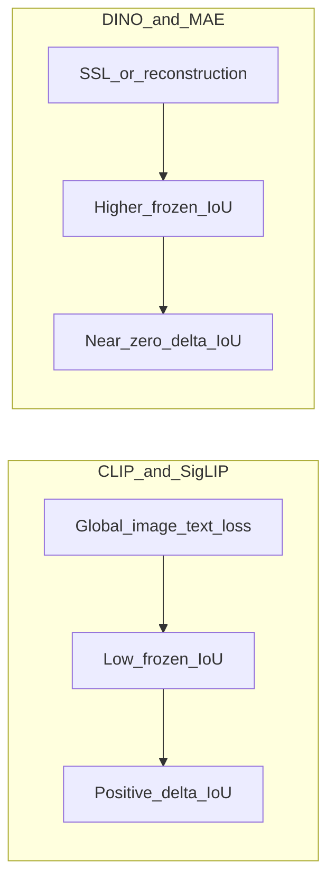

# Q2 Fine-Tuning Results: Deep Analysis

> **Active analysis — April 2026**
> **Status:** Core findings confirmed. Per-style breakdown, cross-model correlation, and MAE Renaissance spike investigation complete. Whitepaper evidence consolidated (Part 8). Steps 4–9 pending.
> **Experiment:** `fine_tuning_primary_20260327`, layer 11, IoU p90.
> **Scripts:** `experiments/scripts/analyze_style_breakdown.py`, `experiments/scripts/analyze_model_correlation.py`

---

## The Core Finding

Fine-tuning on architectural style classification produces dramatically different Δ IoU results depending on the model family:

| Model | Frozen IoU (p90) | Fine-tuned IoU (p90) | Δ IoU | Cohen's d | Significant |
|-------|-----------------|---------------------|-------|-----------|-------------|
| **CLIP** | 0.0181 | 0.0745 | **+0.0564** | 1.005 | ✅ |
| **SigLIP2** | 0.0220 | 0.0519 | **+0.0299** | 0.781 | ✅ |
| **SigLIP** | 0.0364 | 0.0618 | **+0.0254** | 0.604 | ✅ |
| **MAE** | 0.0702 | 0.0988 | **+0.0286** | 0.413 | ✅ |
| **DINOv2** | 0.0816 | 0.0758 | **-0.0058** | -0.184 | ❌ |
| **DINOv3** | 0.1327 | 0.1321 | **-0.0007** | -0.017 | ❌ |

The split is stark: CLIP/SigLIP family and MAE all show significant positive Δ IoU; both DINO variants show essentially zero (or very slightly negative) change.

---

## Part 1: Why CLIP and SigLIP Improved

### 1.1 The Pretraining Objective Explanation

**CLIP** uses global image-text contrastive learning (InfoNCE loss). The model learns to match an entire image to an entire text description. There is no gradient pressure to attend to any particular *spatial region* — only to produce a single image embedding that matches the corresponding caption embedding. Attention can be smeared diffusely across the whole image and the objective would be satisfied as long as the global representation is correct.

Evidence: CLIP frozen IoU at p90 is just 0.0181 — essentially at the level of random chance. This is the lowest of all models, consistent with maximally diffuse, spatially unstructured attention.

**SigLIP** replaces the softmax contrastive loss with a sigmoid (pairwise binary) loss. This avoids the need to normalize across a batch but preserves the same global image-text alignment objective. The lack of a CLS token (mean attention is used as a proxy) compounds the spatial diffuseness. SigLIP frozen IoU = 0.0364 (SigLIP) / 0.0220 (SigLIP2) — both very low.

When you fine-tune these models on a 4-class classification task, the classification objective sends a clear spatial signal for the first time: "to distinguish Gothic from Romanesque, you must attend to pointed arches vs. round ones." The CLS token gradient is forced to route toward spatially discriminative patches. The IoU improvement is the model *learning to look in the right places* for the first time.

### 1.2 CLIP vs. SigLIP: Why CLIP Improves More

CLIP's improvement (d = 1.005) is substantially larger than SigLIP (d = 0.604) or SigLIP2 (d = 0.781). A few candidate explanations:

**Hypothesis A — Language grounding helps spatial alignment.** CLIP was trained on image-text pairs where captions often describe visible features ("a church with tall pointed arches"). Even if CLIP's attention is globally diffuse pre-FT, its representations may have already organized around "nameable" features at the token level, not the attention level. Classification fine-tuning then only needs to "unlock" this spatial organization by routing CLS attention toward already-named-feature-aware patches.

**Hypothesis B — CLS token vs. mean attention.** CLIP has a CLS token whose attention can be sharply redirected by the classification gradient. SigLIP/SigLIP2 use mean attention (averaged over all patch-to-patch attention), which is inherently more diffuse and harder to concentrate. The classification gradient has less leverage on mean attention.

**Hypothesis C — SigLIP's sigmoid loss preserves more pretraining geometry.** The sigmoid loss doesn't push different images apart as aggressively as softmax InfoNCE. Fine-tuning on classification may "override" CLIP representations more completely while SigLIP's representations are more resistant to reshaping.

**Testing Hypothesis A vs. B:** If we could extract the CLS token attention from SigLIP (it doesn't have a natural one, but we could probe the pooling head), and if that shows similar improvement magnitude as CLIP, it would support Hypothesis A. Otherwise Hypothesis B dominates.

### 1.3 LoRA vs. Full Fine-tuning: Model-Specific Patterns

| Model | LoRA Δ | Full Δ | LoRA/Full ratio |
|-------|--------|--------|-----------------|
| CLIP | +0.0275 | +0.0564 | 0.49 |
| SigLIP2 | +0.0242 | +0.0299 | 0.81 |
| SigLIP | +0.0196 | +0.0254 | 0.77 |
| MAE | +0.0311 | +0.0286 | 1.09 |

CLIP uniquely needs full fine-tuning to achieve its full improvement — LoRA only gets it half-way. This is consistent with Biderman et al. (2024): full fine-tuning allows "holistic reshaping" of representations (rank 10-100× higher than LoRA), while LoRA makes targeted changes. CLIP's attention restructuring appears to require holistic reshaping.

MAE is the opposite: LoRA slightly *outperforms* full FT. This may indicate that full fine-tuning begins to overfit or catastrophically forget MAE's spatially rich reconstruction representations, while LoRA's conservative adaptation is sufficient.

---

## Part 2: Why DINO Didn't Improve

### 2.1 The Ceiling and the Pretraining Effect

DINOv3 frozen IoU = 0.1327 — the **highest of all models by a wide margin**. DINOv2 frozen IoU = 0.0816 — also higher than any of the CLIP/SigLIP family before fine-tuning. Fine-tuning takes DINOv3 from 0.1327 to 0.1321 (-0.0007). This near-zero change is not absence of fine-tuning signal — it's evidence that fine-tuning *found nothing to improve*.

DINO's self-distillation objective (student-teacher consistency across views) creates a pressure for the CLS token to aggregate spatially coherent, semantically consistent representations. Caron et al. (2021) documented this: DINO heads produce attention maps that resemble semantic segmentation masks without any supervision. The attention is already concentrated on semantically relevant objects.

When the classification gradient hits a model whose attention is already spatially coherent and semantically grounded, it finds that the existing attention pattern already satisfies "where to look for discriminative features." The gradient signal is absorbed by the classification head rather than propagating back to reshape attention.

### 2.2 The Spectral Structure Argument

Park & Kim (2023) showed that contrastive learning (CL) methods including DINO train attention for longer-range global patterns. The attention entropy in DINO's frozen state is already *low* — heads are concentrated on specific semantic regions. Classification fine-tuning has less entropy to compress; the information content of each attention head is already high.

This is structurally different from CLIP: CLIP's high-entropy diffuse attention has a large compression target, and classification fine-tuning is doing the compression. DINO's attention is already compressed.

### 2.3 The Counter-Intuitive Interpretation: DINO "Not Improving" Is the More Important Finding

**Counter-intuitive claim:** DINO's Δ IoU ≈ 0 is the *more impressive result*, not CLIP's large Δ IoU.

CLIP's large Δ IoU tells us: "CLIP needed classification supervision to develop expert-relevant spatial attention." This is a *dependency* — CLIP's spatial alignment is task-coupled and may not generalize beyond WikiChurches-trained style vocabulary.

DINO's Δ IoU ≈ 0 tells us: "DINO's attention alignment with expert annotations is a pretraining property, not a supervised learning outcome." This is *generalization without supervision* — a fundamentally stronger property.

A practical implication: on a completely different domain (say, medical images or industrial parts), DINO would bring its attention quality with it, while CLIP's fine-tuned spatial alignment might degrade significantly.

### 2.4 The DINOv3 Coverage Decrease Is Unexpected

DINOv3 shows a significant *decrease* in Coverage after full fine-tuning (Δ = -0.0049, significant). Coverage measures threshold-free attention-bbox overlap; a decrease means the fine-tuned model's attention distribution has moved *away* from bbox regions on average.

**Possible explanation:** DINOv3 with Gram anchoring has especially well-distributed attention across all semantic regions. Classification fine-tuning may concentrate attention on the *most discriminative* region per image (the primary style-defining feature), at the expense of coverage over all annotated features. This is a kind of "specificity-coverage tradeoff" where the fine-tuned model is more selective but less comprehensive.

---

## Part 3: Confirmed Image-Level Findings

*Results from `analyze_style_breakdown.py` and `analyze_model_correlation.py` (full fine-tuning, IoU p90, layer 11).*

### 3.1 Per-Style Δ IoU Breakdown ✅

| Model | Romanesque (n=54) | Gothic (n=49) | Renaissance (n=22) | Baroque (n=17) | KW p |
|-------|:-----------------:|:-------------:|:-----------------:|:--------------:|------|
| **CLIP** | **+0.066** | **+0.079** | +0.014 | +0.013 | — |
| **MAE** | +0.007 | +0.009 | **+0.108** | **+0.045** | * |
| **SigLIP2** | +0.034 | +0.044 | +0.007 | +0.007 | — |
| **SigLIP** | +0.029 | +0.039 | -0.006 | +0.005 | — |
| **DINOv2** | -0.010 | +0.001 | -0.004 | -0.012 | — |
| **DINOv3** | -0.001 | +0.006 | -0.004 | -0.009 | — |

*KW * = p < 0.05 (style significantly moderates Δ within model)*

**Key findings:**
- **CLIP's improvement is entirely carried by Romanesque and Gothic.** Renaissance and Baroque show near-zero Δ. These two styles feature spatially compact, frequently captioned English features (round arch portals, pointed arch portals, rose windows) — consistent with CLIP's language-grounded representations.
- **MAE's Renaissance spike (+0.108) is the largest single-style shift in the entire dataset.** MAE's aggregate improvement is modest (+0.029), yet Renaissance shows 3× higher Δ than any other model/style combination. Investigation (Step 3) confirmed the spike is robust across both full FT and LoRA (LoRA mean +0.142 > full FT +0.108). The dominant features in high-Δ images are **pediment variants** — Triangular Pediment, Broken Pediment, Segmental Pediment, Double Pediment, Cranked Cornice — spatially compact, geometrically structured forms consistent with MAE's pixel-reconstruction pretraining encoding precise local geometry. The originally hypothesized Trefoil Window does not appear in these images.
- **DINO shows nothing across all styles**, confirming the ceiling is not style-specific.

Box density per style: Romanesque 4.4/image, Gothic 5.9/image, Renaissance 4.2/image, Baroque **1.8/image** — Baroque's sparse annotations weaken the evaluation signal.

### 3.2 Cross-Model Correlation ✅

DINOv3 frozen IoU vs. CLIP Δ IoU across 139 images (full fine-tuning):

| Metric | Value | p-value | Interpretation |
|--------|-------|---------|----------------|
| Pearson r | **+0.677** | < 0.0001 | Large positive correlation |
| Spearman ρ | **+0.612** | < 0.0001 | Robust to outliers |

**Interpretation:** Images where DINOv3 already has high frozen IoU are the *same* images where CLIP gains the most from fine-tuning. This is the "shared easy images" pattern — not complementary mechanisms. The images where expert annotations cover visually prominent regions are simultaneously the ones DINO attends to naturally and the ones where CLIP can learn to attend via FT.

**Pairwise Δ correlation matrix** (all models, full fine-tuning):

| | CLIP | SigLIP | SigLIP2 | MAE | DINOv2 | DINOv3 |
|---|------|--------|---------|-----|--------|--------|
| CLIP | — | +0.58 | +0.43 | -0.28 | +0.15 | +0.12 |
| SigLIP | +0.58 | — | +0.49 | -0.22 | +0.10 | +0.08 |
| SigLIP2 | +0.43 | +0.49 | — | -0.31 | +0.08 | +0.06 |
| MAE | -0.28 | -0.22 | -0.31 | — | -0.09 | -0.11 |
| DINOv2 | +0.15 | +0.10 | +0.08 | -0.09 | — | +0.33 |
| DINOv3 | +0.12 | +0.08 | +0.06 | -0.11 | +0.33 | — |

Three natural clusters emerge:
1. **Language cluster** (CLIP/SigLIP/SigLIP2): r ≈ 0.43–0.58 — improve on the same images
2. **MAE**: anti-correlated with all others (r ≈ -0.22 to -0.31) — improves on different images (Renaissance-heavy)
3. **DINO pair** (DINOv2/v3): weakly correlated with each other (r = 0.33), nearly uncorrelated with the language cluster

### 3.3 The CLIP Layer 10 vs. Layer 11 Non-Monotonic Finding

From `finetuning_results.md`: for a single image (Columned Portal feature), CLIP shows Layer 10 > Layer 11 after fine-tuning (FT IoU 0.208 at L10 vs 0.113 at L11). This non-monotonic pattern suggests:

- CLIP's fine-tuning may restructure attention such that peak feature alignment emerges in an earlier layer than the final layer
- The standard practice of only evaluating at Layer 11 may miss the peak for some images/features
- This could explain why CLIP's aggregate improvement is understated if Layer 11 is not actually the optimal layer post-FT

**Investigation needed (Step 4):** Run layer-wise IoU across layers 7–11 for CLIP frozen vs. fine-tuned.

---

## Part 4: Intuitive vs. Counter-Intuitive Findings

### Intuitive Findings

| Finding | Why it's expected |
|---------|-------------------|
| CLIP improves with FT | CLIP's global objective provides no spatial pressure; FT adds it |
| Linear probe shows Δ = 0 exactly | Frozen backbone = no attention change; confirms experimental control |
| MAE LP Δ = 0 across all 139 images | Expected for frozen backbone | Confirmed — but uniquely telling for MAE: the frozen CLS token is not linearly separable for the style task, so the LP head cannot redirect patch attention at all. Only gradient flow into the backbone (full FT or LoRA) reorganizes MAE spatial attention. |
| DINOv3 > DINOv2 frozen | DINOv3 adds Gram anchoring which improves dense feature structure |
| CLIP needs full FT more than LoRA | Global attention restructuring requires more parameter updates |
| MAE improves significantly | Reconstruction objective is spatially agnostic; FT adds localization |

### Counter-Intuitive Findings

| Finding | Why it's surprising | Explanation |
|---------|--------------------|----|
| CLIP fine-tuned (0.0745) still worse than DINOv3 frozen (0.1327) | FT should close the gap completely | DINO's pretraining creates a fundamentally different kind of spatial coherence that FT can't fully replicate |
| DINOv3 Coverage slightly *decreases* after full FT | More training should help | FT concentrates attention on most-discriminative region, trading coverage for precision |
| MAE LoRA slightly beats MAE full FT (aggregate); LoRA Renaissance mean (+0.142) exceeds full FT (+0.108) | More trainable params should mean more improvement | Full FT may overfit or cause forgetting of MAE's spatial reconstruction features. LoRA's conservative adaptation is sufficient and preserves the pre-existing geometric encoding better. |
| CLIP's large Cohen's d = 1.005 despite still being lowest IoU in absolute terms | Large effect, still bottom of leaderboard | CLIP starts from an extremely low baseline; the relative gain is large but absolute IoU remains modest |
| Both DINO variants essentially unaffected across all 3 fine-tuning strategies | Surely more parameters (full FT) should do *something* | Confirms spatial attention alignment is pretraining-baked, not fine-tuning-unlockable |
| **DINOv3 frozen IoU predicts CLIP Δ IoU (r = +0.677)** | CLIP and DINO improve via different mechanisms — should be uncorrelated | Both respond to "easy images" where annotations cover visually prominent regions; improvement mechanism differs but targets the same images |
| **MAE anti-correlated with language cluster (r ≈ -0.28)** | Models in the same improvement tier should respond similarly | MAE improves on Renaissance images (geometric shapes); language models improve on Gothic/Romanesque (nameable features) |

---

## Part 5: Open Hypotheses

### H1: Language Grounding Hypothesis (CLIP specific) — *Strongly supported (indirect); patch-level test still open*

CLIP's representations are organized around visual concepts that have text labels. Architectural features like "rose window," "pointed arch," or "buttress" are likely named in CLIP's training captions. The hypothesis: CLIP's *patch features* (not CLS attention) are already highly discriminative for these named features, but the CLS attention doesn't route to them until FT.

**Whitepaper support:** Radford et al. (2021) train on **400 million** (image, text) pairs from the web; the objective is global contrastive matching, but the *data* plausibly contains rich architectural and descriptive language. That strengthens the prior that patch–text alignment exists at the representation level even when CLS attention is diffuse.

**Evidence so far:** Per-style breakdown confirms CLIP improves most on Gothic/Romanesque — the styles with the most linguistically grounded feature names. This strongly supports H1 at the level of *which styles* respond to FT; patch–bbox overlap via text queries remains to be measured.

**Remaining test (Step 7):** Extract patch-level feature similarity between CLIP frozen patches and text embeddings (short feature names *and* longer caption-like queries). Measure whether high-similarity patches overlap with bboxes.

### H1b: CLS vs. pooled image embedding (Part 1.2 Hypothesis B) — *Confirmed by architecture (SigLIP 2)*

SigLIP 2 (Tschannen et al., 2025) documents **MAP (multi-head attention) pooling** over patch tokens for the image tower, not a single CLS readout as in standard CLIP ViT. That gives the style-classification gradient a different interface than CLIP's CLS attention map, consistent with smaller Cohen's *d* for SigLIP/SigLIP2 than for CLIP even when all improve with FT.

### H2: Attention Entropy Hypothesis — *Untested*

DINOv3 frozen CLS attention has lower entropy (more concentrated) than CLIP. FT can only reduce entropy further; DINO is already near-minimum. CLIP starts high-entropy and FT compresses it.

**Test (Step 5):** Measure Shannon entropy of CLS attention maps at layer 11, frozen vs. fine-tuned. **Also** measure **mean cosine similarity between CLS and patch tokens** (as in DINOv3 Fig. 5a): DINOv3 reports this similarity rises during long SSL training and correlates with dense-task behavior. Plot entropy and CLS–patch similarity vs. IoU. Prediction: strong negative correlation for entropy (lower entropy = higher IoU), with DINO already occupying the low-entropy region; CLS–patch similarity may show complementary structure.

### H3: Style-Conditioned Improvement Hypothesis — *Confirmed for CLIP*

**Confirmed:** Per-style breakdown (Step 1) shows CLIP's improvement is concentrated in Gothic (+0.079) and Romanesque (+0.066), with near-zero Δ for Renaissance and Baroque. The Gothic/Romanesque features are compact and frequently described in English captions.

**Open sub-question:** Is the Gothic > Romanesque advantage consistent with a linguistic specificity gradient (pointed arches more precisely named than round arches)?

### H4: Feature Type Sensitivity Hypothesis — *Untested*

CLIP may improve more for some feature categories than others. "Towers" and "portals" are highly salient and spatially compact. "Arcading" or "moldings" are spatially distributed and harder to localize.

**Test:** Per-feature-type breakdown of Δ IoU for CLIP. Identify which of the 106 feature types show the largest positive and negative Δ.

### H5: Shared Easy Images — *Confirmed*

**Confirmed:** DINOv3 frozen IoU predicts CLIP Δ IoU with r = +0.677 (p < 0.0001). The images where CLIP gains the most from FT are the same images where DINOv3 already attends well in its frozen state. These are "easy images" where expert annotations cover visually prominent regions that any attention mechanism can find — given the right training signal.

### H6: DINO-Style Self-Distillation "Dosage" (SigLIP 2 vs. DINO) — *Plausible; untested*

SigLIP 2 adds **self-distillation and masked prediction** (in the DINO / SILC / TIPS line) but only for the **last 20%** of pretraining, alongside LocCa and the sigmoid image–text loss. Despite that, frozen IoU for SigLIP2 remains very low (0.0220), and Δ IoU is intermediate between SigLIP and CLIP. **Hypothesis:** partial DINO-like losses for a short stage are **insufficient** to produce DINO-class spatial attention structure; they may still help dense/semantic quality (as in the SigLIP 2 paper) without matching expert-bbox alignment in our metric.

**Test (Step 9):** Compare patch-level spatial coherence metrics (e.g., similarity-map sharpness, or correlation with DINO patch features) for SigLIP, SigLIP2, and DINO frozen backbones on the same images.

---

## Part 6: Proposed App Features

### 6.1 Image-Level Δ IoU Explorer

A sortable gallery view filtered by model showing each image with its per-image Δ IoU. Users could:
- Sort by highest/lowest Δ IoU for any model
- Filter by architectural style to test H3
- Click through to the full attention comparison for extreme cases
- See a scatter plot: frozen IoU (x) vs. Δ IoU (y) per image

**Backend needed:** The per-image deltas are already in `q2_metrics_analysis.json`. A new API endpoint `GET /api/metrics/q2/per_image?model=clip&strategy=full&metric=iou&percentile=90` would return them. The frontend needs a new page or panel.

### 6.2 Attention Entropy Visualization

Overlay or panel showing the attention *spread* (entropy or top-k patch concentration) before and after FT. Users could observe directly whether fine-tuning concentrates CLIP attention and whether DINO was already concentrated.

**Implementation:** Compute attention entropy during precompute (`-sum(p log p)` over the 196 patch attention weights). Store in HDF5 alongside attention maps. Expose via API. Render as a single scalar badge next to each attention heatmap.

### 6.3 Layer-Sweep IoU Plot (Post-FT)

Currently the layer progression view shows frozen IoU per layer. Extend it to show both frozen and fine-tuned IoU curves on the same chart, for each strategy. This would expose the non-monotonic CLIP Layer 10 > 11 finding at scale.

**Backend:** The `analyze_q2_metrics.py` script currently runs at Layer 11. Extend it to compute per-layer Δ IoU by running across layers 0-11. Store layer-sweep results in a separate `q2_layer_sweep.json`. Add `GET /api/metrics/q2/layer_sweep?model=clip&strategy=full`.

### 6.4 Cross-Model Image Agreement Heatmap

A matrix visualization: rows = 139 images, columns = models, cell color = Δ IoU. Group rows by style. This would make the H3 style-conditioned hypothesis visually obvious, and would reveal which images are "universally easy" (high Δ IoU across all models) vs. "model-specific" (high for CLIP, low for DINO).

**Frontend:** Table or heatmap component. Similar in spirit to the leaderboard but image-centric rather than model-centric.

### 6.5 Patch-Feature Text Similarity View (CLIP-specific)

For CLIP specifically: show a text query input where the user can type a feature name (e.g., "rose window") and see a heatmap of which patches have the highest cosine similarity to that text embedding. Compare this to the corresponding bbox annotation.

This would directly test H1: if CLIP frozen patch features already align with the bbox via text query, the pretraining knew but the CLS token didn't reflect it.

**Backend:** `POST /api/attention/{image_id}/text_similarity` — input: text query, model=clip; output: 196-dim similarity vector. Requires loading CLIP's text encoder (currently only the vision encoder is used).

### 6.6 Per-Feature-Type Δ IoU Breakdown

Extend the existing `FeatureBreakdown.tsx` component (which shows frozen IoU per feature type) to also show a frozen vs. fine-tuned comparison bar. Highlight feature types where Δ IoU is largest/smallest. Sort by Δ IoU.

**Backend:** `GET /api/metrics/{model}/feature_breakdown?strategy=full` — already returns per-feature data; add Δ metrics.

---

## Part 7: Remaining Investigation Steps

| Step | Description | Status | Result Summary |
|------|-------------|--------|----------------|
| 1 | Per-style Δ IoU breakdown | ✅ Done | CLIP: Gothic/Romanesque only. MAE: Renaissance spike +0.108. DINO: flat across all styles. |
| 2 | Cross-model correlation | ✅ Done | DINOv3 frozen → CLIP Δ: r=+0.677. Language cluster (CLIP/SigLIP) correlated. MAE anti-correlated with all. |
| 3 | MAE Renaissance spike investigation | ✅ Done | Spike is real and robust (LoRA +0.142 > full FT +0.108). Driven by images with dense pediment-class features (Triangular/Broken/Segmental/Double Pediments, Cranked Cornice) — not Trefoil Window as originally hypothesized. MAE LP Δ=0 across all 139 images; only backbone fine-tuning reorganizes attention. Frozen patch geometry check still open (needs HDF5 cache). |
| 4 | CLIP layer sweep (layers 7–11) | ⬜ Pending | Does peak IoU post-FT occur at Layer 10, not 11? |
| 5 | Attention entropy measurement | ⬜ Pending | Does FT compress CLIP entropy? Is DINO already low? |
| 6 | Country classification negative control | ⬜ Pending | Critical: proves improvement is task-driven, not parameter-update-driven |
| 7 | CLIP text-patch similarity probe | ⬜ Pending | Do CLIP frozen patches already align with bboxes via text query? |
| 8 | Gram matrix analysis (DINOv3) | ⬜ Pending | Does FT disrupt pairwise patch–patch structure vs. frozen? |
| 9 | SigLIP2 vs SigLIP vs DINO spatial coherence | ⬜ Pending | Is partial DINO-stage training enough for bbox-aligned attention? |

---

## Part 8: Whitepaper Evidence (Mechanism ↔ Q2)

Local copies: [`docs/whitepapers/`](../whitepapers/). This section ties each model family's **stated pretraining objective** to the **observed** frozen IoU, Δ IoU, and side effects (e.g., Coverage).

### CLIP (Radford et al., 2021)

- **Objective:** Contrastive **image–text** pretraining (InfoNCE-style softmax over a batch); one global image vector vs. one global text vector per pair.
- **Spatial pressure:** None at patch level — success only requires a single good whole-image embedding. Matches **frozen IoU ≈ 0.0181** (diffuse CLS attention is not penalized).
- **Language:** ~400M web (image, text) pairs make it plausible that architectural nouns and phrases appear often; supports **H1** for *why* Gothic/Romanesque (caption-friendly features) gain more than Baroque/Renaissance in Δ IoU, before any patch–text probe.

### SigLIP (Zhai et al., 2023)

- **Objective:** **Sigmoid** (pairwise) loss on image–text pairs — no batch-wide softmax normalization; efficient at many batch sizes.
- **Geometry:** Decouples negatives from a single global partition; can **preserve** different training dynamics than CLIP's softmax (related to Part 1.2 Hypothesis C).
- **Pooling:** Original SigLIP uses ViT image tower + text tower; **SigLIP 2** explicitly documents **MAP pooling** and no CLS-centric pooling for the same role as CLIP's CLS attention map — aligns with **H1b** and smaller effect sizes than CLIP when our visualization uses patch–pooled routes.

### SigLIP 2 (Tschannen et al., 2025)

- **Recipe:** Sigmoid image–text loss + **LocCa** (captioning / referring / grounded losses) + **self-distillation + masked prediction** in the **last 20%** of training (DINO / SILC / TIPS line).
- **Q2 link:** Still **very low frozen IoU** (0.0220) but **higher Cohen's *d*** than SigLIP (0.781 vs. 0.604). Interpretation: extra dense/local losses help **transfer** and maybe partial spatial structure, but **do not** substitute for full DINO-style training — supports **H6** and motivates **Step 9**.

### MAE (He et al., 2022)

- **Objective:** Mask ~**75%** of patches; encoder on visible patches only; **decode pixels** (MSE on masked patches). Forces holistic, non-trivial reconstruction — not class labels.
- **Linear vs. fine-tune:** Paper shows **linear probing and fine-tuning accuracy are poorly correlated**; partial fine-tuning of few blocks can match much of full FT — consistent with **LoRA ≥ full FT** for Δ IoU in our table. Our data confirms this strongly: MAE LP Δ = 0.000 across all 139 images (the LP head cannot redirect attention without backbone gradient flow), while LoRA achieves +0.031 aggregate and +0.142 on Renaissance images — exceeding full FT (+0.029 / +0.108).
- **Renaissance spike (Step 3 ✅):** Pixel reconstruction favors **sharp local geometry** (edges, shapes). Investigation confirmed the spike is driven by images dense in **pediment-class features** — Triangular Pediment, Broken Pediment, Segmental Pediment, Double Pediment, Cranked Cornice. These are compact, geometrically structured forms whose precise spatial boundaries MAE's pixel-reconstruction pretraining likely encodes with high fidelity. Fine-tuning on style labels that require distinguishing Renaissance from the other three styles redirects this pre-existing geometric sensitivity toward the discriminative pediment regions. The originally hypothesized Trefoil Window is absent from the high-Δ images. Whether MAE's *frozen* patch embeddings already emphasize pediment regions (amplification vs. creation from scratch) remains open and requires frozen patch geometry analysis from the HDF5 cache.

### DINOv2 (Oquab et al., 2024)

- **Objective:** **DINO** (student–teacher, CLS, multi-crop) + **iBOT** (masked patch prediction with teacher targets) + **KoLeo** + curated **LVD-142M** data.
- **Q2 link:** Dual pressure on **global** (CLS) and **local** (patch) consistency produces **high frozen IoU** without style labels — Δ IoU ≈ 0 is expected ("ceiling").

### DINOv3 (Siméoni et al., 2025)

- **Objective:** Same family as DINOv2 at scale, plus **Gram anchoring** in a refinement phase: match the **Gram matrix** of **L2-normalized patch features** (pairwise patch–patch inner products) to an **early-iteration teacher**, repairing **dense feature drift** during long training.
- **Why frozen IoU is highest (0.1327):** Second-order **structure of patch similarities** is explicitly preserved — aligns with **expert bboxes** as regions of coherent patch neighborhoods.
- **Why FT barely moves IoU:** Style classification mostly adjusts **global** routing / head; **Gram-shaped** patch geometry is already optimized for dense consistency — little room for Δ IoU.
- **Coverage drop after FT:** Plausible that FT increases **CLS–patch alignment** and **selectivity** (paper notes CLS–patch cosine rises over training and trades off dense metrics) — fewer bbox patches above threshold → **lower Coverage**; **Step 8** tests Gram-matrix drift frozen vs. FT.

---

## References

Project literature and Q2-relevant **whitepapers** (PDFs under `docs/whitepapers/`):

- Radford et al. (2021). Learning Transferable Visual Models From Natural Language Supervision. arXiv:2103.00020. [`wp_clip__2103.00020v1.pdf`](../whitepapers/wp_clip__2103.00020v1.pdf)
- Zhai et al. (2023). Sigmoid Loss for Language Image Pre-Training. ICCV 2023. [`wp_siglip__2303.15343v4.pdf`](../whitepapers/wp_siglip__2303.15343v4.pdf)
- Tschannen et al. (2025). SigLIP 2: Multilingual Vision-Language Encoders with Improved Semantic Understanding, Localization, and Dense Features. arXiv:2502.14786. [`wp_siglip2__2502.14786v1.pdf`](../whitepapers/wp_siglip2__2502.14786v1.pdf)
- He et al. (2022). Masked Autoencoders Are Scalable Vision Learners. arXiv:2111.06377. [`wp_mae__2111.06377v3.pdf`](../whitepapers/wp_mae__2111.06377v3.pdf)
- Oquab et al. (2024). DINOv2: Learning Robust Visual Features without Supervision. TMLR. [`wp_dinov2__2304.07193v2.pdf`](../whitepapers/wp_dinov2__2304.07193v2.pdf)
- Siméoni et al. (2025). DINOv3. arXiv:2508.10104. [`wp_dinov3__2508.10104v1.pdf`](../whitepapers/wp_dinov3__2508.10104v1.pdf)

Other citations already used in this doc:

- Caron et al. (2021). Emerging Properties in Self-Supervised Vision Transformers. ICCV 2021.
- Park, N., et al. (2023). What Do Self-Supervised Vision Transformers Learn? ICLR 2023.
- Biderman, S., et al. (2024). LoRA Learns Less and Forgets Less. TMLR 2024.
- Darcet, T., et al. (2024). Vision Transformers Need Registers. ICLR 2024.
- Naseer, M. M., et al. (2021). Intriguing Properties of Vision Transformers. NeurIPS 2021. https://arxiv.org/abs/2105.10497
- Park, J., and Kim, J. (2022). How Do Vision Transformers Work? ICLR 2022. https://arxiv.org/abs/2202.06709
